# Chapter 1_Java Fundamentals

> *Source: Sunil Sir's Lecture Notes — B.Sc. CSIT (Tribhuvan University)*

---

## Unit 1: Java Architecture & Fundamentals

*Source: `UNIT 1.docx`*

> 📷 *This document contains images/diagrams — see the original .docx for visual content*

# UNIT 1:

### Java Architecture

**Java Architecture** is a collection of components, i.e., **JVM** (Java Virtual Machine) - run java program, **JRE** (Java Runtime Environment) - provide environments to run java program, and **JDK** (Java Development Kit) - used to develop and run java program. It integrates the process of **interpretation** and **compilation**. It defines all the processes involved in creating a Java program. **Java Architecture** explains each and every step of how a program is compiled and executed.
**JVM (Java virtual machine)** - JVM runs Java programs.
```java
It executes bytecode (.class file).
It converts bytecode into machine code.
It makes Java platform independent.
Write once → Run anywhere (Windows, Linux, Mac).
JRE(Java Runtime Environment)- JRE provides the environment to run Java programs.
Which includes JVM, Java class libraries, Supporting files
JDK(Java Development Kit)- used to develop and run Java programs.
It includes JRE, Compiler (javac), Debugger and development tools
```

```java
Java Architecture can be explained by using the following steps:
There is a process of compilation and interpretation in Java.
Java compiler converts the Java code into byte code.
After that, the JVM converts the byte code into machine code.
The machien code is then executed by the machine.
The following figure represents the Java Architecture in which each step is elaborate graphically.
```


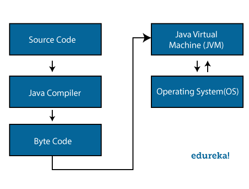

**Components of Java Architecture**
The Java architecture includes the three main components:
Java Virtual Machine (JVM)
.
Java Development Kit (JDK)

### Java Virtual Machine (JVM):

Java applications are called **WORA** (**Write once Run Anywhere**) because of their ability to run a code on any platform. This is done only because of **JVM**. JVM interprets the **bytecode** into **machine code** which is executed in the machine in which the Java program runs.
JVM performs the following functions:
Loads the code
Verifies the code
Executes the code
Provides runtime environment

### Java Runtime Environment:
The Java Runtime Environment (JRE) is the essential software package that enables the execution of Java applications on a computer.

### Java Development Kit:

The Java Development Kit (JDK) is a software package provided by Oracle (and other vendors) that includes tools and libraries necessary for **developing**, **compiling**, and **running** Java applications.

### The Java "White Paper" Buzzwords (Features of Java)

The authors of Java wrote an influential white paper that explains their design goals and accomplishments. They also published a shorter overview that is organized along the following 11 buzzwords: 
Simple 
Object-Oriented 
Distributed 
Robust 
Secure 
Architecture-Neutral 
Portable 
Interpreted 
High-Performance
Multithreaded
Dynamic

### Simple

Java is very **easy to learn**, and its **syntax is simple**, **clean and easy** to understand. According to Sun Microsystem, Java language is a simple programming language because:
**Java is an object-oriented programming language.**
Everything in Java is an object. Object-oriented means we organize our software as a combination of different types of objects that incorporate both data and behavior.
Basic concepts of OOPs are:
Object
Class
Inheritance
Polymorphism
Abstraction
Encapsulation

### Platform Independent


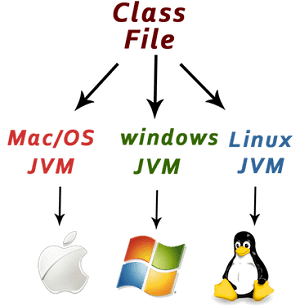

Java is platform independent because it is different from other languages like , , etc. which are compiled into platform specific machines while Java is a write once, run anywhere language. A platform is the hardware or software environment in which a program runs.

### Secured

Java is best known for its security. With Java, we can develop virus-free systems. Java is secured because:
No explicit pointer
**Java programs run inside a virtual machine called a sandbox.**
A sandbox is a **safe and protected environment** where Java programs are executed.
Robust
Java is robust(Strong) because:
There is a lack of **pointers** that avoids security problems.
Java has strong **memory management** and **exception handling** to ensure **reliable and error-free code.**

### Architecture-neutral

### The architecture-neutral feature of Java means that Java programs can run on any computer system or device without needing modification.

### Portable

### Java programs can be easily moved from one system to another

### High-performance

Java is faster than other traditional interpreted programming languages because Java bytecode is "close" to **native code**. It is still a little bit slower than a compiled language (e.g., C++). Java is an **interpreted language** that is why it is slower than compiled languages, e.g., C, C++, etc.

### Distributed

Java is distributed because it facilitates users to create distributed applications in Java. RMI (Java Remote Method Invocation) and EJB (Enterprise Java Bean) (Middleware services such as **security, transaction management** etc) are used for creating distributed applications. This feature of Java makes us able to access files by calling the methods from any machine on the internet.

### Multi-threaded

A thread is like a separate program, executing concurrently. We can write Java programs that deal with many tasks at once by defining multiple threads. The main advantage of multi-threading is that it doesn't occupy memory for each thread. It shares a common memory area. Threads are important for multi-media, Web applications, etc.

### Dynamic

Java supports dynamic compilation and automatic memory management (garbage collection).

**Installing Java in Visual Studio Code.**
1. Go to

### 2. Download Package


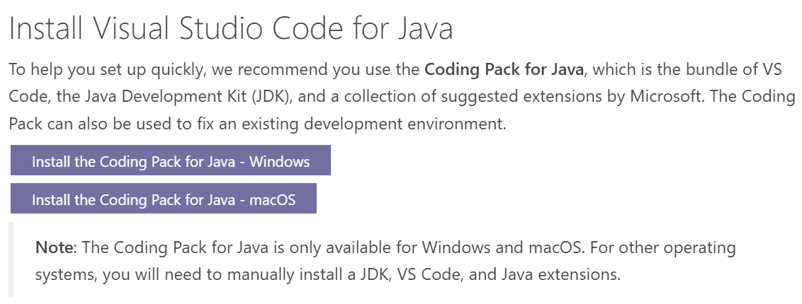

3. Open VS Code. Now open command ctrl+shift+p (in VS Code)
4. Select in dropdown (Java:create java project)
5. Select (No built tools)
6. Select your FolderLocation
7. Type name of your project given in screenshot

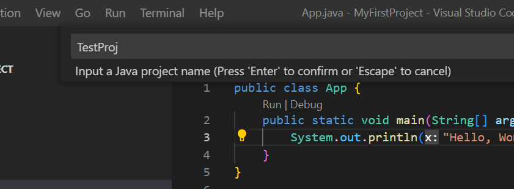

### A Simple Java Program

The process of Java programming can be simplified in three steps: 
Create the program by typing it into a text editor and saving it to a file – HelloWorld.java.
Compile it by typing “javac HelloWorld.java” in the terminal window.
Execute (or run) it by typing “java HelloWorld” in the terminal window.
The below-given program is the most simple program of Java printing “Hello World” to the screen. Let us try to understand every bit of code step by step.
```java
// This is a simple Java program.
// FileName : "HelloWorld.java".
```

```java
class HelloWorld
{
    public static void main(String args[])
    {
        System.out.println("Hello, World");
    }
}
```

1. Class definition
This line uses the keyword class to declare that a new class is being defined. 
```java
class HelloWorld {
    //
    //Statements
}
```

2. HelloWorld
It is an identifier that is the name of the class. The entire class definition, including all of its members, will be between the opening curly brace “{” and the closing curly brace “}“.

#### 3. main method:

In the Java programming language, every application must contain a main method. The main function(method) is the entry point of your Java application, and it’s mandatory in a Java program. whose signature in Java is: 
```java
public static void main(String[] args)
public: So that JVM can execute the method from anywhere.
static: The main method is to be called without an object. The modifiers public and static can be written in either order.
void: The main method doesn’t return anything.
main(): Name configured in the JVM. The main method must be inside the class definition. The compiler executes the codes starting always from the main function.
String[]: The main method accepts a single argument, i.e., an array of elements of type String.
Like in C/C++, the main method is the entry point for your application and will subsequently invoke all the other methods required by your program.
The next line of code is shown here. Notice that it occurs inside the main() method.
System.out.println("Hello, World");
This line outputs the string “Hello, World” followed by a new line on the screen. Output is accomplished by the built-in println( ) method. The System is a predefined class that provides access to the system, and out is the variable of type output stream connected to the console.
```

```java
Compiling and Running Java Programs.
```


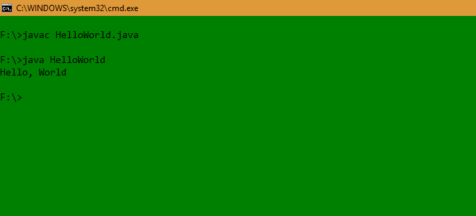

```java
How to install JDK
Step 1: Java8 JDK is available https://www.oracle.com/java/technologies/downloads/#java8-windows
Step 2: Click To Download X64 Installer for windows
```


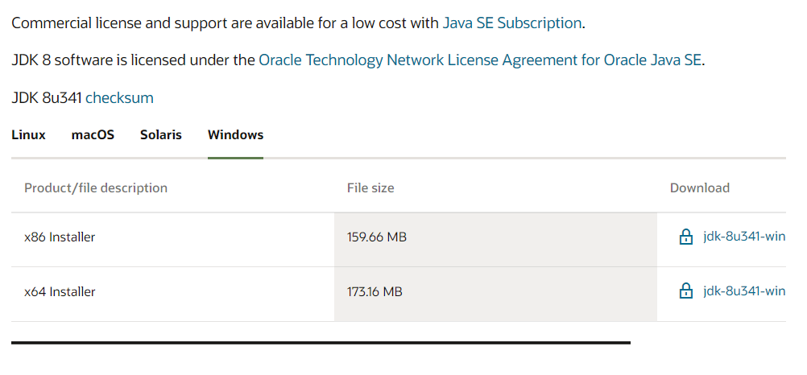

```java
Step 3: After download, run the .exe file and follow the instructions to install Java on your machine. Once you install Java on your machine, you have to set up the environment variable.
```

```java
Step 4: Go to Control Panel -> System and Security -> System. Under the Advanced System Setting option click on Environment Variables as highlighted below.
```


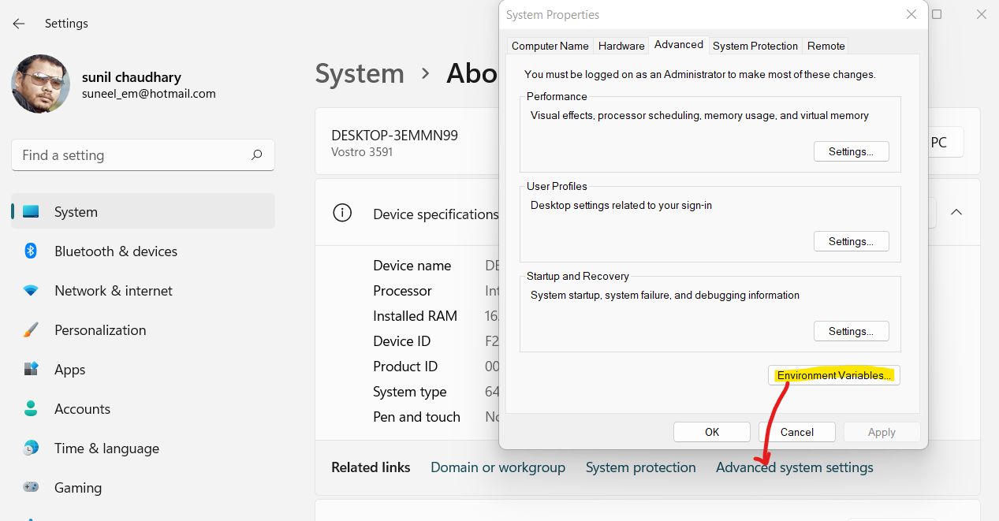

```java
Step 5: Now, you have to alter the “Path” variable under System variables so that it also contains the path to the Java environment. Select the “Path” variable and click on the Edit button as highlighted below.
```


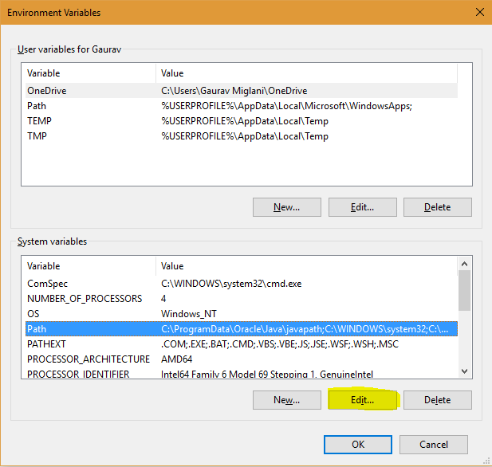

```java
Step 6: You will see a list of different paths, click on the New button, and then add the path where java is installed. By default, java is installed in “C:\Program Files\Java\jdk\bin” folder OR “C:\Program Files(x86)\Java\jdk\bin”. In case, you have installed java at any other location, then add that path.
```


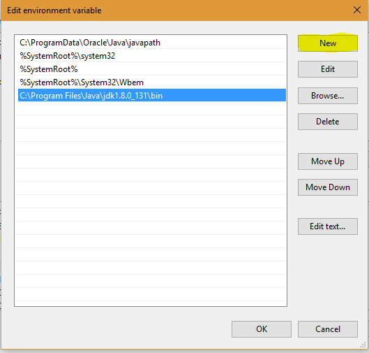

```java
Step 6: Click on OK, Save the settings, and you are done !! Now to check whether the installation is done correctly, open the command prompt and type javac -version. You will see that java is running on your machine.
```

**Conditional Statement**
Java supports the usual logical conditions from mathematics:
Less than: a < b
Less than or equal to: a <= b
Greater than: a > b
Greater than or equal to: a >= b
Equal to a == b
Not Equal to: a != b
You can use these conditions to perform different actions for different decisions.
Java has the following conditional statements:
Use if to specify a block of code to be executed, if a specified condition is true
Use else to specify a block of code to be executed, if the same condition is false
Use else if to specify a new condition to test, if the first condition is false
Use switch to specify many alternative blocks of code to be executed

## The if Statement

Use the if statement to specify a block of Java code to be executed if a condition is true.
Syntax:
```java
if (condition) {
  // block of code to be executed if the condition is true
}
Example:
 if (20 > 18) {
  System.out.println("20 is greater than 18");
}
```

**The else Statement**
```java
Use the else statement to specify a block of code to be executed if the condition is false.
Syntax:
if (condition) {
  // block of code to be executed if the condition is true
} else {
  // block of code to be executed if the condition is false
}
Example:
int time = 20;
if (time < 18) {
  System.out.println("Good day.");
} else {
  System.out.println("Good evening.");
}
// Outputs "Good evening
```

**The else if Statement**
Use the else if statement to specify a new condition if the first condition is false.
```java
Syntax:
if (condition1) {
  // block of code to be executed if condition1 is true
} else if (condition2) {
  // block of code to be executed if the condition1 is false and condition2 is true
} else {
  // block of code to be executed if the condition1 is false and condition2 is false
}
Example:
int time = 22;
if (time < 10) {
  System.out.println("Good morning.");
} else if (time < 20) {
  System.out.println("Good day.");
} else {
  System.out.println("Good evening.");
}
// Outputs "Good evening."
```

Switch Statement in Java

# The switch statement is a multi-way branch statement. In simple words, the Java switch statement executes one statement from multiple conditions. It is like an if-else-if ladder statement. It provides an easy way to dispatch execution to different parts of code based on the value of the expression.

# Syntax:

switch(expression) {
  case x:
    // code block
    break;
  case y:
    // code block
    break;
  default:
    // code block
}
Example:        
int day = 4;
switch (day) {
  case 1:
    System.out.println("Monday");
    break;
  case 2:
    System.out.println("Tuesday");
    break;
  case 3:
    System.out.println("Wednesday");
    break;
  case 4:
    System.out.println("Thursday");
    break;
  case 5:
    System.out.println("Friday");
    break;
  case 6:
    System.out.println("Saturday");
    break;
  case 7:
    System.out.println("Sunday");
    break;
}
// Outputs "Thursday" (day 4)  

# Loops in Java

Simple for Loop
For-each or Enhanced for Loop
A simple for loop is the same as **C/C++**. We can initialize the **variable** check condition and increment/decrement value. It consists of four parts:
Initialization: It is the initial condition which is executed once when the loop starts. Here, we can initialize the variable, or we can use an already initialized variable. It is an optional condition.
Condition: It is the second condition which is executed each time to test the condition of the loop. It continues execution until the condition is false. It must return boolean value either true or false. It is an optional condition.
Increment/Decrement: It increments or decrements the variable value. It is an optional condition.
Statement: The statement of the loop is executed each time until the second condition is false.
**Syntax**:
```java
for(initialization; condition; increment/decrement)
{    
//statement or code to be executed    
}
```

**Example:**
```java
//Code of Java for loop
    for(int i=1;i<=10;i++){
        System.out.println(i);
    }
```

```java
Example Print Pyramid
for(int i=1;i<=5;i++){
for(int j=1;j<=i;j++){
        System.out.print("* ");
}
System.out.println();//new line
```

**Example Print Pyramid**
```java
int term=6;
for(int i=1;i<=term;i++){
for(int j=term;j>=i;j--){
        System.out.print("* ");  }
System.out.println();//new line
```

**Java for-each Loop**
The for-each loop is used to traverse array or collection in Java. It is easier to use than simple for loop because we don't need to increment value and use subscript notation.
It works on the basis of elements and not the index. It returns element one by one in the defined variable.

### Syntax:

```java
for(data_type variable : array_name){
//code to be executed
}
```

**Example:**
```java
//Declaring an array
    int arr[]={12,23,44,56,78};
    //Printing array using for-each loop
    for(int i:arr){
        System.out.println(i);
    }
```

```java
Array
in array is a collection of similar type of elements which has contiguous memory location.Array in Java is index-based, the first element of the array is stored at the 0th index, 2nd element is stored on 1st index and so on.
```


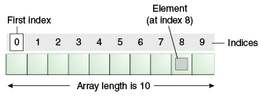

**Advantages**
**Code Optimization:** It makes the code optimized, we can retrieve or sort the data efficiently.
**Random access:** We can get any data located at an index position.

### Disadvantages

**Size Limit:** We can store only the fixed size of elements in the array. It doesn't grow its size at runtime. To solve this problem, **collection framework** is used in Java which grows automatically.

### Types of Array in java

There are three types of array.
Single Dimensional Array
Multidimensional Array
Jagged Array
```java
Syntax:
dataType[] arr;
Instantiation of an Array 
arr=new datatype[size];
```

**Example:**
```java
public class App {
    public static void main(String[] args) throws Exception {
        int[] a=new int[5];//declaration and instantiation
        a[0]=10;//initialization
        a[1]=20;
        a[2]=70;
        a[3]=40;
        a[4]=50;
```

```java
        int[] b=new int[]{1,2,3,4,5,6,7};//declaration and instantiation
```

```java
        //traversing array
        for(int i=0;i<a.length;i++)//length is the property of array
        System.out.println(a[i]);
    }
}
```

**Declaration, Instantiation and Initialization of Java Array**
```java
public class App {
    public static void main(String[] args) throws Exception {
        int a[]={33,3,4,5};//declaration, instantiation and initialization
        //printing array
        for(int i=0;i<a.length;i++)//length is the property of array
        System.out.println(a[i]);
```

```java
    }
}
```

**For-each Loop for Java Array**
```java
public class App {
    public static void main(String[] args) throws Exception {
        int arr[]={33,3,4,5};
        //printing array using for-each loop
        for(int i:arr)
        System.out.println(i);
```

```java
    }
}
```

**Multidimensional Array in Java**
In such case, data is stored in row and column based index (also known as matrix form).

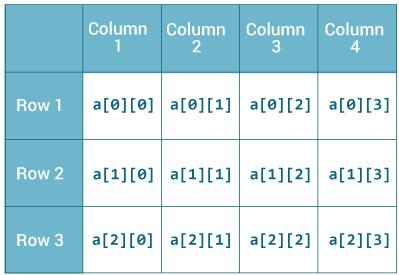

Syntax:
dataType[][] arrayRefVar; 
```java
Instantiate Multidimensional Array
 int[][] arr = new int[2][2]{ {1,2},{4,5} }; // 2 row and 2 column
int[,] arr = new int[2,2]{ {1,2},{4,5} };
```

Example of Multidimensional Java Array

```java
public class App {
    public static void main(String[] args) throws Exception {
              //declaring and initializing 2D array
              int arr[][]={{1,2,3},{2,4,5},{4,4,5}};
              //printing 2D array
              for(int i=0;i<3;i++)
              {
                for(int j=0;j<3;j++)
                {
                System.out.print(arr[i][j]+" ");
                }
              System.out.println();
            }
}
}
```


**Jagged Array in Java**
If we are creating odd number of columns in a 2D array, it is known as a jagged array. In other words, it is an array of arrays with different number of columns.

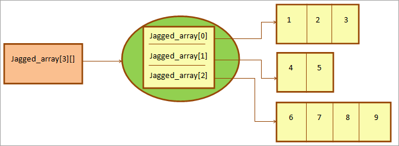


```java
public class App {
    public static void main(String[] args) throws Exception {
int[][] matrix = new int[][]{{ 1, 2, 3 },{ 4, 5, 6, 7 },{ 8, 9 }};
        for (int i = 0; i < matrix.length; i++) //row
        {
            for (int j = 0; j < matrix[i].length; j++) //column
            {
                System.out.print(matrix[i][j]+" ");
            }
            System.out.println();
        }
}
}
Output:
1 2 3
4 5 6 7
8 9
```


```java
Lab: Write a Java program to initialize and display jagged array elements with sum of each row.
```

```java
public class App {
    public static void main(String[] args) throws Exception {
```


```java
        int[][] matrix = new int[][]{{1, 2, 3}, {4, 5, 6, 7}, {8, 9}};
```


```java
        for (int i = 0; i < matrix.length; i++) //row
        {
            int sum = 0;
            for (int j = 0; j < matrix[i].length; j++) //column
            {
                System.out.print(matrix[i][j] + " ");
                sum += matrix[i][j];
            }
            System.out.println("Sum of row " + (i + 1) + ": " + sum);
        }
    }
}
```

```java
Lab: Write a Java program to initialize and display 2D array elements with sum of each row.
public class App {
    public static void main(String[] args) throws Exception {
```


```java
        int[][] matrix = new int[][]{{1, 2, 3}, {4, 5, 6, 7}, {8, 9}};
```


```java
        for (int i = 0; i < matrix.length; i++) // row
        {
            int sum = 0; // Variable to store sum of elements in each row
            for (int j = 0; j < matrix[i].length; j++) // column
            {
                System.out.print(matrix[i][j] + " ");
                sum += matrix[i][j]; // Add the current element to the sum
            }
            System.out.println("Sum of row " + (i + 1) + ": " + sum); // Print sum of the current row
        }
    }
}
```

```java
Lab:Write a Java program to initialize and display jagged array elements with sum of each column.
Lab: Write a Java program to find the maximum element in each row of a 2D array.
Lab:Write a Java program to count even and odd numbers in a jagged array.
Lab:Write a Java program to transpose a 2D array.
```


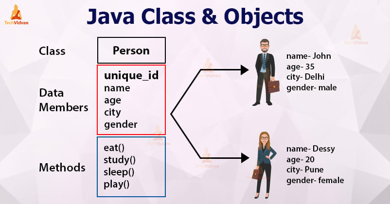

**Class and Object**
The object is *an entity which has state and behavior*. The object is *an instance of a class*.
An object has three characteristics:
**State:** represents the data (value) of an object.
**Behavior:** represents the behavior (functionality) of an object such as deposit, withdraw, etc.
**Identity:** An object identity is typically implemented via a unique ID. The value of the ID is not visible to the external user. However, it is used internally by the JVM to identify each object uniquely.
A **class** is a group of objects which have common properties. It is a template or blueprint from which objects are created. A class in Java can contain:

### Fields

### Methods

### Constructors

### Blocks

### Nested class and interface

### Syntax to declare a class:

```java
class <class_name>{
    field;
    method;
}
```

**Class and Object Example:**
```java
public class App {
    public static void main(String[] args) throws Exception {
      //Creating an object or instance
        Student s1=new Student();//creating an object of Student
        //Printing values of the object
        System.out.println(s1.id);//accessing member through reference variable
        System.out.println(s1.name);
      }
  }
//Defining a Student class.
class Student{
 //defining fields
 int id=1;//field or data member or instance variable
 String name="Sunil Chaudhary";
 //creating main method inside the Student class
}
```

**Method Overloading**
If a **class** has multiple methods having same name but different in parameters, it is known as Method Overloading.
If we have to perform only one operation, having same name of the methods increases the readability of the **program**.
```java
public class App {
    public static void main(String[] args) throws Exception {
        DisplayOverloading obj = new DisplayOverloading();
        System.out.println(obj.add(10, 20));
        System.out.println(obj.add(10, 20, 30));
      }
  }
  class DisplayOverloading
  {
    int add(int a, int b)
    {
      int sum = a+b;
      return sum;
    }
    int add(int a, int b, int c)
    {
      int sum = a+b+c;
      return sum;
    }
  }
```

**Constructor Overloading**
If a **class** has multiple constructors having same name but different in parameters, it is known as Constructor Overloading.

### Example:

```java
public class App {
    public static void main(String[] args) throws Exception {
        DisplayOverloading obj = new DisplayOverloading(2,3);
        System.out.println(obj.Add());
      }
  }
  class DisplayOverloading
  {
    int a=0;
    int b=0;
    public DisplayOverloading()
    {
```

```java
    }
    public DisplayOverloading(int aa, int bb)
    {
        a=aa;
        b=bb;
    }
    public int Add()
    {
        return a+b;
    }
```

```java
  }
```

Constructor Chaining
Constructor chaining is the process of calling one constructor from another constructor with respect to current object. 
One of the main use of constructor chaining is to avoid duplicate codes while having multiple constructor (by means of constructor overloading) and make code more readable.

### Constructor chaining can be done in two ways:

**By using this() keyword:** It is used when we want to call the current class constructor within the same class.
**By using super() keyword:** It is used when we want to call the superclass constructor from the base class.
Why do we need constructor chaining? 
This process is used when we want to perform multiple tasks in a single constructor rather than creating a code for each task in a single constructor we create a separate constructor for each task and make their chain which makes the program more readable. 

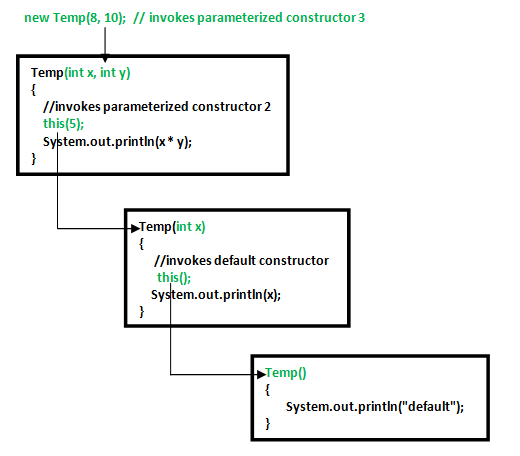

Example:
```java
public class App
{
        public static void main(String[] args)
        {
```

```java
            ConstructorChain obj=new ConstructorChain();
        }
```

```java
}
class ConstructorChain
{
    //default constructor
    ConstructorChain()
    {
    this(“Samriddhi");
    System.out.println("Default constructor called.");
    }
    //parameterized constructor
    ConstructorChain(String str)
    {
    System.out.println("Parameterized constructor called");
    }
}
```

```java
Output:
Parameterized constructor called
Default constructor called.
```

**Invoking Base class Constructor:**
A derived class can call a constructor in its base class using the **super** keyword. 

Example: using **Super()** keyword
```java
public class App {
    public static void main(String[] args) throws Exception {
        ChildClass cls=new ChildClass();
    }
}
class BaseClass
{
    BaseClass()
    {
    System.out.println("Base Class Constructor is Called");
    }
}
class ChildClass extends BaseClass
{
    ChildClass()
    {
        super();
        System.out.println("From Base Class Constructor");
    }
}
```

**Output:**
```java
Base Class Constructor is Called
From Base Class Constructor
```

**Private Constructor (VVI)**
The use of private constructor is to serve **singleton** classes. 
A singleton class is one which limits the number of objects creation to one. Using private constructor, we can ensure that no more than one object can be created at a time. 
It is often used in scenarios like managing database connections, logging, configuration settings, etc.
The main purpose of using a private constructor is **to restrict object creation**. Shown below example:
```java
public class App {
    public static void main(String[] args) throws Exception {
        int square=Rectangle.Square(2);
    }
}
class Rectangle {
    private Rectangle() {
```

```java
    }
    public static int Square(int x) {
        return x * x;
    }
}
Here,
You can't create: new Rectangle();
Only use: Rectangle.Square(2);
```

```java
We will see in the below example how to use private constructor for limiting the number of objects for a singleton class.
Example2
public class App {
    public static void main(String[] args) throws Exception {
    // Step 4: Use getInstance() to access the single instance of Object Creation
        SingleTonClass cls = SingleTonClass.objectCreationMethod();
    // Step 5: Trying to create another instance (will return the same instance)
        SingleTonClass cls1 = SingleTonClass.objectCreationMethod();
        cls.display();
        // Verify both references point to the same instance
        System.out.println(cls == cls1);
    }
}
```

```java
class SingleTonClass {
    // Step 1: Declare a private static instance of the class
    private static SingleTonClass obj = null;
    // Step 2: Private constructor prevents instantiation from other classes
    private SingleTonClass() {
```

```java
    }
    // Step 3: Public method to get the single instance of the class
    public static SingleTonClass objectCreationMethod() {
        if (obj == null) {
            obj = new SingleTonClass();
        }
        return obj;
    }
    public void display() {
        System.out.println("Singleton class Example");
    }
```

```java
}
```

**Use of Private Constructor:**
**Singleton Pattern:** To ensure that a class has only one instance and provides a global point of access to that instance.
**Utility Classes:** To prevent the instantiation of utility classes that contain only static methods and constants.
**Factory Methods:** To control object creation and provide more flexible ways to create instances through factory methods.
**Preventing Sub-classing:** To prevent the creation of subclasses by making the constructor private in a class intended to be used.
**Resource Management:** In classes responsible for resource management (e.g., managing database connections), you might use a private constructor to ensure proper resource allocation.

## Access Modifiers
Access modifiers specify the availability of a parent class. 
In real-time coding, we cannot allow child classes to have access to all of the other classes. 
The availability of a data member, method, or constructor can be described in four ways.


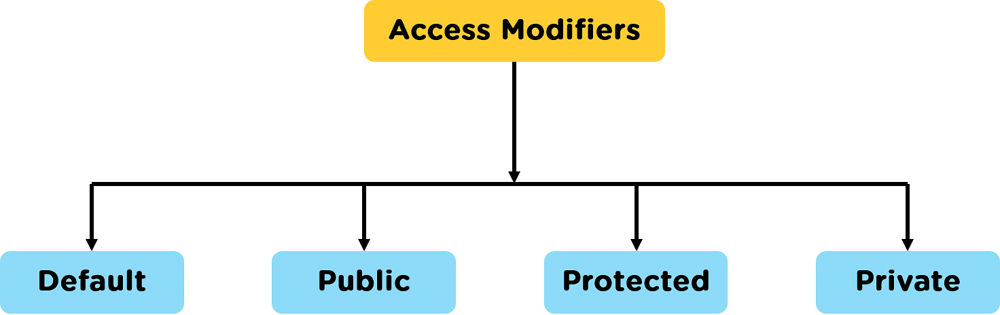

**Default Access Modifier:**
**Default modifier is also called (package-private access).**
If no **modifier** is specified, java assigns **default** access
The Member (**class, method and variables**) is access with in the **same package**

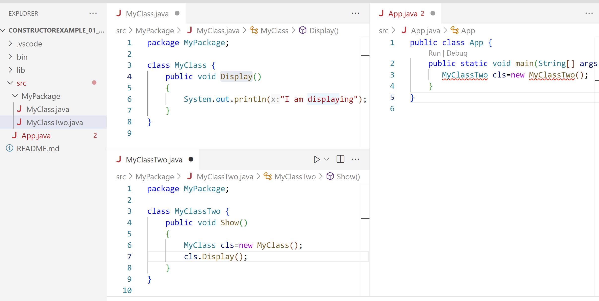

Here, the **MyClassTwo** and **MyClass** class has the **default** access modifier. And the class is visible to all the classes that belong to the **MyPackage** package. However, if we try to use the any (**MyClassTwo** or **MyClass**) class in another class outside of **MyPackage**, we will get a compilation error.
**Private Access Modifier**
When **access modifier (method and variables)** declared **private modifier** it can access within the **same class**, they cannot be accessed outside of the class even if they are belong to **same package**.
For example,

```java
public class App {
    public static void main(String[] args) throws Exception {
       MyClass cls=new MyClass();
       cls.Show()
    }
}
class MyClass
{
    private int a=100;//private member
    private void Display()//private function
    {
        System.out.println("Private value of a is: "+a);
    }
    public void Show()
    {
        Display();//allowed
        System.out.println("Accessing Private value of a: "+a);
    }
}
```

```java
In the above example, 
private member (a and Display) are accessible with in class shown in above code.
Even though it is declare with in the same package. It cannot access private member directly.
Private member access indirectly via public methods, in our code Show() is the public method create inside class. 
we can also access private member using getter and setter we will see this example in encapsulation chapter for better understanding.
```

```java
Protected Access Modifier
When methods and data members are declared protected, we can access them within the same package as well as from subclasses. For example,
class Animal {
    protected int a;
    // protected method
    protected void display() {
        System.out.println("I am an animal");
    }
}
class Dog extends Animal {
```

```java
    public void Show()
    {
        display();
        System.out.println(a);
    }
}
```

```java
Public Access Modifier
When methods, variables, classes, and so on are declared public, then we can access them from anywhere. The public access modifier has no scope restriction. For example,
// Animal.java file
// public class
public class Animal {
    // public variable
    public int legCount;
```

```java
    // public method
    public void display() {
        System.out.println("I am an animal.");
        System.out.println("I have " + legCount + " legs.");
    }
}
```

```java
// Main.java
public class Main {
    public static void main( String[] args ) {
        // accessing the public class
        Animal animal = new Animal();
```

```java
        // accessing the public variable
        animal.legCount = 4;
        // accessing the public method
        animal.display();
    }
}
```

```java
Q.1 why we use interfaces when we have abstract classes?
```

**Interface:**
 An interface in Java is a blueprint of a class. 
It is used to achieve total abstraction.
Since java does not support multiple inheritances in the case of class, by using an interface it can achieve multiple inheritances.
It is also used to achieve loose coupling.
Interfaces are used to implement abstraction
**Syntax:**
```java
interface <interface_name>{
    // declare constant fields
    // declare methods that abstract
    // by default.
}
```

**The relationship between classes and interfaces**


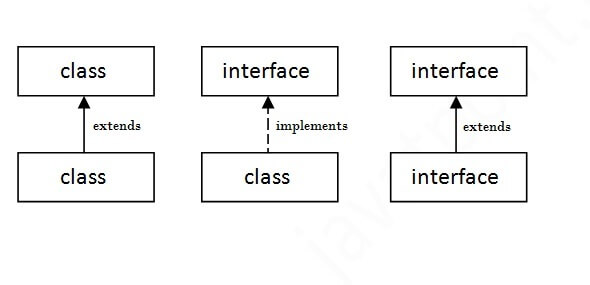

```java
public class App
{
    public static void main(String[] args) throws Exception {
        A6 obj = new A6();
        obj.print();
      }
    }
interface printable
{
    void print();
}
class A6 implements printable
{
    public void print()
    {
        System.out.println("Hello");
    }
}
```

```java
Difference Between Class and InterfaceThe major differences between a class and an interface are:
```

```java
Q.Multiple inheritance is not supported through class in java, but it is possible by an interface, why?
Multiple inheritance is not supported in the case of class because of ambiguity. Multiple inheritance through classes can lead to issues like the "diamond problem," However, it is supported in case of an interface because there is no ambiguity. It is because its implementation is provided by the implementation class. For example:
```

```java
public class App
{
    public static void main(String[] args) throws Exception
    {
       A aa=new A();
       aa.printA();
       aa.printB();
    }
    }
interface IA
{
    void printA();
}
interface IB
{
    void printB();
}
class A implements IA,IB
    {
        public void printA()
        {
            System.out.println("MethodA");
        }
        public void printB()
        {
            System.out.println("MethodB");
        }
}
```

Output:
MethodA
MethodB

### Packages:

A java package is a group of similar types of **classes**, **interfaces** and **sub-packages**.
It helps in organizing and managing large code bases by grouping related classes together.
A package name is the same as the directory(Folder) name which contains the .java files
Syntax:
```java
package nameOfPackage;
There are two types of packages
Pre-defined
User Defined
Pre-Defined Packages examples are Java.lang, java.util, java,io, java.awt, java.swing, java.net, java.sql
User Defined Package example are package p1, package college, package mypackage
```

**Advantages:**
Java package is used to categorize the classes and interfaces so that they can be easily maintained.
Java package provides access protection.
Java package removes naming collision.
Reusability
Readability

### How to access package from another package?

There are three ways to access the package from outside the package.
```java
import package.*;
```

```java
import package.classname;
```

```java
fully qualified name.
```

**import package.*;**
```java
package MyPackage;
public class MyClassOne {
```

```java
}
```

```java
import MyPackage.*;
public class App {
    public static void main(String[] args) throws Exception {
       MyClassOne cls=new MyClassOne();
     }
    }
import package.classname;
import MyPackage.MyClassOne;
```

```java
public class App {
    public static void main(String[] args) throws Exception {
       MyClassOne cls=new MyClassOne();
     }
    }
fully qualified name.
public class App {
    public static void main(String[] args) throws Exception {
       MyPackage.MyClassOne cls=new MyPackage.MyClassOne();
     }
    }
```

**Subpackage in java**
Package inside the package is called the **subpackage**. It should be created to categorize the package further.
Example:
```java
package MyPackage.MySubPackage;
public class MySubClassOne {
```

```java
}
```

**Advantage of Java Package**
1) Java package is used to categorize the classes and interfaces so that they can be easily maintained.
2) Java package provides access protection.
3) Java package removes naming collision.

### How to Create Java Packages

### Right click on Project select (New Package_


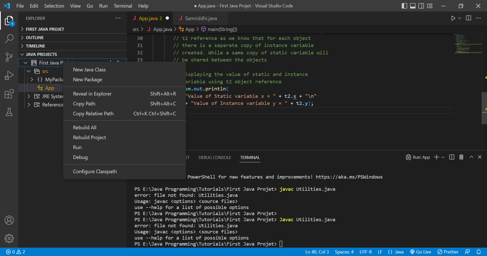


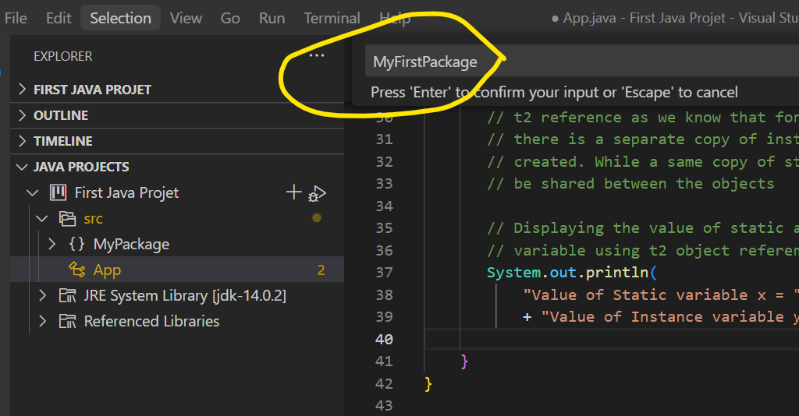

Package can be also created using command line

### Simple example of java package

The package keyword is used to create a package in java.
```java
package mypack;
public class Simple{
 public static void main(String args[]){
    System.out.println("Welcome to package");
   }
}
```

**How to compile java package**
If you are not using any IDE, you need to follow the syntax given below:

### javac -d directory javafilename

### For example

javac -d .Simple.java
The **-d** switch specifies the **destination** where to put the generated class file. You can use any directory name like **/home (in case of Linux),** **d:/abc (in case of windows)** etc. If you want to keep the package within the same directory, you can use **. (dot)**.

### Inheritance:

**Inheritance** can be defined as the process where one class acquires the properties (methods and fields) of another. With the use of **inheritance** the information is made manageable in a hierarchical order.
The class which inherits the properties of other is known as **subclass** (derived class, child class) and the class whose properties are inherited is known as **superclass** (base class, parent class).

### extends Keyword

extends is the keyword used to inherit the properties of a class. Following is the syntax of extends keyword.

### Syntax:

```java
class Super 
{
   .....
}
class Sub extends Super 
{
   .....
}
```

**Example:**
```java
public class App
{
```

```java
    public static void main(String[] args)
    {
        DerivedClass cls=new DerivedClass();
        cls.Method1();
        cls.Method2();
```

```java
    }
}
class BaseClass {
```

```java
       public void Method1()
       {
        System.out.println("I am from base class");
       }
    }
```

```java
class DerivedClass extends BaseClass {
    public void Method2()
    {
     System.out.println("I am from child class");
    }
}
```

**Output:**
I am from base class
I am from child class

### The super keyword

The super keyword is similar to this keyword. Following are the scenarios where the super keyword is used.
It is used to differentiate the members of superclass from the members of subclass, if they have same names.
It is used to invoke the superclass constructor from subclass.

### Super class Example:

```java
public class App
{
```

```java
    public static void main(String[] args)
    {
        DerivedClass cls=new DerivedClass();
```

```java
        cls.Method2();
```

```java
    }
}
class BaseClass {
```

```java
       public void Method1()
       {
        System.out.println("I am from base class");
       }
    }
```

```java
class DerivedClass extends BaseClass {
    public void Method2()
    {
    super.Method1();//calling base class method (similar to base keyword in C#)
     System.out.println("I am from child class");
    }
}
```

**Types of Inheritance**
There are various types of inheritance as demonstrated below.

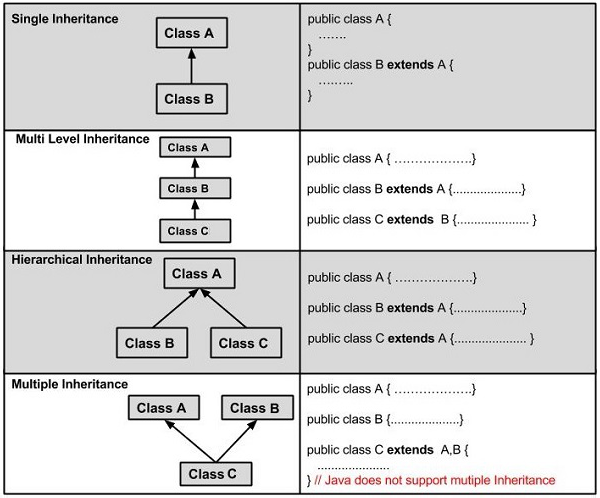

### Single Inheritance:

When a class inherits another class, it is known as a single inheritance. In the example given below, A class inherits the B class, so there is the single inheritance.

```java
public class App
{
    public static void main(String[] args)
    {
        B cls=new B();
        cls.Method2();
        cls.Method1();
    }
}
class A {
       public void Method1()
       {
        System.out.println("I am from base class");
       }
    }
class B extends A {
    public void Method2()
    {
     System.out.println("I am from child class");
    }
}
```

**Multilevel Inheritance Example**
When there is a chain of inheritance, it is known as multilevel inheritance. As you can see in the example given below, C class inherits the B class which again inherits the A class, so there is a multilevel inheritance.

```java
public class App
{
    public static void main(String[] args)
    {
        C cls=new C();
        cls.Method2();
        cls.Method1();
        cls.Method3();
    }
}
class A {
       public void Method1()
       {
        System.out.println("I am from A class");
       }
    }
class B extends A {
    public void Method2()
    {
     System.out.println("I am from B class");
    }
}
class C extends B {
    public void Method3()
    {
     System.out.println("I am from C class");
    }
}
```

**Hierarchical Inheritance Example**
When two or more classes inherits a single class, it is known as hierarchical inheritance. In the example given below, B and C classes inherits the A class, so there is hierarchical inheritance.

```java
class A {
       public void Method1()
       {
        System.out.println("I am from A class");
       }
    }
class B extends A {
    public void Method2()
    {
     System.out.println("I am from B class");
    }
}
class C extends A {
    public void Method3()
    {
     System.out.println("I am from C class");
    }
}
```

**Why multiple inheritance is not supported in java?**
To reduce the complexity and simplify the language, multiple inheritance is not supported in java.
Consider a scenario where A, B, and C are three classes. The C class inherits A and B classes. If A and B classes have the same method and you call it from child class object, there will be ambiguity to call the method of A or B class.
Since compile-time errors are better than runtime errors, Java renders compile-time error if you inherit 2 classes. So whether you have same method or different, there will be compile time error.
```java
class A
    {
    void msg(){System.out.println("Hello");}
    }
class B
    {
    void msg(){System.out.println("Welcome");}
    }
class C extends A,B
    {//suppose if it were
        void msg(){System.out.println("Hi");}
    }
```

**How to Solve the Multiple Inheritance Problem in Java**
Object Oriented Programming provides a user the feature of multiple inheritance, wherein a class can inherit the properties of more than a single parent class. In simpler terms, multiple inheritance means a class extending more than one class.
Multiple inheritance in java means one class implementing two or more than two interfaces simultaneously. In simple words multiple inheritance in java means one class accessing the states and behavior of two or more than two interfaces simultaneously.

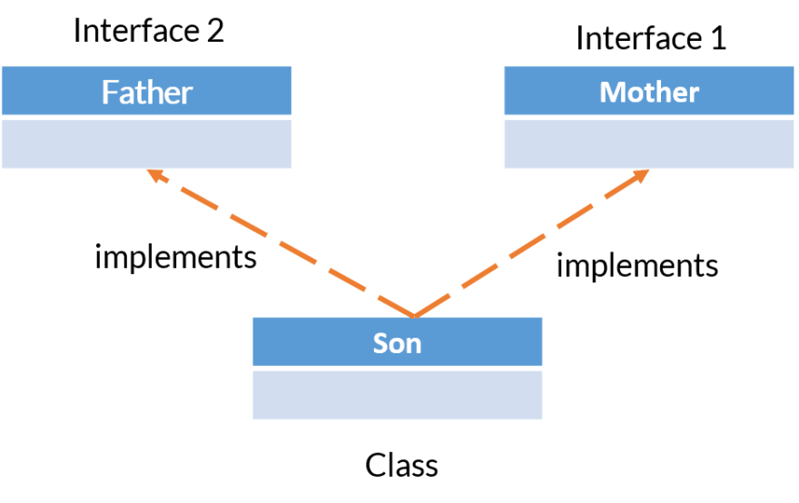

Example:

```java
public class App
{
    public static void main(String[] args)
    {
       C c=new C();
       c.display();
       c.show();
    }
}
interface IA
{
   public void show();
}
interface IB
{
   public void display();
}
class C implements IA,IB
{
    public void show()
    {
        System.out.println("Method One");
    }
    public void display()
    {
        System.out.println("Method One");
    }
}
```

**Overriding:**

**Method Overriding:** Declaring a method in sub class which is already present in parent class is known as method overriding. Overriding is done so that a child class can give its own implementation to a method which is already provided by the parent class. In this case the method in parent class is called **overridden method** and the method in child class is called **overriding method**. In this guide, we will see what is method overriding in Java and why we use it.
```java
public class App
{
    public static void main(String[] args)
    {
        Boy obj = new Boy();
        //This will call the child class version of eat()
        obj.eat();
    }
}
class Human{
    //Overridden method
    public void eat()
    {
       System.out.println("Human is eating");
    }
 }
 class Boy extends Human{
    //Overriding method
    public void eat(){
       System.out.println("Boy is eating");
    }
}
```

```java
Output:
Boy is eating
 Overriding is also done in java using @override keyword
public class App
{
    public static void main(String[] args)
    {
        Dog obj = new Dog();
        obj.displayInfo();
    }
}
class Animal {
    public void displayInfo() {
       System.out.println("I am an animal.");
    }
 }
```

```java
 class Dog extends Animal {
    @Override
    public void displayInfo() {
       System.out.println("I am a dog.");
    }
 }
Output: I am a dog.
```

**Advantage of method overriding:**
The main advantage of method overriding is that the class can give its own specific implementation to a inherited method **without even modifying the parent class code.**
This is helpful when a class has several child classes, so if a child class needs to use the parent class method, it can use it and the other classes that want to have different implementation can use overriding feature to make changes without touching the parent class code.

### Super keyword in Method Overriding:

The **super **keyword is used in method overriding to call the method of the superclass (parent class) from the subclass (child class). When you override a method in the subclass, you can still access the original method from the superclass using **super**. By using super we can call the overridden method as shown in the example below:
```java
public class App
{
    public static void main(String[] args)
    {
        ChildClass obj = new ChildClass();
        obj.myMethod();
    }
}
class ABC{
    public void myMethod()
    {
     System.out.println("Overridden method");
    }
 }
 class ChildClass extends ABC{
    public void myMethod(){
     //This will call the myMethod() of parent class
     super.myMethod();
     System.out.println("Overriding method");
    }
}
```

**Output:**
Overridden method
Overriding method

### Access Specifiers in Method Overriding:

The same method declared in the superclass and its subclasses can have different access specifiers. However, there is a restriction.
We can only use those access specifiers in subclasses that provide larger access than the access specifier of the superclass. For example,
Suppose, a method myClass() in the superclass is declared protected. Then, the same method myClass() in the subclass can be either public or protected, but not private.
```java
public class App
{
    public static void main(String[] args)
    {
        Dog d1 = new Dog();
        d1.displayInfo();
    }
}
class Animal {
    protected void displayInfo() {
       System.out.println("I am an animal.");
    }
 }
```

```java
 class Dog extends Animal {
    public void displayInfo() {
       System.out.println("I am a dog.");
    }
 }
Output:
I am a dog.
```

**Java Overriding Rules:**
Both the superclass and the subclass must have the same method name, the same return type and the same parameter list.
We cannot override the method declared as final and static.
We should always override abstract methods of the superclass

### Inner Class:

In Java, just like methods, variables of a class too can have another class as its member. Writing a class within another is allowed in Java. The class written within is called the **nested class**, and the class that holds the inner class is called the **outer class**.

### There are certain advantages associated with inner classes are as follows:

Making code clean and readable.
Private methods of the outer class can be accessed, so bringing a new dimension and making it closer to the real world.
Optimizing the code module.

### Syntax:

```java
class Java_Outer_class
    {
        //code
        class Java_Inner_class
        {
         //code
        }
    }
```

**Types of Inner Class**
Local Inner Classes
Anonymous Inner Classes
Static Inner Classes

**Local Inner Class:** declared class inside class
```java
public class App
{
    public static void main(String[] args) throws Exception
    {
        Outer.Inner in = new Outer().new Inner();
        in.show();
    }
}
class Outer {
```

```java
    class Inner {
        // show() method of inner class
        public void show()
        {
            // Print statement
            System.out.println("In a nested class method");
        }
    }
}
```

```java
Anonymous Inner Class: An Anonymous Inner Class in Java is a way to create a class on the spot, without giving it a name. It's often used when you need to quickly implement a method or override methods of an interface or superclass.
 Java Anonymous inner class can be created in two ways:
Class (may be abstract or concrete).
Interface
```

```java
//class 2
public class App
{
    //  An anonymous class with Demo as base class
    static Demo d = new Demo()
    {
        // Method 1
        // show() method
        void show()
        {
            // Calling method show() via super keyword
            // which refers to parent class
            super.show();
            // Print statement
            System.out.println("i am in Flavor1Demo class");
        }
    };
    public static void main(String[] args) throws Exception
    {
       d.show();
    }
}
// Class 1
class Demo {
     void show()
    {
       System.out.println("i am in show method of super class");
    }
}
```

**Example Using Abstract Class**
```java
abstract class Utilities{
    abstract void display();
  }
public class App {
      public static void main(String[] args)
      {
        Utilities p=new Utilities()
        {
            void display()
            {
                System.out.println("Good Morning");
            }
        };
            p.display();
      }
}
```

**Example Using Interface**
```java
interface Utilities{
   public void display();
  }
public class App {
      public static void main(String[] args)
      {
        Utilities p=new Utilities()
        {
           public void display()
            {
                System.out.println("Good Morning");
            }
        };
            p.display();
      }
}
Static Inner Class: Static nested classes are not technically inner classes. They are like a static member of outer class.
//class 3 Main CLass
public class App
{
```

```java
    public static void main(String[] args) throws Exception
    {
        Outer.Inner obj = new Outer.Inner();
        obj.display();
    }
}
class Outer {
    private static void outerMethod()
    {
        System.out.println("inside outerMethod");
    }
    static class Inner {
        public static void display()
        {
             System.out.println("inside inner class Method");
             outerMethod();
        }
    }
}
```

**Final and Static Modifier**
**Final Access Modifier** is a modifier applicable to **classes**, **methods**, and **variables**. If we declare a parent class method as **final** then we can’t **override** that method in the child class because its implementation is final and if a class is declared as final we can’t extend the functionality of that class i.e we can’t create a child class for that class i.e **inheritance** is not possible for final classes. 
**Every method** present inside the final class is always **final** by default but **every variable** present inside the final class need not be final. 
The main advantage of the final keyword is we can achieve security and we can provide a unique implementation. 
Preventing Inheritance
Immutable Variables
Preventing Method Overriding
But the main **disadvantage** of the final keyword is we are **missing key benefits of OOPs** like **Inheritance**(Because of the final class)

### Example:

```java
// Class 2
// Sub-class
// Extending above class
public class App extends P
{
    // Method 1
    // Trying to override the last name
    public void surName()
    {
        // Display surname
        System.out.println("Sharma");
    }
    // Method 2
    // Main driver method
```

```java
    public static void main(String[] args)
    {
       // Display message
       System.out.println("Samriddhi");
    }
}
// Class 1
// Super-class
class P {
    // Method 1
    // To declare first name
    public void firstName()
    {
        // Passing name and print it
        System.out.println("SUnil");
    }
    // Method 2
    // To declare last name
    public final void surName()
    {
        // Passing name and print it
        System.out.println("Chaudhary");
    }
}
```

**Throws an exception**

### Static Access Modifier

The static modifier is used to create members (fields or methods) that belong to the class itself, rather than to a specific instance of the class.
A static method can be called on the class itself, without needing an instance of the class.
Static members can be accessed using the class name (e.g., ClassName.staticField or ClassName.staticMethod()).
Instance data members declaration should preceded by a keyword **static**.
Static variables **reduce the amount of memory** used by a program.
In Static, Memory is allocated only once, at the time of class loading.
Static variables **Exists for the entire lifetime** of the program.
Static data member is like a **global** and is available to all methods.

```java
public class App
{
    /// Creating a static variable and
    // initializing a custom value
    static int x = 10;
```

```java
    // Creating a instance variable and
    // initializing a custom value
    int y = 20;
```

```java
    // Main driver method
    public static void main(String[] args)
    {
       // Creating an object of class inside main() method
       App t1 = new App();
```

```java
       // Accessing and re-initializing the
       // static and instance variable
       // using t1 reference
       t1.x = 88;
       t1.y = 99;
```

```java
       // Creating an object of class inside main() method
       // again
       App t2 = new App();
```

```java
       // Accessing the static and instance variable using
       // t2 reference as we know that for each object
       // there is a separate copy of instance variable
       // created. While a same copy of static variable will
       // be shared between the objects
```

```java
       // Displaying the value of static and instance
       // variable using t2 object reference
       System.out.println(
           "Value of Static variable x = " + t2.x + "\n"
           + "Value of Instance variable y = " + t2.y);
```

```java
    }
}
```

**Handling Exceptions:**
**Exception Handling** in Java is one of the effective means to handle the **runtime errors** so that the regular flow of the application can be preserved. Java Exception Handling is a mechanism to handle **runtime errors** such as **ClassNotFoundException**, **IOException**, **SQLException**, **RemoteException**, etc.
**Exception** is an unwanted or unexpected event, which occurs during the execution of a program, i.e. at run time, that disrupts the normal flow of the program’s instructions. Exceptions can be caught and handled by the program. When an exception occurs within a method, it creates an object. This object is called the **exception object**. It contains information about the exception, such as the **name** and **description** of the exception and the state of the program when the exception occurred

### Major reasons why an exception Occurs

Invalid user input
Device failure
Loss of network connection
Physical limitations (out of disk memory)
Code errors
Opening an unavailable file
**Errors** represent irrecoverable conditions such as Java virtual machine (JVM) running out of memory, memory leaks, stack overflow errors, library incompatibility, infinite recursion, etc. Errors are usually beyond the control of the programmer, and we should not try to handle errors.

### Differences between Error and Exception:

**Error: **An Error indicates a serious problem that a reasonable application should not try to catch.
**Exception: **Exception indicates conditions that a reasonable application might try to catch.

**Handling exceptions in Java.**
try...catch block
finally block
```java
throw and throws keyword
```

**Java try...catch block**
The  block is used to handle exceptions in Java. Here's the syntax of try...catch block:
```java
 try {
            // code
          }
          catch(Exception e) {
            // code
          }
```

```java
Here, we have placed the code that might generate an exception inside the try block. Every try block is followed by a catch block.
When an exception occurs, it is caught by the catch block. The catch block cannot be used without the try block.
Example:
public class App
{
    public static void main(String[] args)
    {
        try {
```

```java
            // code that generate exception
            int divideByZero = 5 / 0;
            System.out.println("Rest of code in try block");
          }
```

```java
          catch (ArithmeticException e) {
            System.out.println("ArithmeticException => " + e.getMessage());
          }
    }
}
```

```java
Output:
ArithmeticException => / by zero
```

**Java finally block**
In Java, the **finally** block is always executed no matter whether there is an exception or not.
The **finally** block is optional. And, for each try block, there can be only one **finally** block.
The basic syntax of finally block is:
```java
try {
            //code
          }
          catch (ExceptionType1 e1) {
            // catch block
          }
          finally {
            // finally block always executes
          }
If an exception occurs, the finally block is executed after the try...catch block. Otherwise, it is executed after the try block. For each try block, there can be only one finally block.
```

**Example: Java Exception Handling using finally block**

```java
public class App
{
    public static void main(String[] args)
    {
        try {
            // code that generates exception
            int divideByZero = 5 / 0;
          }
```

```java
          catch (ArithmeticException e) {
            System.out.println("ArithmeticException => " + e.getMessage());
          }
```

```java
          finally {
            System.out.println("This is the finally block");
          }
    }
}
```

**Output:**
ArithmeticException => / by zero
This is the finally block
In the above example, we are dividing a number by 0 inside the try block. Here, this code generates an ArithmeticException.
The exception is caught by the catch block. And, then the finally block is executed.

### Java throw and throws keyword

The Java **throw** keyword is used to explicitly throw a **single exception**.
When we throw an exception, the flow of the program moves from the try block to the catch block.
```java
public class App
{
    public static void divideByZero() {
```

```java
        // throw an exception
        throw new ArithmeticException("Trying to divide by 0");
      }
    public static void main(String[] args)
    {
        divideByZero();
    }
}
In the above example, we are explicitly throwing the ArithmeticException using the throw keyword.
Similarly, the throws keyword is used to declare the type of exceptions that might occur within the method. It is used in the method declaration.
```

**Java throws keyword:**
```java
import java.io.*;
```

```java
public class App
{
    // declareing the type of exception
  public static void findFile() throws IOException
  {
```

```java
    // code that may generate IOException
    File newFile = new File("test.txt");
    FileInputStream stream = new FileInputStream(newFile);
  }
```

```java
    public static void main(String[] args)
    {
        try {
            findFile();
          }
          catch (IOException e) {
		throw e;
            System.out.println(e);
          }
    }
}
```

**Output:**
java.io.FileNotFoundException: test.txt (The system cannot find the file specified)
When we run this program, if the file **test.txt** does not exist, FileInputStream throws a FileNotFoundException which extends the IOException class.
The findFile() method specifies that an IOException can be thrown. The main() method calls this method and handles the exception if it is thrown.
If a method does not handle exceptions, the type of exceptions that may occur within it must be specified in the throws clause.

**How to Create Exception Class and What is custom exceptions or User defined Exception?**
Java exceptions cover almost all the general type of exceptions that may occur in the programming. However, we sometimes need to create custom exceptions.
Following are few of the reasons to use custom exceptions:
To catch and provide specific treatment to a subset of existing Java exceptions.
Business logic exceptions: These are the exceptions related to business logic and workflow. It is useful for the application users or the developers to understand the exact problem.
In order to create custom exception, we need to extend Exception class that belongs to **java.lang** package.
Consider the following example, where we create a custom exception named WrongFileNameException:
```java
public class App
{
        public static void main(String[] args)
    {
        try {
            // Throw an object of user defined exception
            throw new MyException("User Defined");
        }
        catch (MyException ex) {
            System.out.println("Caught");
```

```java
            // Print the message from MyException object
            System.out.println(ex.getMessage());
        }
    }
}
class MyException extends Exception {
    public MyException(String s)
    {
        // Call constructor of parent Exception
        super(s);
    }
}
```

```java
Output:
Caught
User Defined
```

**Concurrency:**
**Java Concurrency** package covers **concurrency, multithreading**, and **parallelism** on the Java platform. Concurrency is the ability to run several or multi programs or applications in parallel. The **backbone** of Java concurrency is  (a lightweight process, which has its own files and stacks and can access the shared data from other threads in the same process).
The throughput and the interactivity of the program can be improved by performing time-consuming tasks asynchronously or in parallel.
**Java 5** added a new package to the java platform ⇾ **java.util.concurrent** package. This package has a set of classes and interfaces that helps in developing concurrent applications in java. 

### Concurrency Problem:

Because threads run at the same time as other parts of the program, there is no way to know in which order the code will run. When the threads and main program are **reading and writing the same variables**, the values are unpredictable. The problems that result from this are called concurrency problems.

### Thread:

Thread allows a program to operate more efficiently by doing multiple things at the same time. 
Threads can be used to perform complicated tasks in the background without interrupting the main program.

### Life cycle of a Thread (Thread States)

A thread can be in one of the five states. The life cycle of the thread in java is controlled by JVM. The java thread states are as follows: 
**New**: Thread created, not yet started.
**Runnable**: Started, ready for execution.
**Running**: Currently executing its code.
**Non-Runnable (Blocked)**: Waiting for a condition to proceed.
**Terminated**: Finished its execution, cannot be restarted.


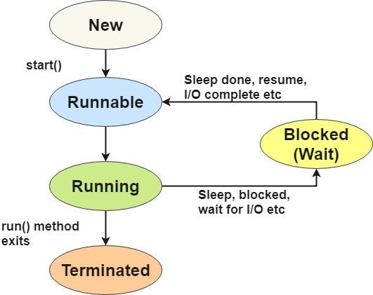

### Creating Thread:

We can create a new thread by either extending the **Thread** class or implementing the **Runnable** interface.

### Extending java.lang.Thread:

Extending the **Thread** class:
```java
public class App {
    public static void main(String[] args) throws Exception {
         MyThread thread = new MyThread();
        thread.start(); // Start the thread
    }
}
class MyThread extends Thread {
    public void run() {
        // Code to be executed in the thread
        System.out.println("Thread is running.");
    }
}
Or,
public class App {
    public static void main(String[] args) throws Exception {
        Thread t1=new Thread() {
            public void run() {
                // Code to be executed in the thread
                System.out.println("Thread is running.");
            }
        };
        t1.start();
    }
}
```

**Implementing java.lang.Runnable:**
Implementing the **Runnable** interface:

```java
public class App {
    public static void main(String[] args) throws Exception {
        MyRunnable runnable = new MyRunnable();
        Thread thread = new Thread(runnable);
        thread.start(); // Start the thread
    }
}
class MyRunnable implements Runnable {
    public void run() {
        // Code to be executed in the thread
        System.out.println("Thread is running.");
    }
}
Or,
public class App {
    public static void main(String[] args) throws Exception {
        Runnable r1=new Runnable() {
            public void run() {
                // Code to be executed in the thread
                System.out.println("Thread is running.");
            }
        };
       Thread t1=new Thread(r1);
       t1.start();
```

```java
    }
}
```

```java
How can you write multithreaded programs in java? Discuss with suitable example.
What is multithreading? Why is it important to develop in computer programs? Discuss life cycle of thread in detail.
```

**Why multithreading is important in programming? Discuss**
**Why do we need to synchronize the thread? Justify with an example. An array with an odd number of elements is said to be centered if all elements (except the middle one) are strictly greater than the value of the middle element. Note that only arrays with an odd number of elements have a middle element. Write a function that accepts an integer array and returns 1 if it is a centered array, otherwise it returns 0.**

### Multithreading:

The process of executing multiple threads simultaneously is known as multithreading.
Multithreading could be defined as the programming language’s functionality to get the various tasks executed simultaneously. It is a common feature that facilitates simultaneous thread execution. The thread is nothing but a small task that is supposed to run concurrently.
What are the differences between process and thread? 
Threads are not independent from each other unlike processes. As a result, threads shares with other threads their code section, data section and OS resources like open files and signals. But, like processes, a thread has its own program counter (PC), a register set, and a stack space. 
**Why Multithreading?** Threads are popular way to improve application through parallelism. For example, in a browser, multiple tabs can be different threads. MS word uses multiple threads, one thread to format the text, other thread to process inputs, etc. 
Threads operate faster than processes due to following reasons: 
1) Thread creation is much faster.
2) Context switching between threads is much faster.
3) Threads can be terminated easily
4) Communication between threads is faster.

### Multitasking vs Multithreading vs Multiprocessing vs parallel processing

If you are new to java, you may get confused among these terms as they are used quite frequently when we discuss multithreading. Let’s talk about them in brief.
**Multitasking**: Ability to execute more than one task at the same time is known as multitasking.
**Multithreading**: We already discussed about it. It is a process of executing multiple threads simultaneously. Multithreading is also known as Thread-based **Multitasking**.
**Multiprocessing:** It is same as multitasking, however in multiprocessing more than one CPUs are involved. On the other hand, one CPU is involved in multitasking.
**Parallel Processing:** It refers to the utilization of multiple CPUs in a single computer system.

### Working with Multithreading:

It is implemented using the **run** function. The **run** function can be defined as the special function that **starts** the thread execution. This function could be invoked using the start function that has to be used with the object to bring the thread into execution. Once the thread starts, it will perform all the tasks defined **underrun**(). Based on the priority, the thread is used to choose which one has to run and which one has to wait. we will use the **run()** and **start()** functions to bring the thread’s multiple executions.

### Advantages of Multithreading in java

When we talk about the quick execution of any program, it just has to perform several operations simultaneously. It is advantageous when making an efficient program that executes quickly at almost no time.

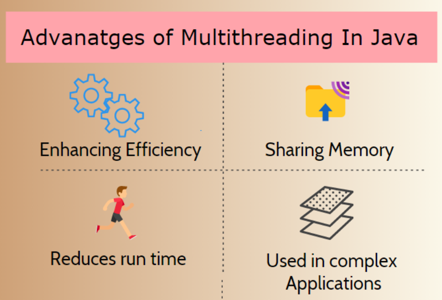

**Enhancing efficiency –** It makes the application very efficient by making the optimal use of the CPUs. I let the threads use the CPU efficiently by making use of it while other threads wait for some output.
**Sharing Memory –** The best part about multithreading is that the thread it uses does not occupy the memory but uses it on a shared basis. Hence, it also makes efficient use of memory by sharing it appropriately.
​**Reduces run time –** It usually mitigates the time utilized by an application to run the particular program. The time saved by threads could be used for other programs to minimize program execution time.
**Used in complex applications –** Threads in application development make it easy to create the modules in the application. They are being used very efficiently to make designing and development easy.

### Implementing Multithreading by extending Thread

The above example starts creating threads 8 times as mentioned there and ensures that the number assigned with the threads should start from 8. The output for this program will be below.
Example:
```java
public class App
{
```

```java
        public static void main(String[] args)
        {
```

```java
            for(int i=0; i<8; i++)
            {
 		   TestMultithreading obj=new TestMultithreading();
                obj.start();
            }
        }
```

```java
}
class TestMultithreading extends Thread
{
    public void run()
    {
        try{
            System.out.println("I am thread number"+ Thread.currentThread().getId());
```

```java
        }
        catch(Exception ex)
        {
            System.out.println("Go to Exception");
        }
    }
}
```

```java
Output:
I am thread number14
I am thread number15
I am thread number21
I am thread number20
I am thread number16
I am thread number18
I am thread number17
I am thread number19
```

**Implementing Multithreading by Runnable interface:**

### Example:

```java
public class App
{
```

```java
        public static void main(String[] args)
        {
```

```java
            for(int i=0; i<8; i++)
            {
                Thread obj=new Thread(new TestMultithreading());
                obj.start();
```

```java
            }
        }
```

```java
}
class TestMultithreading implements Runnable
{
    public void run()
    {
        try{
            System.out.println("I am thread number"+ Thread.currentThread().getId());
```

```java
        }
        catch(Exception ex)
        {
            System.out.println("Go to Exception");
        }
    }
}
```

```java
Output:
I am thread number18
I am thread number20
I am thread number21
I am thread number15
I am thread number16
I am thread number19
I am thread number17
I am thread number14
```

**Priority of a Thread (Thread Priority): **
Each thread have a priority. Priorities are represented by a number between 1 and 10. 3 constants defined in Thread class: 
```java
public static int MIN_PRIORITY
public static int NORM_PRIORITY
public static int MAX_PRIORITY
Default priority of a thread is 5 (NORM_PRIORITY). The value of MIN_PRIORITY is 1 and the value of MAX_PRIORITY is 10.
Example:
```

```java
Lab: Write a simple java program to demonstrate how thread Priority handled.
public class App {
    public static void main(String[] args) throws Exception {
        TestMultiPriority1 m1=new TestMultiPriority1();
        TestMultiPriority1 m2=new TestMultiPriority1();
        m1.setPriority(Thread.MIN_PRIORITY);
        m2.setPriority(Thread.MAX_PRIORITY);
        m1.start();
        m2.start();
    }
}
class TestMultiPriority1 extends Thread{
public void run()
    {
    System.out.println(Thread.currentThread().getPriority());
    }
}
Output:
1
10
```

```java
Write a program to execute multiple threads in priority base in java
```

**Synchronization**
Synchronization in Java is the capability to *control the access of multiple threads to any **shared resource**.*
In a multithreaded environment, if multiple threads access and modify **shared resources** simultaneously, it can lead to problems such as data corruption, and unpredictable behavior.
Java provides mechanisms for **synchronization** to help address these issues.

## Types of Synchronization

Synchronization is classified into two types
Process Synchronization
Thread Synchronization

#### Process Synchronization:

Process Synchronization is a technique used to coordinate the execution of multiple processes. It ensures that the shared resources are safe and in order.

### Thread Synchronization

There are two types of thread synchronization mutual exclusive and inter-thread communication.
Mutual Exclusive
Synchronized method.
Synchronized block.
Static synchronization.
Cooperation (Inter-thread communication in java)
Mutual Exclusive helps **keep threads from interfering with one another** while sharing data. It can be achieved by using the following three ways:
By Using Synchronized Method
By Using Synchronized Block
By Using Static Synchronization

### Java synchronized method

 It is a method that can be declared synchronized using the keyword **“synchronized”** before the method name. 
It is used for **locking** an object for any shared resources.
The object gets the lock whenever the **synchronized method** is called.
The lock does not release until the **thread completes** its function

Lab: Write java program to demonstrate Multithreading using synchronized Method.
```java
public class App {
    public static void main(String[] args) throws Exception {
        Table obj = new Table();//only one object
        MyThread1 t1=new MyThread1(obj);
        MyThread2 t2=new MyThread2(obj);
        t1.start();
        t2.start();
    }
}
class Table{
 synchronized void printTable(int n){//synchronized method
   for(int i=1;i<=5;i++){
     System.out.println(n*i);
     try{
      Thread.sleep(400);
     }catch(Exception e)
{System.out.println(e);}
   }
 }
}
class MyThread1 extends Thread{
    Table t;
    MyThread1(Table t){
    this.t=t;
    }
    public void run(){
    t.printTable(5);
    }
}
class MyThread2 extends Thread{
    Table t;
    MyThread2(Table t){
    this.t=t;
    }
    public void run(){
    t.printTable(100);
    }
}
Output
100
200
300
400
500
5
10
15
20
25
```

**Synchronized Block**
If a block is declared as synchronized then the code which is written *inside a method is only executed instead of the whole code*. **It is used when sequential access to code is required**.
```java
public class App {
    public static void main(String[] args) throws Exception {
        Table obj = new Table();//only one object
        MyThread1 t1=new MyThread1(obj);
        MyThread2 t2=new MyThread2(obj);
        t1.start();
        t2.start();
```

```java
    }
}
```

```java
class Table{
 public void printTable(int n){//synchronized method
 synchronized(this){    //This is a synchronized block
     for(int i=1;i<=5;i++){
      System.out.println(n*i);
      try{
       Thread.sleep(400);
      }catch(Exception e){System.out.println(e);}
     }
   }
 }
}
```

```java
class MyThread1 extends Thread{
    Table t;
    MyThread1(Table t){
    this.t=t;
    }
    public void run(){
    t.printTable(5);
    }
```

```java
}
class MyThread2 extends Thread{
    Table t;
    MyThread2(Table t){
    this.t=t;
    }
    public void run(){
    t.printTable(100);
    }
}
```

```java
inter-thread communication or Co-operation is all about allowing synchronized threads to communicate with each other.
Inter-thread communication is the mechanism by which threads coordinate and exchange information in a multithreaded program. It allows threads to work together, share data, and synchronize their actions to achieve a specific task or goal. In Java, inter-thread communication can be accomplished using methods like wait(), notify(), and notifyAll() within synchronized blocks.
wait()
notify()
notifyAll()
wait(): Causes the current thread to release the lock it holds and wait until another thread calls notify() or notifyAll() on the same object.
notify(): Wakes up one waiting thread (chosen arbitrarily) that's waiting on the same object. The awakened thread will continue once the notifying thread releases the lock.
notifyAll(): Wakes up all waiting threads that are waiting on the same object. They compete for the lock once it's released by the notifying thread
```

```java
Lab: Write a Java program to demonstrate inter-thread communication or Co-operation threading.
public class App {
    public static void main(String[] args) throws Exception {
       Customer c=new Customer();
       Thread t1= new Thread()
        {
            public void run()
            {
                c.withdraw(15000);
            }
        };
        t1.start();
       Thread t2= new Thread()
        {
            public void run()
            {
                c.deposit(10000);
            }
        };
        t2.start();
    }
}
```

```java
class Customer{
    int amount=10000;
    synchronized void withdraw(int amount)
    {
        System.out.println("going to withdraw...");
        if(this.amount<amount)
        {
        System.out.println("Less balance; waiting for deposit...");
        try
        {
            wait();
        }
        catch(Exception e){}
        }
        this.amount-=amount;
        System.out.println("withdraw completed...");
    }
    synchronized void deposit(int amount)
    {
    System.out.println("going to deposit...");
    this.amount+=amount;
    System.out.println("deposit completed... ");
    notify();
    }
}
```

**Working with Files:**

### (IO Streams)

**Stream: Sequence of data** is called **stream**. There are two types of Streams:
**InPutStream**: The InputStream is used to **read data** from a source.
**OutPutStream**: The OutputStream is used for **writing data** to a destination.

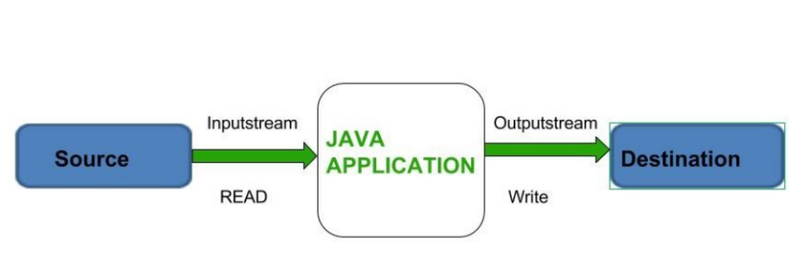

### IO Class Hierarchy


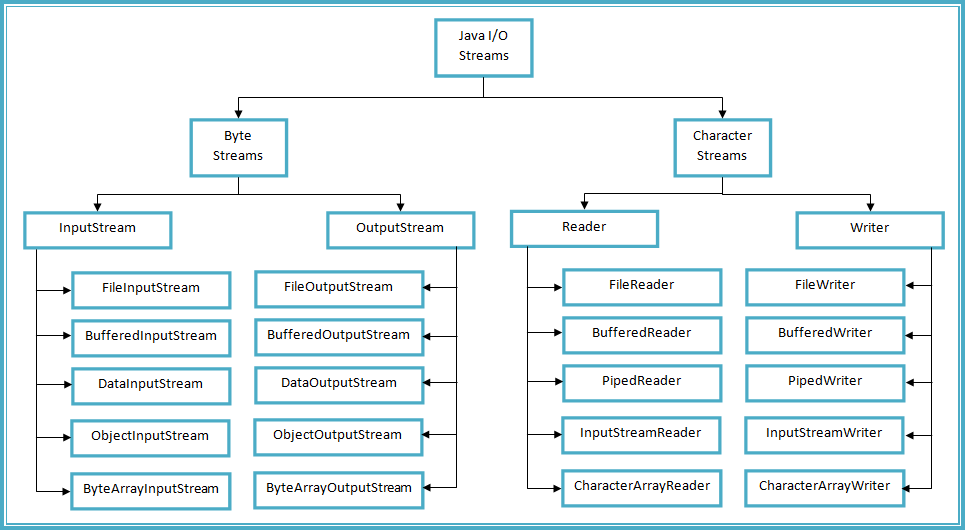

### ByteStreams:

Byte streams in Java handle I/O operations at the **byte level**. They are primarily used for reading and writing binary data, such as images, audio files, or any other non-textual data. Byte streams work with the **InputStream** and **OutputStream** classes

### Types of ByteStream:

**ByteStreams** can be divided into two primary classes:
 These streams are used to **read data** that must be taken as an input from a source array or file or any peripheral device. For eg., FileInputStream, BufferedInputStream, ByteArrayInputStream etc.

 These streams are used to **write data** as outputs into an array or file or any output peripheral device. For eg., FileOutputStream, BufferedOutputStream, ByteArrayOutputStream etc.

**InputStream**:
FileInputStream: Reads data from **a file** as a sequence of bytes.
ByteArrayInputStream: Reads data from a **byte array**.
BufferedInputStream: Provides **buffering** capabilities to improve input performance.
DataInputStream: Reads **primitive Java data types** from an underlying input stream.
ObjectInputStream: Reads **objects** from an underlying input stream, including serialized objects.
**OutputStream**:
FileOutputStream: Writes data to a file as a sequence of bytes.
ByteArrayOutputStream: Writes data to a byte array.
BufferedOutputStream: Provides buffering capabilities to improve output performance.
DataOutputStream: Writes primitive Java data types to an underlying output stream.
ObjectOutputStream: Writes objects to an underlying output stream, including serialized objects.

### Example ByteStream:

**Lab: Write a Java program to read from file input.txt and write its contents to output.txt.**

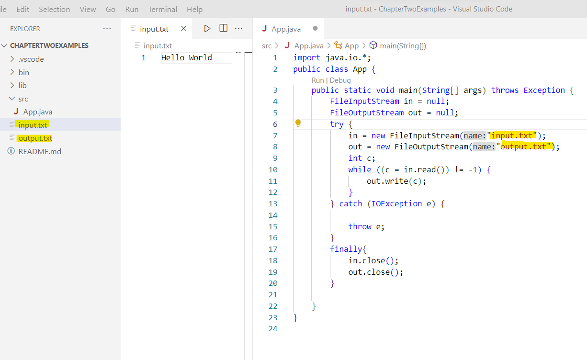

### Example BufferInput Stream(Reading File Content)


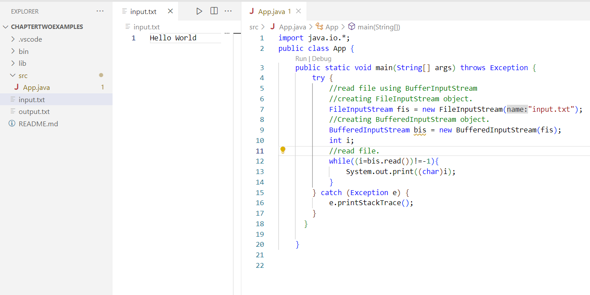

### Example BufferOutput Stream(Writing to File)


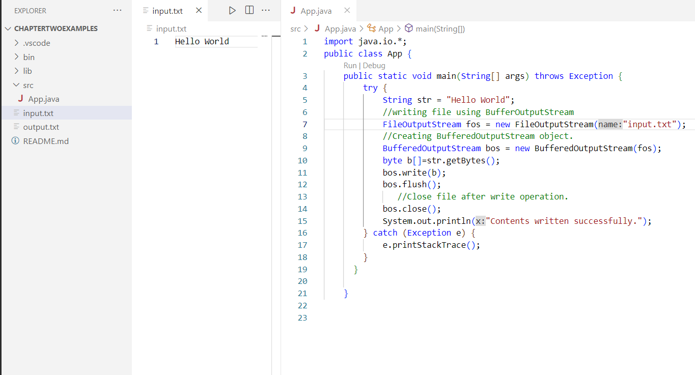

### CharacterStreams:

Character streams in Java handle I/O operations at the **character level**, making them suitable for reading and writing text-based data. They are designed to handle character **encoding** and **decoding** automatically, allowing for the reading and writing of characters. Character streams work with the **Reader** and **Writer** classes

### Types of CharacterStreams:

**Reader**: The Reader class is an abstract base class for all character input streams. It defines methods for reading characters from a source and provides a common interface for working with character-based input streams. Some commonly used subclasses of Reader include **FileReader**, **BufferedReader**, **StringReader**, and **InputStreamReader**.
**Writer**: The Writer class is an abstract base class for all character output streams. It defines methods for writing characters to a destination and provides a common interface for working with character-based output streams. Some commonly used subclasses of Writer include **FileWriter**, **BufferedWriter**, **StringWriter**, and **OutputStreamWriter**.

### Character StreamsExample:

**Lab: Write a Java program to read from file input.txt and write its contents to output.txt using FileReader and FileWriter (CharacterStreams).**

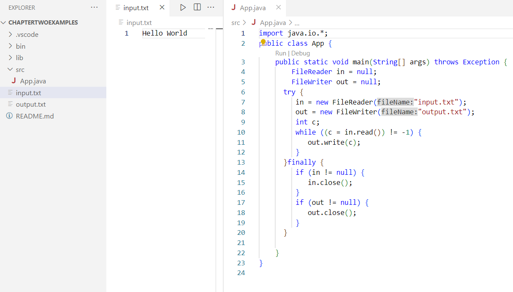

### ByteStream Classes:

### CharacterStream Class

### File and Directories:

### List all file from directories

```java
import java.io.*;
public class App {
    public static void main(String[] args) throws Exception {
        String directoryPath = "E:\\OOP in Java";
        File directory = new File(directoryPath);
        File[] files = directory.listFiles();
                for (File file : files) {
                        System.out.println(file.getName());
                }
    }
}
```

**Create New File:**
```java
import java.io.*;
public class App {
    public static void main(String[] args) throws Exception {
        File file = new File("newfile.txt");
        try
        {
           file.createNewFile();
        } catch (IOException e)
        {
            System.out.println("An error occurred: ");
        }
}
}
```

**Copy File:**
```java
import java.io.*;
import java.nio.file.*;
public class App {
    public static void main(String[] args) throws Exception {
       String sourceFilePath = "E://OOP in Java//Threads.docx";
        String destinationFilePath = "E://OOP in Java//Sample Questions//Threads.docx";
        Path sourcePath = Paths.get(sourceFilePath);
        Path destinationPath = Paths.get(destinationFilePath);
        try {
            Files.copy(sourcePath, destinationPath);
            System.out.println("File copied successfully!");
        } catch (IOException e) {
            System.out.println("An error occurred: " + e.getMessage());
        }
}
}
```

**Delete File:**
```java
import java.io.*;
import java.nio.file.*;
public class App {
    public static void main(String[] args) throws Exception {
       String filePath = "E://OOP in Java//Threads.docx";
       Path path = Paths.get(filePath);
       try {
           Files.delete(path);
           System.out.println("File deleted successfully!");
       } catch (IOException e) {
           System.out.println("An error occurred: " + e.getMessage());
       }
}
}
```

**Object Serialization: (reading and writing object)**
Object serialization is the process of converting an **object into a byte stream**, which can be saved to a file, sent over a network, or stored in a database. It is mainly used in Hibernate, RMI (Remote Method Invocation) technologies.
The reverse operation of serialization is called *deserialization* **where byte-stream is converted into an object**. The serialization and deserialization process is **platform-independent**, it means you can serialize an object on one platform and deserialize it on a different platform.
For serializing the object, we call the **writeObject()** method of **ObjectOutputStream** class, and for deserialization we call the **readObject()** method of **ObjectInputStream** class.


### Syntax for the writeObject() method:

```java
public final void writeObject(Object o) throws IO Exception
```

**Syntax for the readObject() method:**
```java
public final Object readObject() throws IOException, ClassNotFoundException
```

```java
Lab: Write a java program to demonstrate Object serialization and deserialization.
```


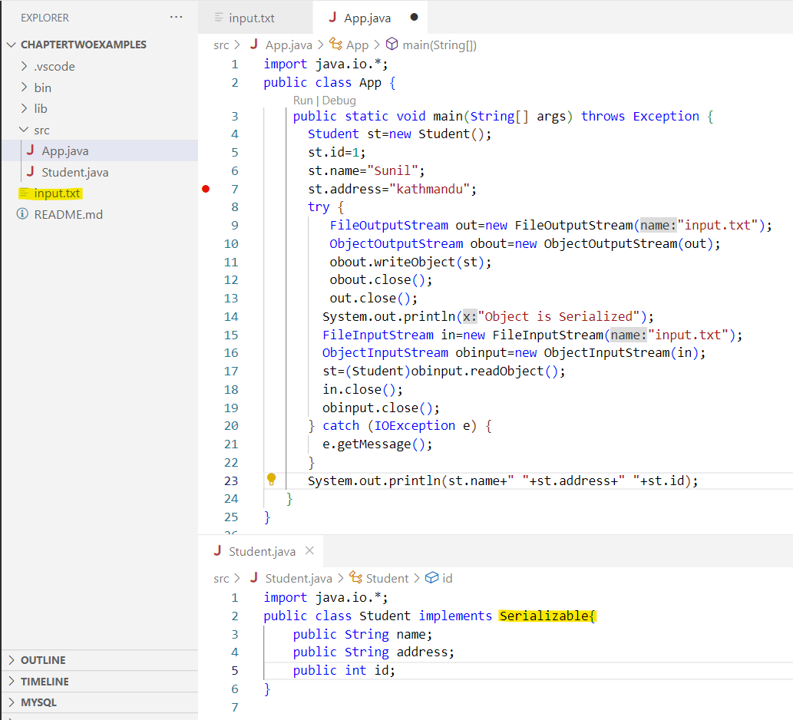

**RandomAccessFile**
The **RandomAccessFile** class is used to perform random access to a file. Unlike other file handling classes like **FileInputStream** or **FileOutputStream**, which provide **sequential access** to a file, **RandomAccessFile** allows you to **read** from or **write** to any position within the file.
To work with a file using **RandomAccessFile**, you first need to create an instance of the class. You can do this by providing the file path and the mode (**read-only**, **write-only**, or **both**) as parameters to the constructor. 
There are two modes: **"r" for reading** and **"rw" for reading and writing.**
**Reading from a **RandomAccessFile**:**
```java
  RandomAccessFile raf = new RandomAccessFile("example.txt", "r");
  byte[] buffer = new byte[1024];
  int bytesRead = raf.read(buffer);
```

```java
Writing To a RandomAccessFile:
RandomAccessFile raf = new RandomAccessFile("example.txt", "rw");
byte[] data = "Hello, World!".getBytes();
raf.write(data);
```

```java
Moving Pointer:
raf.seek(50);
```

```java
Closing RandomAccessFile:
raf.close();
```

**Lab: Write a java program to read, read write using RandomAccessFile**
Example:
```java
import java.io.*;
public class App {
    public static void main(String[] args)
    {
        String FILEPATH ="input.txt";
        try {
            System.out.println(new String(readFromFile(FILEPATH, 0, 18)));
            writeToFile(FILEPATH, "Stay positive. Better days are on their way.", 31);
            System.out.println(new String(readFromFile(FILEPATH, 0,100)));
        } catch (IOException e) {
            e.printStackTrace();
        }
    }
```

```java
private static byte[] readFromFile(String filePath, int position, int size)
            throws IOException {
        RandomAccessFile file = new RandomAccessFile(filePath, "r");
        file.seek(position);
        byte[] bytes = new byte[size];
        file.read(bytes);
        file.close();
        return bytes;
    }
    private static void writeToFile(String filePath, String data, int position)
            throws IOException {
        RandomAccessFile file = new RandomAccessFile(filePath, "rw");
        file.seek(position);
        file.write(data.getBytes());
        file.close();
    }
}
```

```java
1.Write a simple java program to read from and write to files
2.Discuss any 5 exception classes in java.
3. Explain the importance of exception handling with suitable example.
4. Write the simple java program that reads data from one file and writes data to another file.
5.Why do we need to handle the exception? Distinguish error and exception, Write a program to demonstrate your own exception class
6. What is exception handling? Discuss the use of each keyword (try, catch, throw, throws and finally) with suitable Java program.
7. Write a program to read an input string from the user and write the vowels of that string in VOWEL.TXT and consonants in CONSOLNANT.TXT
Code:
```

```java
import java.io.FileWriter;
import java.io.IOException;
import java.util.Scanner;
```

```java
public class App extends Thread {
    public static void main(String[] args) {
        Scanner sc = new Scanner(System.in);
        String s = sc.next();
        String vowel = "";
        String consonant = "";
        for (int i = 0; i < s.length(); i++) {
            if (s.charAt(i) == 'a' || s.charAt(i) == 'A' || s.charAt(i) == 'e' || s.charAt(i) == 'E'
                    || s.charAt(i) == 'i' || s.charAt(i) == 'I' || s.charAt(i) == 'o' || s.charAt(i) == 'O'
                    || s.charAt(i) == 'u' || s.charAt(i) == 'U') {
                vowel += s.charAt(i);
```

```java
            } else {
                consonant += s.charAt(i);
            }
        }
        try {
            FileWriter vWriter = new FileWriter("E:VOWEL.txt");
            // Writes this content into the specified file
            vWriter.write(vowel);
```

```java
            // Closing is necessary to retrieve the resources allocated
            vWriter.close();
```

```java
            FileWriter cWriter = new FileWriter("E:CONSONANT.txt");
            // Writes this content into the specified file
            cWriter.write(consonant);
```

```java
            // Closing is necessary to retrieve the resources allocated
            cWriter.close();
```

```java
        } catch (IOException e) {
            System.out.println("An error occurred.");
            e.printStackTrace();
```

```java
        }
```

```java
    }
}
```

```java
8.  What is the task of manifest file? Write the procedure to create it
In the Java programming language, a manifest file is a text file that contains metadata related to files contained in a programmer's JAR archive. This metadata can range from information relating to package information to attributes of security properties
Code:
import java.io.File;
```

```java
import java.io.IOException;
```

```java
public class App extends Thread {
    public static void main(String[] args) {
        try {
            // Creating an object of a file
            File myObj = new File("E:Test.jar");
            if (myObj.createNewFile())
            {
                System.out.println("File created: " + myObj.getName());
            } else
            {
                System.out.println("File already exists.");
            }
            } catch (IOException e)
            {
                System.out.println("An error occurred.");
                e.printStackTrace();
            }
```

```java
    }
}
```


---

**Table 1:**

| Modifier | Description |
| --- | --- |
| Default | declarations are visible only within the package (package private) |
| Private | declarations are visible within the class only(data member,Function Member) |
| Protected | declarations are visible within the package or all subclasses
(data member,Function Member) |
| Public | declarations are visible everywhere |


**Table 2:**

| S. No. | Class | Interface |
| --- | --- | --- |
| 1. | In class, you can instantiate variables and create an object. | In an interface, you can’t instantiate variables and create an object. |
| 2. | Class can contain concrete(with implementation) methods | The interface cannot contain concrete(with implementation) methods |
| 3. | The access specifiers used with classes are private, protected, and public. | In Interface only one specifier is used- Public. |


**Table 3:**

| S.No | Errors | Exceptions |
| --- | --- | --- |
| 1. | The error indicates trouble that primarily occurs due to the lack of system resources. | The exceptions are the issues that can appear at runtime and compile time. |
| 2. | It is not possible to recover from an error. | It is possible to recover from an exception. |
| 3. | In java, all the errors are unchecked.(runtime) | In java, the exceptions can be both checked and unchecked.(compile and runtime) |
| 4. | The system in which the program is running is responsible for errors. | The code of the program is responsible for exceptions. |
| 5. | They are described in the java.lang.Error package. | They are described in java.lang.Exception package |


**Table 4:**

| Stream class | Description |
| --- | --- |
| BufferedInputStream | It is used for Buffered Input Stream. |
| DataInputStream | It contains method for reading java standard datatypes. |
| FileInputStream | This is used to reads from a file |
| InputStream | This is an abstract class that describes stream input. |
| PrintStream | This contains the most used print() and println() method |
| BufferedOutputStream | This is used for Buffered Output Stream. |
| DataOutputStream | This contains method for writing java standard data types. |
| FileOutputStream | This is used to write to a file. |
| OutputStream | This is an abstract class that describe stream output. |


**Table 5:**

| Stream class | Description |
| --- | --- |
| BufferedReader | It is used to handle buffered input stream. |
| FileReader | This is an input stream that reads from file. |
| InputStreamReader | This input stream is used to translate byte to character. |
| OutputStreamReader | This output stream is used to translate character to byte. |
| Reader | This is an abstract class that define character stream input. |
| PrintWriter | This contains the most used print() and println() method |
| Writer | This is an abstract class that define character stream output. |
| BufferedWriter | This is used to handle buffered output stream. |
| FileWriter | This is used to output stream that writes to file. |


---

## Inner Classes

*Source: `Unit-1( Inner Class).docx`*

> 📷 *This document contains images/diagrams — see the original .docx for visual content*

### What is an Inner Class?

An inner class in Java is a class defined within another class. It's also called a nested class.
Inner classes can access members (fields and methods) of their enclosing or outer class, including private members.

### Types of Inner Classes:

There are four main types of inner classes in Java:
Member Inner Class
Static Nested Class
Local Inner Class
Anonymous Inner Class

### Member Inner Class:

A member inner class is defined within the scope of an outer class.
It can access both static and non-static members of the outer class.
It is instantiated using an instance of the outer class.

```java
public class App {
    public static void main(String[] args)
    {
     OuterClass.Inner in=new OuterClass().new Inner();
     in.innerMethod();
    }
}
class OuterClass
{
   private int outerField;
    public class Inner {
        public void innerMethod() {
            // Inner class can access outer class members
            outerField = 10;
            System.out.println(outerField);
        }
    }
}
```

**Local Inner Classes**
A local inner class is defined within a method or a block.
It has limited scope and can only be accessed within the method or block where it's defined.

```java
public class App {
    public static void main(String[] args)
    {
        Outer x = new Outer();
        x.outerMethod();
    }
}
class Outer {
   public void outerMethod() {
        System.out.println("outer Method");
        class LocalInner {
          public void innerMethod() {
                System.out.println("inner Method");
            }
        }
        LocalInner y = new LocalInner();
        y.innerMethod();
    }
}
```

**Static Nested Class**
A static nested class is declared as a static member of the outer class.
It can only access static members of the outer class.
It can be instantiated without an instance of the outer class.

```java
public class App {
    public static void main(String[] args)
    {
        Outer.StaticNested.nestedMethod();
    }
}
class Outer {
    private static int staticField;
```

```java
    public static class StaticNested {
        public static void nestedMethod() {
```

```java
            staticField = 20;
            System.out.println(staticField);
        }
    }
}
```

```java
Anonymous Inner Class: An anonymous inner class can be useful when making an instance of an object with certain "extras" such as overloading methods of a class or interface,
 Java Anonymous inner class can be created in two ways:
Class (may be abstract or concrete).
Interface
```

**Example Using Abstract Class**
```java
abstract class Utilities{
    abstract void display();
  }
public class App {
      public static void main(String[] args)
      {
        Utilities p=new Utilities()
        {
            void display()
            {
                System.out.println("Good Morning");
            }
        };
            p.display();
      }
}
```

**Example Using Interface**
```java
interface Utilities{
   public void display();
  }
public class App {
      public static void main(String[] args)
      {
        Utilities p=new Utilities()
        {
           public void display()
            {
                System.out.println("Good Morning");
            }
        };
            p.display();
      }
}
```

**Final and Static Modifier**
**Final Access Modifier** is a modifier applicable to **classes**, **methods**, and **variables**. If we declare a parent class method as **final** then we can’t override that method in the child class because its implementation is final and if a class is declared as final we can’t extend the functionality of that class i.e we can’t create a child class for that class i.e **inheritance** is not possible for final classes. Every method present inside the final class is always final by default but every variable present inside the final class need not be final. The main advantage of the final keyword is we can achieve security and we can provide a unique implementation. But the main disadvantage of the final keyword is we are missing key benefits of OOPs like **Inheritance**(Because of the final class)
```java
final int constantValue = 42;//final variable
```

```java
class Parent {
            final void finalMethod() {
                // Method implementation
            }
        }
```

```java
final class FinalClass {
            // Class members and methods
        }
```

**Static Modifier:**
The static modifier is used to create members (**fields or methods**) that belong to the class itself, rather than to a specific instance of the class.
A static method can be called on the class itself, without needing an instance of the class.
Static members can be accessed using the class name (e.g., **ClassName.staticField** or **ClassName.staticMethod()**

```java
        class MyClass {
            static int staticField = 42;
        }
```

```java
    class MathUtils {
        static int add(int a, int b) {
            return a + b;
        }
    }
```

```java
    class Outer {
        static class StaticNested {
            // Static nested class members
        }
    }
```

**Exception Handling in Java:**
The Exception Handling in Java is one of the powerful **mechanism to handle the runtime errors** so that the normal flow of the application can be maintained.

### Error and Exception

In Java, **errors** and **exceptions** are both types of **throwable** objects, but **they represent different types of problems** that can occur during the execution of a program.
**Errors** came first, the people started analyzing the reasons behind errors, which gave rise to **exceptions**.
**Errors** are usually caused by serious problems that are outside the control of the program, such as **running out of memory** or **a system crash**. **Errors** are represented by the **Error class** and its **subclasses**. Some common examples of errors in Java include:
**OutOfMemoryError**: Thrown when the Java Virtual Machine (JVM) runs out of memory.
**StackOverflowError**: Thrown when the call stack overflows due to too many method invocations.
**NoClassDefFoundError**: Thrown when a required class cannot be found.


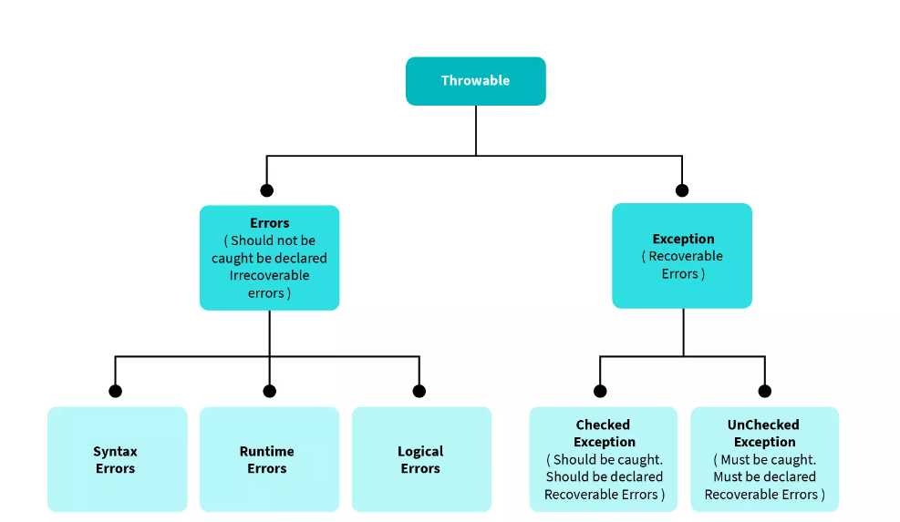

Since **errors** are generally caused by problems that cannot be recovered from, it’s usually not appropriate for a program to catch errors. Instead, the best course of action is usually to **log** the error and exit the program.

### There are 3 types of Errors:

Syntax Error
Runtime Error
Logical Error

### Syntax Errors

**Syntax Errors** are those errors detected during the compilation phase by the compiler when your code does not follow the **syntactical rules** of the programming language you are using. e.g, **missing semi-colon(s), missing parenthesis, using else if() block directly without using if block first**, **returning nothing from the function when the return type is some data type**, say, int, etc.

### Runtime Errors

**Runtime Errors** occur during the execution of a program, due to lack of system resources, or due to irrelevant input by the user. The compiler has no idea whatever how to detect these kinds of errors. For example, **dividing a number by 0**, **accessing an element from an array that is out of range**, **trying to convert an invalid string to an integer, out of memory error**, etc.

### Logical Errors

**Logical Errors** are those errors where the program returned incorrect results when you were **expecting the desired result**. These occur due to some mistake in the code logic made by the programmer. The compiler cannot detect these errors. The user can just understand them after seeing the output. These are also known as **Semantic Errors**.
For example, When the programmer writes mistakenly, if(i = 1) instead of, if(i == 1): This will change the program's narrative.

**Exceptions**, used to handle errors that can be recovered from within the program. Exceptions are represented by the **Exception class** and its **subclasses**. Some common examples of exceptions in Java include:
**NullPointerException**: Thrown when a null reference is accessed.
**IllegalArgumentException**: Thrown when an illegal argument is passed to a method.
**IOException**: Thrown when an I/O operation fails.

Example: NullPointerException

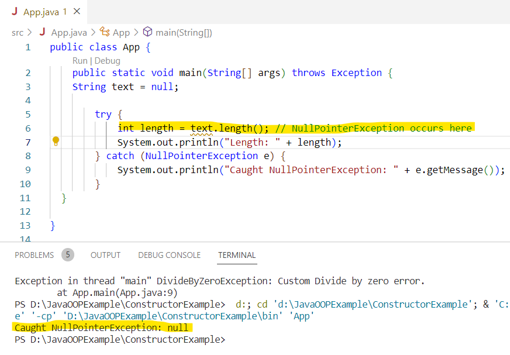

IllegalArgumentException

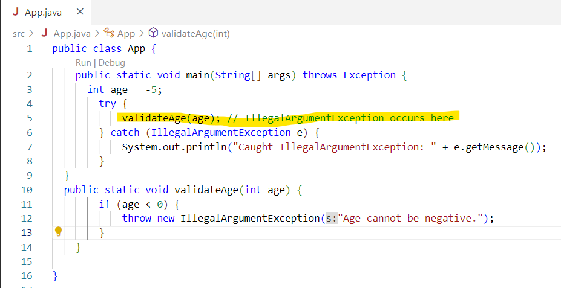

## There are 2 types of Exceptions:
Checked Exceptions
Unchecked Exceptions


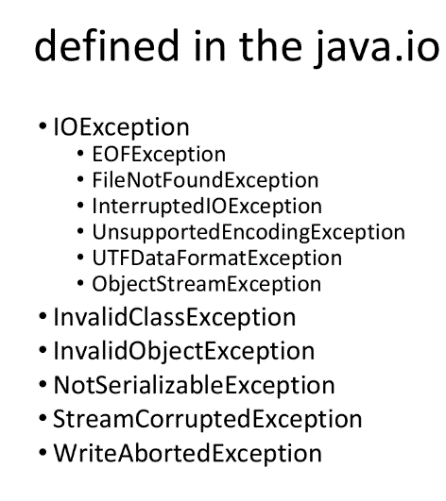


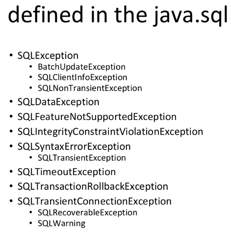

## Unchecked Exceptions

## Exceptions that occur at the time of the program execution, i.e., at runtime, are known as Unchecked Exceptions. These exceptions are ignored at the time of compilation.
They occur due to the following main reasons:

## Invalid User Input

## Bugs in the program

## Improper usage of an API

## Memory limit exceeded

## Examples of unchecked exceptions include ArrayIndexOutOfBoundsException, NullPointerException, IllegalArgumentException, ArithmeticException, NumberFormatException, etc.


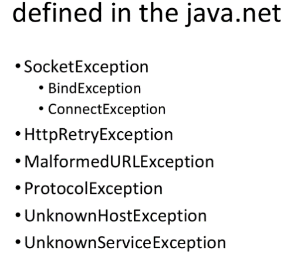

## Difference between Errors and Exceptions in Java


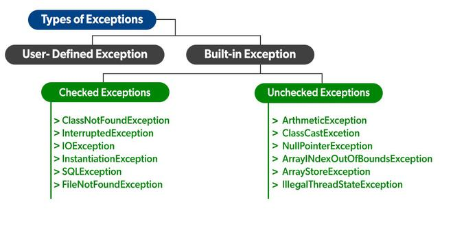

### Why we need to deal with exception?

Exception handling is a critical aspect of programming, and there are several reasons why we need to deal with exceptions:

1. Error detection and reporting: Exceptions allow us to identify and handle errors or exceptional situations that may occur during program execution. Instead of the program crashing abruptly, exceptions provide a mechanism to detect errors and report them in a controlled manner.

2. Program stability and robustness: Exception handling helps in creating stable and robust software. By catching and handling exceptions, we can prevent the program from terminating unexpectedly and provide graceful error recovery or fallback mechanisms. This ensures that the program continues to execute and doesn't leave the system in an inconsistent state.

3. Separation of concerns: Exception handling allows for the separation of normal program logic from error handling code. By handling exceptions separately, we can keep the main code clean and focused on its primary purpose, improving code readability and maintainability.

4. User-friendly experience: Exception handling enables us to provide meaningful error messages or feedback to the users. Instead of displaying mysterious error codes or crashing, we can catch exceptions and present user-friendly messages, guiding users on how to resolve or recover from errors.

5. Debugging and troubleshooting: Exceptions can provide valuable information for debugging and troubleshooting purposes. This information can be used to identify the root cause of the issue and fix the problem effectively.

6. Resource management: Exception handling plays a crucial role in proper resource management. For example, if a file is opened for reading and an exception occurs while reading from it, the exception handling code can ensure that the file is closed properly, preventing resource leaks.

### Catching and Handling Exception:

In Java, exception handling is done using the "try-catch" blocks. Here's how you can catch and handle exceptions in Java:

1. Try block: The code that may throw an exception is placed within a "try" block. It is enclosed within curly braces.

```java
try {
    // Code that may throw an exception
    // ...
}
```

```java
2. Catch block(s): Following the try block, one or more "catch" blocks can be added to handle specific types of exceptions. Each catch block specifies the type of exception it can handle.
try {
    // Code that may throw an exception
    // ...
} catch (ExceptionType1 e) {
    // Exception handling for ExceptionType1
    // ...
} catch (ExceptionType2 e) {
    // Exception handling for ExceptionType2
    // ...
}
You can have multiple catch blocks for different exception types. When an exception occurs, the catch blocks are evaluated sequentially to find a matching catch block. If a matching catch block is found, the code within that catch block is executed.
```

```java
3. Handling the exception: Inside each catch block, you can include code to handle the exception. This could involve displaying an error message, logging the exception, performing error recovery, or any other appropriate action.
try {
    // Code that may throw an exception
    // ...
} catch (ExceptionType1 e) {
    // Exception handling for ExceptionType1
    // ...
    // e.printStackTrace(); // Print stack trace (optional)
} catch (ExceptionType2 e) {
    // Exception handling for ExceptionType2
    // ...
}
4. Optional finally block: After the catch block(s), you can include an optional "finally" block. The code within the finally block is executed regardless of whether an exception occurred or not. It is typically used for cleanup operations, such as releasing resources like open files or closing database connections.
try {
    // Code that may throw an exception
    // ...
} catch (ExceptionType1 e) {
    // Exception handling for ExceptionType1
    // ...
} catch (ExceptionType2 e) {
    // Exception handling for ExceptionType2
    // ...
} finally {
    // Cleanup code (optional)
    // ...
}
```

```java
The finally block will always execute, even if an exception is thrown and caught or if an exception is not thrown at all.
By catching and handling exceptions in Java, you can prevent your program from crashing, provide appropriate error handling, and ensure proper resource management.
```

**Exception Class:**
In Java, the Exception class is a fundamental class that serves as the base class for all exceptions.
It is part of the Java **java.lang** package
The **Exception** class itself is an **abstract** class, so you cannot directly instantiate it.
It also provides the basis for creating **custom exception** classes by extending it.

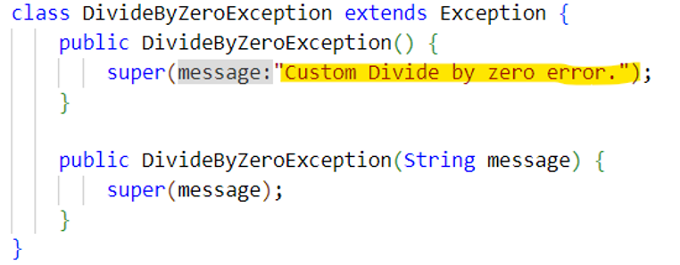

In this example, **DivideByZeroException** is a custom exception class that extends the **Exception** class. By extending **Exception**, the custom exception inherits all the **properties** and **behaviors** of the Exception class.
By extending the **Exception** class, you can create custom exception classes that suit your application's specific needs. Helps to give error in meaningful way.
The **Exception class** provides several **constructors** and **methods** to work with exceptions. Some commonly used methods include:
**getMessage()**: Returns the detail message string of the exception.
**getCause():** Returns the cause of the exception, or null if the cause is unknown.

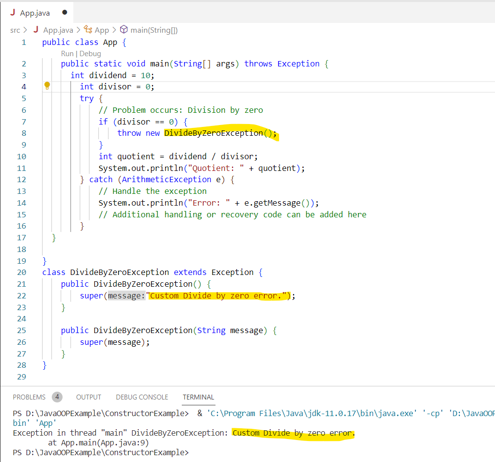

**printStackTrace():** Prints the stack trace of the exception to the standard error stream.


---

**Table 1:**

| S.No | Errors | Exceptions |
| --- | --- | --- |
| 1. | The error indicates trouble that primarily occurs due to the lack of system resources. | The exceptions are the issues that can appear at runtime and compile time. |
| 2. | It is not possible to recover from an error. | It is possible to recover from an exception. |
| 3. | In java, all the errors are unchecked. | In java, the exceptions can be both checked and unchecked. |
| 4. | The system in which the program is running is responsible for errors. | The code of the program is responsible for exceptions. |
| 5. | They are described in the java.lang.Error package. | They are described in java.lang.Exception package |


---

## File I/O (Streams)

*Source: `Unit-1 (File IO).docx`*

> 📷 *This document contains images/diagrams — see the original .docx for visual content*

### Stream:

Sequence of data is called **stream**. There are two types of Streams:
**InPutStream**: The InputStream is used to read data from a source.
**OutPutStream**: The OutputStream is used for writing data to a destination.


### IO Class Hierarchy


### ByteStreams:

Byte streams in Java handle I/O operations at the byte level. They are primarily used for reading and writing binary data, such as images, audio files, or any other non-textual data. Byte streams work with the **InputStream** and **OutputStream** classes

### Types of ByteStream:

**ByteStreams** can be divided into two primary classes:
 These streams are used to **read data** that must be taken as an input from a source array or file or any peripheral device. For eg., FileInputStream, BufferedInputStream, ByteArrayInputStream etc.

 These streams are used to **write data** as outputs into an array or file or any output peripheral device. For eg., FileOutputStream, BufferedOutputStream, ByteArrayOutputStream etc.

**InputStream**:
FileInputStream: Reads data from a file as a sequence of bytes.
ByteArrayInputStream: Reads data from a byte array.
BufferedInputStream: Provides buffering capabilities to improve input performance.
DataInputStream: Reads primitive Java data types from an underlying input stream.
ObjectInputStream: Reads objects from an underlying input stream, including serialized objects.
**OutputStream**:
FileOutputStream: Writes data to a file as a sequence of bytes.
ByteArrayOutputStream: Writes data to a byte array.
BufferedOutputStream: Provides buffering capabilities to improve output performance.
DataOutputStream: Writes primitive Java data types to an underlying output stream.
ObjectOutputStream: Writes objects to an underlying output stream, including serialized objects.

### Example ByteStream:


### Example BufferInput Stream(Reading File Content)


### Example BufferOnput Stream(Writing to File)


### CharacterStreams:

Character streams in Java handle I/O operations at the **character level**, making them suitable for reading and writing text-based data. They are designed to handle character encoding and decoding automatically, allowing for the reading and writing of characters. Character streams work with the **Reader** and **Writer** classes

### Types of CharacterStreams:

**Reader**: The Reader class is an abstract base class for all character input streams. It defines methods for reading characters from a source and provides a common interface for working with character-based input streams. Some commonly used subclasses of Reader include **FileReader**, **BufferedReader**, **StringReader**, and **InputStreamReader**.
**Writer**: The Writer class is an abstract base class for all character output streams. It defines methods for writing characters to a destination and provides a common interface for working with character-based output streams. Some commonly used subclasses of Writer include **FileWriter**, **BufferedWriter**, **StringWriter**, and **OutputStreamWriter**.

### Character StreamsExample:


### ByteStream Classes:

### CharacterStream Class

### File and Directories:

### List all file from directories

```java
import java.io.*;
public class App {
    public static void main(String[] args) throws Exception {
        String directoryPath = "E:\\OOP in Java";
        File directory = new File(directoryPath);
        File[] files = directory.listFiles();
            if (files != null)
            {
                for (File file : files) {
                        System.out.println(file.getName());
                }
            }
            else
            {
                System.out.println("No files in the directory.");
            }
    }
}
```

**Create New File:**
```java
import java.io.*;
public class App {
    public static void main(String[] args) throws Exception {
        File file = new File("newfile.txt");
        try
        {
           file.createNewFile();
        } catch (IOException e)
        {
            System.out.println("An error occurred: ");
        }
}
}
```

**Copy File:**
```java
import java.io.*;
import java.nio.file.*;
public class App {
    public static void main(String[] args) throws Exception {
       String sourceFilePath = "E://OOP in Java//Threads.docx";
        String destinationFilePath = "E://OOP in Java//Sample Questions//Threads.docx";
        Path sourcePath = Paths.get(sourceFilePath);
        Path destinationPath = Paths.get(destinationFilePath);
        try {
            Files.copy(sourcePath, destinationPath);
            System.out.println("File copied successfully!");
        } catch (IOException e) {
            System.out.println("An error occurred: " + e.getMessage());
        }
}
}
```

**Delete File:**
```java
import java.io.*;
import java.nio.file.*;
public class App {
    public static void main(String[] args) throws Exception {
       String filePath = "E://OOP in Java//Threads.docx";
       Path path = Paths.get(filePath);
       try {
           Files.delete(path);
           System.out.println("File deleted successfully!");
       } catch (IOException e) {
           System.out.println("An error occurred: " + e.getMessage());
       }
}
}
```

**Object Serialization:**
Object serialization is the process of converting an **object into a byte stream**, which can be saved to a file, sent over a network, or stored in a database. It is mainly used in Hibernate, RMI (Remote Method Invocation), JPA (Java Persistence API), EJB (Enterprise Java Beans) and JMS (Java Message Service) technologies.
The reverse operation of serialization is called *deserialization* **where byte-stream is converted into an object**. The serialization and deserialization process is **platform-independent**, it means you can serialize an object on one platform and deserialize it on a different platform.
For serializing the object, we call the **writeObject()** method of **ObjectOutputStream** class, and for deserialization we call the **readObject()** method of **ObjectInputStream** class.


### Syntax for the writeObject() method:

```java
public final void writeObject(Object o) throws IO Exception
```

**Syntax for the readObject() method:**
```java
public final Object readObject() throws IOException, ClassNotFoundException
```


**RandomAccessFile**
The **RandomAccessFile** class is used to perform random access to a file. Unlike other file handling classes like **FileInputStream** or **FileOutputStream**, which provide **sequential access** to a file, **RandomAccessFile** allows you to read from or write to any position within the file.
To work with a file using **RandomAccessFile**, you first need to create an instance of the class. You can do this by providing the file path and the mode (read-only, write-only, or both) as parameters to the constructor. 
There are two modes: **"r" for reading** and **"rw" for reading and writing.**
**Reading from a **RandomAccessFile**:**
```java
    RandomAccessFile raf = new RandomAccessFile("example.txt", "r");
  byte[] buffer = new byte[1024];
  int bytesRead = raf.read(buffer);
```

```java
Writing To a RandomAccessFile:
RandomAccessFile raf = new RandomAccessFile("example.txt", "rw");
byte[] data = "Hello, World!".getBytes();
raf.write(data);
```

```java
Moving Pointer:
raf.seek(50);
```

```java
Closing RandomAccessFile:
raf.close();
```

```java
Example:
import java.io.*;
public class App {
    public static void main(String[] args)
    {
        String FILEPATH ="input.txt";
        try {
            System.out.println(new String(readFromFile(FILEPATH, 0, 18)));
            writeToFile(FILEPATH, "Stay positive. Better days are on their way.", 31);
            System.out.println(new String(readFromFile(FILEPATH, 0,100)));
        } catch (IOException e) {
            e.printStackTrace();
        }
    }
```

```java
    private static byte[] readFromFile(String filePath, int position, int size)
            throws IOException {
        RandomAccessFile file = new RandomAccessFile(filePath, "r");
        file.seek(position);
        byte[] bytes = new byte[size];
        file.read(bytes);
        file.close();
        return bytes;
    }
    private static void writeToFile(String filePath, String data, int position)
            throws IOException {
        RandomAccessFile file = new RandomAccessFile(filePath, "rw");
        file.seek(position);
        file.write(data.getBytes());
        file.close();
    }
}
```


---

**Table 1:**

| Stream class | Description |
| --- | --- |
| BufferedInputStream | It is used for Buffered Input Stream. |
| DataInputStream | It contains method for reading java standard datatypes. |
| FileInputStream | This is used to reads from a file |
| InputStream | This is an abstract class that describes stream input. |
| PrintStream | This contains the most used print() and println() method |
| BufferedOutputStream | This is used for Buffered Output Stream. |
| DataOutputStream | This contains method for writing java standard data types. |
| FileOutputStream | This is used to write to a file. |
| OutputStream | This is an abstract class that describe stream output. |


**Table 2:**

| Stream class | Description |
| --- | --- |
| BufferedReader | It is used to handle buffered input stream. |
| FileReader | This is an input stream that reads from file. |
| InputStreamReader | This input stream is used to translate byte to character. |
| OutputStreamReader | This output stream is used to translate character to byte. |
| Reader | This is an abstract class that define character stream input. |
| PrintWriter | This contains the most used print() and println() method |
| Writer | This is an abstract class that define character stream output. |
| BufferedWriter | This is used to handle buffered output stream. |
| FileWriter | This is used to output stream that writes to file. |


---

## Threading

*Source: `Unit1(Threading).docx`*

> 📷 *This document contains images/diagrams — see the original .docx for visual content*

### UNIT-1(Threads):

**Multitasking (or Multiprocessing)** lets the CPU perform various tasks simultaneously (threads, process, program, task), while **multithreading (with in Process)** helps in the execution of various threads in a **single process** simultaneously.
**Multithreading** is faster. In **multitasking**, termination of a process takes more time. While in **multithreading**, termination of thread takes less time.
A thread refers to the smallest unit of execution within a program. 
We use multithreading than multiprocessing because threads share a common memory area. 
They don't allocate separate memory area so saves memory, and context-switching between the threads takes less time than process. 
Java Multithreading is mostly used in games, animation etc.
Java provides built-in support for multithreading through the **java.lang.Thread** class and the **java.lang.Runnable** interface.

### Creating Thread:

We can create a new thread by either extending the **Thread** class or implementing the **Runnable** interface.

### Extending java.lang.Thread:

Extending the **Thread** class:
```java
public class App {
    public static void main(String[] args) throws Exception {
         MyThread thread = new MyThread();
        thread.start(); // Start the thread
    }
}
class MyThread extends Thread {
    public void run() {
        // Code to be executed in the thread
        System.out.println("Thread is running.");
    }
}
Or,
public class App {
    public static void main(String[] args) throws Exception {
        Thread t1=new Thread() {
            public void run() {
                // Code to be executed in the thread
                System.out.println("Thread is running.");
            }
 };
        t1.start();
    }
}
```

**Implementing java.lang.Runnable:**
Implementing the **Runnable** interface:
```java
public class App {
    public static void main(String[] args) throws Exception {
        MyRunnable runnable = new MyRunnable();
        Thread thread = new Thread(runnable);
        thread.start(); // Start the thread
    }
}
class MyRunnable implements Runnable {
    public void run() {
        // Code to be executed in the thread
        System.out.println("Thread is running.");
    }
}
Or,
public class App {
    public static void main(String[] args) throws Exception {
        Runnable r1=new Runnable() {
            public void run() {
                // Code to be executed in the thread
                System.out.println("Thread is running.");
            }
        };
       Thread t1=new Thread(r1);
       t1.start();
```

```java
    }
}
```

**Life cycle of a Thread (Thread States) **

A thread can be in one of the five states. The life cycle of the thread in java is controlled by JVM. The java thread states are as follows: 
**New**: Thread created, not yet started.
**Runnable**: Started, ready for execution.
**Running**: Currently executing its code.
**Non-Runnable (Blocked)**: Waiting for a condition to proceed.
**Terminated**: Finished its execution, cannot be restarted.


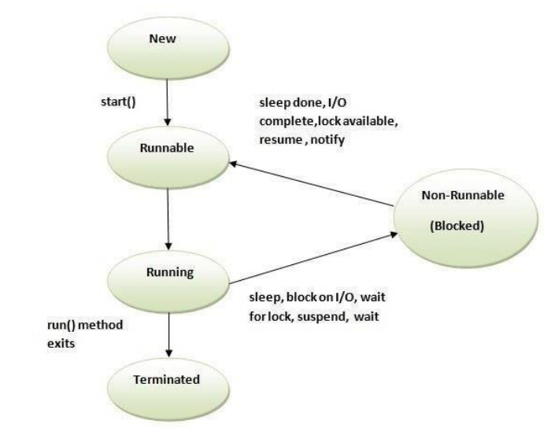

### Priority of a Thread (Thread Priority):

Each thread have a priority. Priorities are represented by a number between 1 and 10. 3 constants defined in Thread class: 
```java
public static int MIN_PRIORITY
public static int NORM_PRIORITY
public static int MAX_PRIORITY
Default priority of a thread is 5 (NORM_PRIORITY). The value of MIN_PRIORITY is 1 and the value of MAX_PRIORITY is 10.
```

```java
Example:
public class App {
public class App {
    public static void main(String[] args) throws Exception {
        TestMultiPriority1 m1=new TestMultiPriority1();
        TestMultiPriority1 m2=new TestMultiPriority1();
        m1.setPriority(Thread.MIN_PRIORITY);
        m2.setPriority(Thread.MAX_PRIORITY);
        m1.start();
        m2.start();
    }
}
class TestMultiPriority1 extends Thread{
public void run()
    {
    System.out.println(Thread.currentThread().getPriority());
    }
}
Output:
1
10
```

**Synchronization**
Synchronization in Java is the capability to *control the access of multiple threads to any shared resource.*
In a multithreaded environment, if multiple threads access and modify shared resources simultaneously, it can lead to problems such as data corruption, and unpredictable behavior.
Java provides mechanisms for **synchronization** to help address these issues.

### Thread Synchronization

There are two types of thread synchronization mutual exclusive and inter-thread communication.
Mutual Exclusive
Synchronized method.
Synchronized block.
Static synchronization.
Cooperation (Inter-thread communication in java)
Mutual Exclusive helps keep threads from interfering with one another while sharing data. It can be achieved by using the following three ways:
By Using Synchronized Method
By Using Synchronized Block
By Using Static Synchronization

### Java synchronized method

 It is a method that can be declared synchronized using the keyword **“synchronized”** before the method name. 
It is used for **locking** an object for any shared resources.
The object gets the lock whenever the **synchronized method** is called.
The lock does not release until the **thread completes** its function

```java
public class App {
    public static void main(String[] args) throws Exception {
        Table obj = new Table();//only one object
        MyThread1 t1=new MyThread1(obj);
        MyThread2 t2=new MyThread2(obj);
        t1.start();
        t2.start();
```

```java
    }
}
class Table{
 synchronized void printTable(int n){//synchronized method
   for(int i=1;i<=5;i++){
     System.out.println(n*i);
     try{
      Thread.sleep(400);
     }catch(Exception e)
{System.out.println(e);}
   }
 }
}
class MyThread1 extends Thread{
    Table t;
    MyThread1(Table t){
    this.t=t;
    }
    public void run(){
    t.printTable(5);
    }
```

```java
}
class MyThread2 extends Thread{
    Table t;
    MyThread2(Table t){
    this.t=t;
    }
    public void run(){
    t.printTable(100);
    }
}
Output
100
200
300
400
500
5
10
15
20
25
```

**Synchronized Block**
If a block is declared as synchronized then the code which is written *inside a method is only executed instead of the whole code*. **It is used when sequential access to code is required**.
```java
public class App {
    public static void main(String[] args) throws Exception {
        Table obj = new Table();//only one object
        MyThread1 t1=new MyThread1(obj);
        MyThread2 t2=new MyThread2(obj);
        t1.start();
        t2.start();
```

```java
    }
}
class Table{
 public void printTable(int n){//synchronized method
 synchronized(this){    //This is a synchronized block
     for(int i=1;i<=5;i++){
      System.out.println(n*i);
      try{
       Thread.sleep(400);
      }catch(Exception e){System.out.println(e);}
     }
   }
 }
}
```

```java
class MyThread1 extends Thread{
    Table t;
    MyThread1(Table t){
    this.t=t;
    }
    public void run(){
    t.printTable(5);
    }
```

```java
}
class MyThread2 extends Thread{
    Table t;
    MyThread2(Table t){
    this.t=t;
    }
    public void run(){
    t.printTable(100);
    }
}
```

```java
inter-thread communication or Co-operation is all about allowing synchronized threads to communicate with each other.
Inter-thread communication is the mechanism by which threads coordinate and exchange information in a multithreaded program. It allows threads to work together, share data, and synchronize their actions to achieve a specific task or goal. In Java, inter-thread communication can be accomplished using methods like wait(), notify(), and notifyAll() within synchronized blocks.
wait()
notify()
notifyAll()
wait(): Causes the current thread to release the lock it holds and wait until another thread calls notify() or notifyAll() on the same object.
notify(): Wakes up one waiting thread (chosen arbitrarily) that's waiting on the same object. The awakened thread will continue once the notifying thread releases the lock.
notifyAll(): Wakes up all waiting threads that are waiting on the same object. They compete for the lock once it's released by the notifying thread
public class App {
    public static void main(String[] args) throws Exception {
       Customer c=new Customer();
       Thread t1= new Thread()
        {
            public void run()
            {
                c.withdraw(15000);
            }
        };
        t1.start();
       Thread t2= new Thread()
        {
            public void run()
            {
                c.deposit(10000);
            }
        };
        t2.start();
    }
}
class Customer{
int amount=10000;
    synchronized void withdraw(int amount)
    {
        System.out.println("going to withdraw...");
        if(this.amount<amount)
        {
        System.out.println("Less balance; waiting for deposit...");
        try
        {
            wait();
        }
        catch(Exception e){}
        }
        this.amount-=amount;
        System.out.println("withdraw completed...");
    }
    synchronized void deposit(int amount)
    {
    System.out.println("going to deposit...");
    this.amount+=amount;
    System.out.println("deposit completed... ");
    notify();
    }
}
```

```java

Thread Deadlock:
Deadlock in multithreading is a situation where two or more threads are unable to proceed with their execution because each is waiting for the other(s) to release a resource they need. This can lead to a situation where the program becomes unresponsive and stuck. Deadlocks are a common issue in multithreaded programming and can be challenging to identify and resolve.
```


```java
public class App {
    public static void main(String[] args) throws Exception {
        final String resource1 = "Nepal";
        final String resource2 = "China";
        Thread t1=new Thread()
        {
            public void run()
            {
                synchronized(resource1)
                {
                    System.out.println("Thread 1: Locked Resource1");
                    try {
                        Thread.sleep(100);
                    } catch (Exception e) {
```

```java
                    }
```

```java
                    synchronized(resource2)
                    {
                        System.out.println("Thread 1: Locked Resource 2");
                    }
                }
            }
```

```java
        };
        Thread t2=new Thread()
        {
            public void run()
            {
                synchronized(resource2)
                {
                    System.out.println("Thread 2: Locked Resource2");
                    try {
                        Thread.sleep(100);
                    } catch (Exception e) {
```

```java
                    }
                    synchronized(resource1)
                    {
                        System.out.println("Thread 2: Locked Resource 1");
                    }
                }
            }
```

```java
        };
        t1.start();
        t2.start();
    }
}
Output:

Thread 1: Locked Resource1
Thread 2: Locked Resource2
```

**Deadlock Solution:**
Let's change the order of the lock and run of the same program to see if both the threads still wait for each other.
```java
public class App {
    public static void main(String[] args) throws Exception {
        final String resource1 = "Nepal";
        final String resource2 = "China";
        Thread t1=new Thread()
        {
            public void run()
            {
                synchronized(resource1)
                {
                    System.out.println("Thread 1: Locked Resource1");
                    try {
                        Thread.sleep(100);
                    } catch (Exception e) {
```

```java
                    }
                    System.out.println("Thread 1: Waiting for lock 2...");
```

```java
                    synchronized(resource2)
                    {
                        System.out.println("Thread 1: Locked Resource 2");
                    }
                }
            }
```

```java
        };
        Thread t2=new Thread()
        {
            public void run()
            {
                synchronized(resource1)
                {
                    System.out.println("Thread 2: Locked Resource2");
                    try {
                        Thread.sleep(100);
                    } catch (Exception e) {
```

```java
                    }
                    System.out.println("Thread 2: Waiting for lock 2...");
                    synchronized(resource2)
                    {
                        System.out.println("Thread 2: Locked Resource 1");
                    }
                }
            }
```

```java
        };
        t1.start();
        t2.start();
    }
}
```

```java
Output:
Thread 1: Locked Resource1
Thread 1: Waiting for lock 2...
Thread 1: Locked Resource 2
Thread 2: Locked Resource2
Thread 2: Waiting for lock 2...
Thread 2: Locked Resource 1
```


---
