# Chapter 2 AWT Swing

> *Source: Sunil Sir's Lecture Notes — B.Sc. CSIT (Tribhuvan University)*

---

## Unit 2: AWT & Swing Components

*Source: `Unit 2.docx`*

> 📷 *This document contains images/diagrams — see the original .docx for visual content*

### Concept of AWT (Abstract Window Toolkit):

Java AWT is an API that contains large number of classes and methods to create and manage graphical user interface ( GUI ) applications. The AWT was designed to provide a common set of tools for GUI design that could work on a variety of platforms. The tools provided by the AWT are implemented using each platform's native GUI toolkit, hence preserving the look and feel of each platform. This is an advantage of using AWT. But the disadvantage of such an approach is that GUI designed on one platform may look different when displayed on another platform that means AWT component are platform dependent.
AWT is the foundation upon which **Swing** is made i.e Swing is a improved GUI API that extends the AWT. But now a days AWT is merely used because most GUI Java programs are implemented using Swing because of its rich implementation of GUI controls and light-weighted nature.
The following image represents the hierarchy for Java AWT.

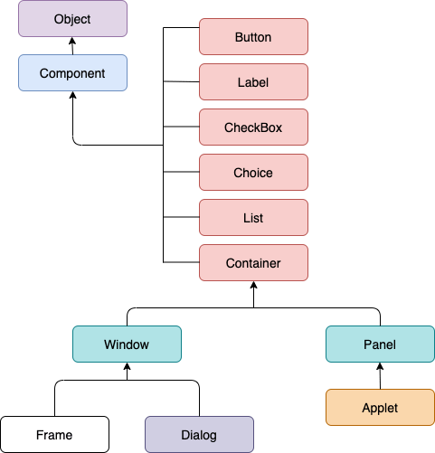

Component Class
The component class stands at the top of the AWT hierarchy, is an abstract class that contains all the properties of the component visible on the screen. 
It is the base class of all the GUI elements that are visible in user screen.
Like button, labels, checkbox and combobox are visible.
Object class is super class of component class
It handle layout display, manages events, set (size, position, visibility)

**Container** — The container is a component that contains other components like button, textfield, label, etc. However, it is a subclass of the Component class.
**Panel** — can be defined as a container that can be used to hold other components. However, it doesn't contain the title bar, menu bar, or border.
**Window** — A window can be defined as a container that doesn't contain any border or menu bar. It creates a top-level view. However, we must have a frame, dialog, or another window for creating a window.
Frame
The frame is a subclass of Window. It can be defined as a container with components like button, textfield, label, etc. In other words, AWT applications are mostly created using frame container.

### Creating a Frame

There are two ways to create a Frame. They are,
By Instantiating Frame class
By extending Frame class

### Creating Frame Window by Instantiating Frame class

```java
import java.awt.*;
public class App {
    App()
    {
    Frame fm=new Frame(“Title”);    //Creating a frame
    Label lb = new Label("welcome to java graphics");   //Creating a label
    fm.add(lb);                  //adding label to the frame
    fm.setSize(300, 300);   //setting frame size.
    fm.setVisible(true);     //set frame visibilty true
    }
    public static void main(String[] args)
    {
new App();
    }
}
```

**Output:**

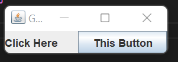

### Creating Frame window by extending Frame class

```java
import java.awt.*;
public class App extends Frame{
    App()
    {
        Button btn=new Button("Hello World");
        add(btn);       //adding a new Button.
        setSize(400, 500);        //setting size.
        setTitle("StudyTonight");  //setting title.
        setLayout(new FlowLayout());     //set default layout for frame.
        setVisible(true);           //set frame visibilty true.
    }
    public static void main(String[] args)
    {
        App app=new App();
    }
}
```


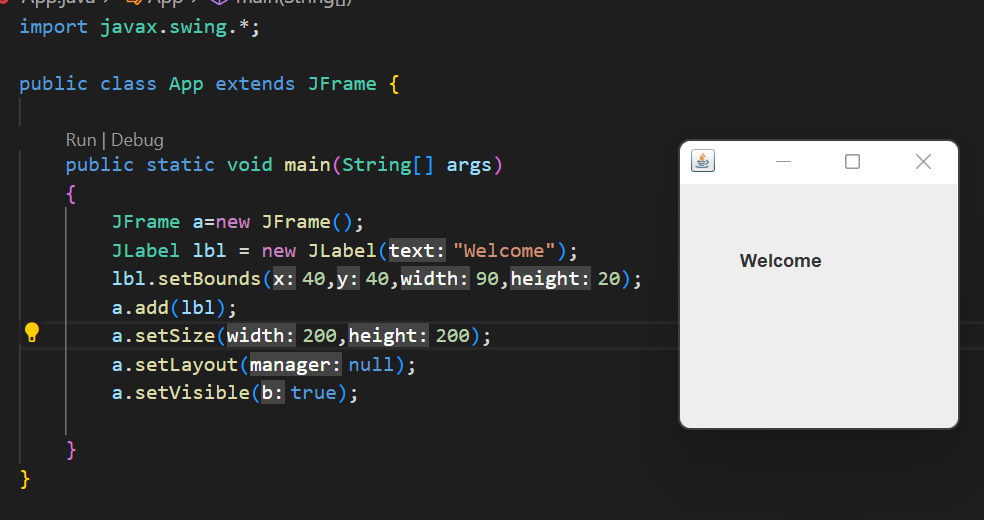

### Java AWT Vs Swing

### Java Applet

Applet is a special type of program that is embedded in the webpage to generate the dynamic content. It runs inside the browser and works at client side.

### Advantage of Applet

There are many advantages of applet. They are as follows:
It works at client side so less response time.
Secured

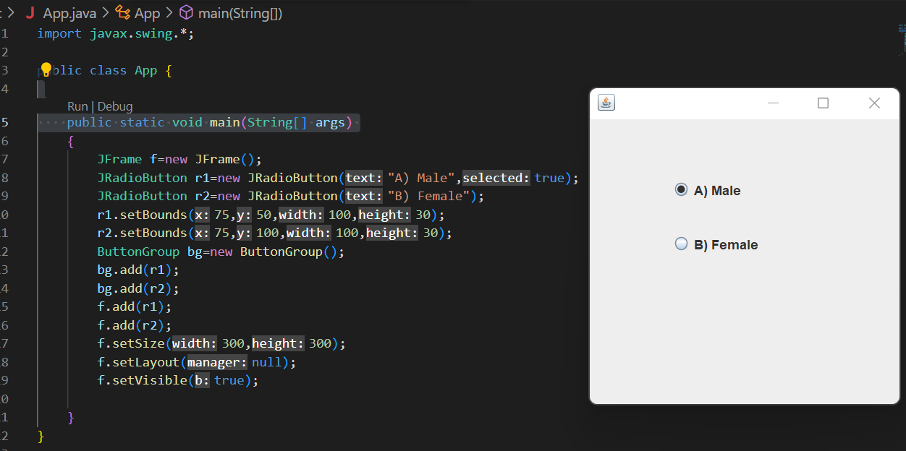

### Lifecycle of Java Applet

Applet is initialized.
Applet is started.
Applet is painted.
Applet is stopped.
Applet is destroyed.

### How to run an Applet?

There are two ways to run an applet
By html file.
By appletViewer tool (for testing purpose).

### Swing:

**Java Swing** is a part of **Java Foundation Classes (JFC)** that *is used to create window-based applications*. It is built on the top of AWT (Abstract Windowing Toolkit) API and entirely written in java.
Unlike AWT, Java Swing provides platform-independent and lightweight components.
The **javax.swing** package provides classes for java swing API such as JButton, JTextField, JTextArea, JRadioButton, JCheckbox, JMenu, JColorChooser etc.

### What is JFC

The Java Foundation Classes (JFC) are a set of GUI components which simplify the development of desktop applications.

### Hierarchy of Java Swing classes

The hierarchy of java swing API is given below.

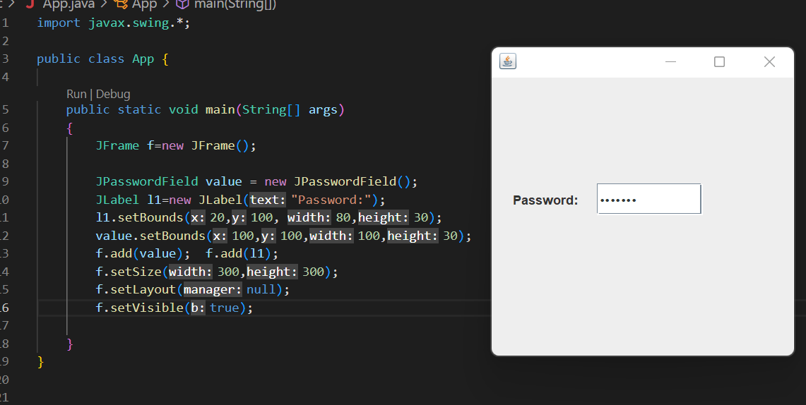

### Java Swing Examples

There are two ways to create a frame:
By creating the object of Frame class (association)
By extending Frame class (inheritance)
We can write the code of swing inside the main(), constructor or any other method.
By creating the object of Frame class (association)

### 1.By creating the object of Frame class (association)

### Simple Java Swing Example

Let's see a simple swing example where we are creating one button and adding it on the JFrame object inside the main() method.
```java
import javax.swing.*;
public class App{
    public static void main(String[] args)
    {
        JFrame f=new JFrame();
        JButton b=new JButton("click");
        b.setBounds(130,100,100, 40);
        f.add(b);
        f.setSize(400,500);
        f.setLayout(null);
        f.setVisible(true);
    }
}
```

### Example of Swing by Association inside constructor

We can also write all the codes of creating JFrame, JButton and method call inside the java constructor.
```java
import javax.swing.*;
public class App{
    App()
    {
        JFrame f=new JFrame();
        JButton b=new JButton("click");
        b.setBounds(130,100,100, 40);
        f.add(b);
        f.setSize(400,500);
        f.setLayout(null);
        f.setVisible(true);
    }
    public static void main(String[] args)
    {
        App app=new App();
    }
}
```

### Example of Swing by Inheritance

We can also inherit the JFrame class, so there is no need to create the instance of JFrame class explicitly.

```java
import javax.swing.*;
public class App extends JFrame{
    JFrame f;
    App()
    {
        JButton b=new JButton("click");
        b.setBounds(130,100,100, 40);
        add(b);
        setSize(400,500);
        setLayout(null);
        setVisible(true);
    }
    public static void main(String[] args)
    {
        App app=new App();
    }
}
```

### Layout Management

The LayoutManagers are used to **arrange components** in a particular manner. The **Java LayoutManagers **facilitates us to control the **positioning** and **size** of the components in GUI forms. LayoutManager is an **interface** that is implemented by all the classes of layout managers. There are the following classes that represent the layout managers:
The Abstract Windowing Toolkit (AWT) has the following five layout managers:
java.awt.BorderLayout
java.awt.FlowLayout
java.awt.GridLayout
java.awt.CardLayout
java.awt.GridBagLayout
Some of these are used in the swing:
javax.swing.BoxLayout
javax.swing.ScrollPanelLayout
javax.swing.GroupLayout
javax.swing.SpringLayout

### No Layout:

```java
import javax.swing.*;
public class App extends JFrame{
    JFrame f;
    App()
    {
        JButton b=new JButton("click");
        b.setBounds(130,100,100, 40);
        add(b);
        setSize(400,500);
        setLayout(null);
        setVisible(true);
    }
    public static void main(String[] args)
    {
        App app=new App();
    }
}
```

### Flow Layout

The Java FlowLayout class is used to arrange the components in a line, one after another (in a flow). It is the default layout of the panel.

### Example:

```java
import javax.swing.*;
import java.awt.*;
public class App{
    JFrame f;
    App()
    {
   f=new JFrame();
   JButton b1 = new JButton("1");
   JButton b2 = new JButton("2");
   JButton b3 = new JButton("3");
   JButton b4 = new JButton("4");
   JButton b5 = new JButton("5");
   JButton b6 = new JButton("6");
   JButton b7 = new JButton("7");
   JButton b8 = new JButton("8");
   JButton b9 = new JButton("9");
   JButton b10 = new JButton("10");
   f.add(b1); f.add(b2); f.add(b3); f.add(b4);
    f.add(b5); f.add(b6);  f.add(b7);  f.add(b8);
    f.add(b9);  f.add(b10);
    f.setLayout(new FlowLayout());
    f.setSize(300, 300);
    f.setVisible(true);
    }
    public static void main(String[] args)
    {
new App();
    }
}
```

Output:

```java
}
```

**Output:**

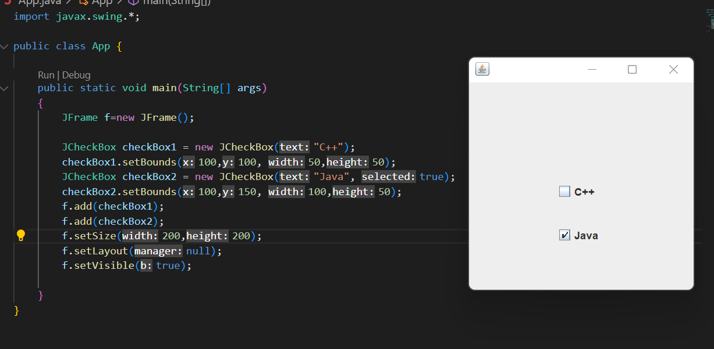

### Java BorderLayout

The **BorderLayout** is used to arrange the components in five regions: **north**, **south**, **east**, **west**, and **center**. Each region (area) may contain one component only. It is the default layout of a frame or window. The BorderLayout provides five constants for each region:
```java
public static final int NORTH
public static final int SOUTH
public static final int EAST
public static final int WEST
public static final int CENTER
```

**Constructors of BorderLayout class:**
**BorderLayout():** creates a border layout but with no gaps between the components.
**BorderLayout(int hgap, int vgap):** creates a border layout with the given horizontal and vertical gaps between the components.

Example:
```java
import javax.swing.*;
import java.awt.*;
public class App{
    JFrame f;
    App()
    {
     f=new JFrame();
     JButton b1 = new JButton("NORTH");; // the button will be labeled as NORTH
     JButton b2 = new JButton("SOUTH");; // the button will be labeled as SOUTH
     JButton b3 = new JButton("EAST");; // the button will be labeled as EAST
     JButton b4 = new JButton("WEST");; // the button will be labeled as WEST
     JButton b5 = new JButton("CENTER");;
     f.add(b1, BorderLayout.NORTH); f.add(b2, BorderLayout.SOUTH);
     f.add(b3, BorderLayout.EAST);  f.add(b4, BorderLayout.WEST);
     f.add(b5, BorderLayout.CENTER);
     f.setSize(300, 300);
     f.setVisible(true);
    }
    public static void main(String[] args)
    {
        App app=new App();
    }
```

```java
}
```

Output:

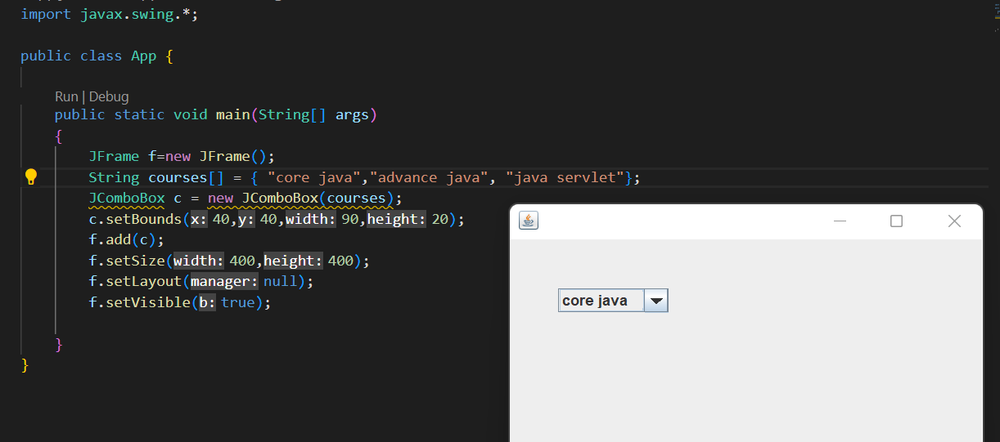

### Grid Layout

The Java GridLayout class is used to arrange the components in a rectangular grid. One component is displayed in each rectangle.

### Constructors of GridLayout class

**GridLayout():** creates a grid layout with one column per component in a row.
**GridLayout(int rows, int columns):** creates a grid layout with the given rows and columns but no gaps between the components.
**GridLayout(int rows, int columns, int hgap, int vgap):** creates a grid layout with the given rows and columns along with given horizontal and vertical gaps.
Example:
```java
import java.awt.GridLayout;
import javax.swing.JButton;
import javax.swing.JFrame;
public class GridLayoutExample extends JFrame{
    GridLayoutExample()
    {
        setTitle("GridLayout Example");
        setSize(300, 300);
        setLayout(new GridLayout(3, 3, 5, 5));
        add(new JButton("Button 1"));
        add(new JButton("Button 2"));
        add(new JButton("Button 3"));
        add(new JButton("Button 4"));
        add(new JButton("Button 5"));
        add(new JButton("Button 6"));
        add(new JButton("Button 7"));
        add(new JButton("Button 8"));
        add(new JButton("Button 9"));
        setVisible(true);
    }
    public static void main(String[] args) {
        new GridLayoutExample();
    }
}
```

Output:


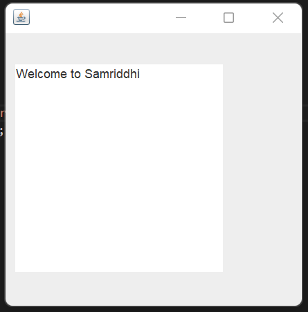

### GridBagLayout

GridBagLayout class is used to align components vertically, horizontally or along their baseline. The components may not be of the same size. Each GridBagLayout object maintains a dynamic, rectangular grid of cells. Each component occupies one or more cells known as its display area.

**Example:**
```java
import java.awt.Button;
import java.awt.GridBagConstraints;
import java.awt.GridBagLayout;
import javax.swing.*;
public class App extends JFrame{
    App()
    {
        GridBagLayout grid = new GridBagLayout();
        GridBagConstraints gbc = new GridBagConstraints();
        setLayout(grid);
        setTitle("GridBag Layout Example");
        gbc.fill = GridBagConstraints.HORIZONTAL;
        gbc.gridx = 0;
        gbc.gridy = 0;
        this.add(new Button("Button One"), gbc);
        gbc.gridx = 1;
        gbc.gridy = 0;
        this.add(new Button("Button two"), gbc);
        gbc.fill = GridBagConstraints.HORIZONTAL;
        gbc.ipady = 20;
        gbc.gridx = 0;
        gbc.gridy = 1;
        this.add(new Button("Button Three"), gbc);
        gbc.gridx = 1;
        gbc.gridy = 1;
        this.add(new Button("Button Four"), gbc);
        gbc.gridx = 0;
        gbc.gridy = 2;
        gbc.fill = GridBagConstraints.HORIZONTAL;
        gbc.gridwidth = 2;
        this.add(new Button("Button Five"), gbc);
        setSize(300, 300);
        setPreferredSize(getSize());
        setVisible(true);
        setDefaultCloseOperation(EXIT_ON_CLOSE);
    }
    public static void main(String[] args)
    {
        App ap=new App();
    }
}
```

Output:


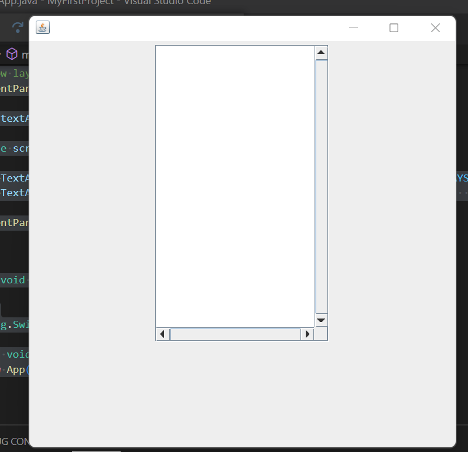

### GroupLayout

GroupLayout *groups its components and places them in a Container hierarchically*. The grouping is done by instances of the Group class.
Example:
```java
import java.awt.*;
import javax.swing.*;
public class App extends JFrame{
    public static void main(String[] args)
    {
        JFrame frame = new JFrame("GroupLayoutExample");
        frame.setDefaultCloseOperation(JFrame.EXIT_ON_CLOSE);
        Container contentPanel = frame.getContentPane();
        GroupLayout groupLayout = new GroupLayout(contentPanel);
        contentPanel.setLayout(groupLayout);
        JLabel clickMe = new JLabel("Click Here");
        JButton button = new JButton("This Button");
        groupLayout.setHorizontalGroup(
                    groupLayout.createSequentialGroup()
                                .addComponent(clickMe)
                                .addGap(10, 20, 100)
                                .addComponent(button));
        groupLayout.setVerticalGroup(
                     groupLayout.createParallelGroup(GroupLayout.Alignment.BASELINE)
                                .addComponent(clickMe)
                                .addComponent(button));
        frame.pack();
        frame.setVisible(true);
    }
}
```

Output:


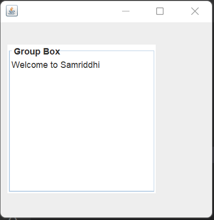

### GUI Elements

- JLabel
- JRadioButton
- ButtonGroup
- JCheckBox
- JTextField
- JTextArea
- JButton
- Border
- JComboBox
- JTabbedPane
- JPasswordField
- Look and Feel Management in Java Swing

### JLabel
The object of the JLabel class may be a component for putting text in a container. It’s used to display one line of **read-only** text. The text is often changed by an application but a user cannot edit it directly. It inherits the JComponent class.
Syntax: 
```java
JLabel jl = new JLabel();
```

### JLabel Constructors

- **JLabel():** It is used to create a JLabel instance with no image and with an empty string for the title.
- **JLabel(String s):** It is used to create a JLabel instance with the specified text.
- **JLabel(Icon i):** It is used to create a JLabel instance with the specified image.
- **JLabel(String s, Icon I, int horizontalAlignment):** It is used to create a JLabel instance with the specified text, image, and horizontal alignment.


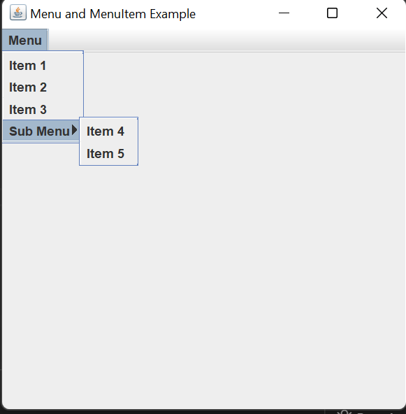

Code:
```java
import javax.swing.*;
public class App extends JFrame {
    public static void main(String[] args)
    {
        JFrame a=new JFrame();
        JLabel lbl = new JLabel("Welcome");
        lbl.setBounds(40,40,90,20);
        a.add(lbl);
        a.setSize(200,200);
        a.setLayout(null);
        a.setVisible(true);
    }
}
```

JRadioButton
This component allows the user to select only one item from a group item. By using the JRadioButton component you can choose one option from multiple options.
```java
JRadioButton jrb = new JRadioButton();
```

### JRadioButton Constructors

- **JRadioButton():** It is used to create an unselected radio button with no text.
- **JRadioButton(Label):** It is used to create an unselected radio button with specified text.
- **JRadioButton(Label, boolean):** It is used to create a radio button with the specified text and selected status.

Code:
```java
import javax.swing.*;
public class App {
    public static void main(String[] args)
    {
        JFrame f=new JFrame();
        JRadioButton r1=new JRadioButton("A) Male",true);
        JRadioButton r2=new JRadioButton("B) Female");
        r1.setBounds(75,50,100,30);
        r2.setBounds(75,100,100,30);
        ButtonGroup bg=new ButtonGroup();
        bg.add(r1);
        bg.add(r2);
        f.add(r1);
        f.add(r2);
        f.setSize(300,300);
        f.setLayout(null);
        f.setVisible(true);
    }
}
```

Output:


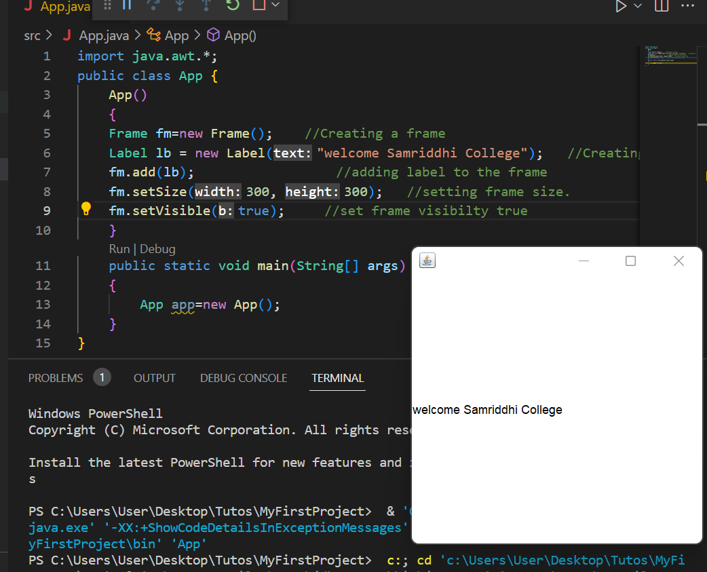

### JPasswordField

The object of a JPasswordField class is a text component specialized for password entry. It allows the editing of a single line of text. It inherits JTextField class.

Code:
```java
import javax.swing.*;
public class App {
    public static void main(String[] args)
    {
        JFrame f=new JFrame();
        JPasswordField value = new JPasswordField();
        JLabel l1=new JLabel("Password:");
        l1.setBounds(20,100, 80,30);
        value.setBounds(100,100,100,30);
        f.add(value);  f.add(l1);
        f.setSize(300,300);
        f.setLayout(null);
        f.setVisible(true);
    }
}
```

Output:


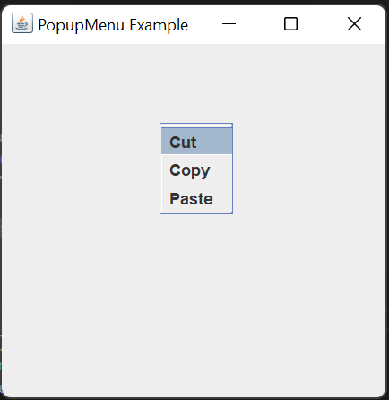

### JCheckBox

The JCheckBox class is used to create a checkbox. It is used to turn an option on (true) or off (false). Clicking on a CheckBox changes its state from "on" to "off" or from "off" to "on ".It inherits **JToggleButton** class.

Code:
```java
import javax.swing.*;
public class App {
    public static void main(String[] args)
    {
        JFrame f=new JFrame();
        JCheckBox checkBox1 = new JCheckBox("C++");
        checkBox1.setBounds(100,100, 50,50);
        JCheckBox checkBox2 = new JCheckBox("Java", true);
        checkBox2.setBounds(100,150, 100,50);
        f.add(checkBox1);
        f.add(checkBox2);
        f.setSize(200,200);
        f.setLayout(null);
        f.setVisible(true);
    }
}
```

Output:


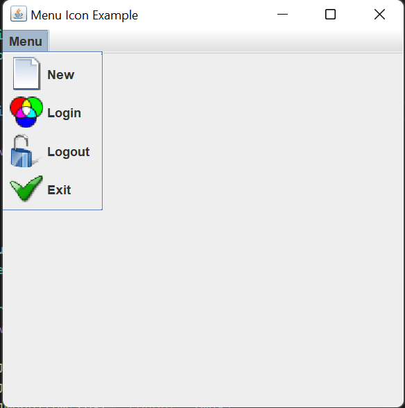

### JComboBox

JComboBox inherits the JComponent class and is used to show pop up menu of choices.

```java
import javax.swing.*;
public class App {
    public static void main(String[] args)
    {
        JFrame f=new JFrame();
        String courses[] = { "core java","advance java", "java servlet"};
        JComboBox c = new JComboBox<>(courses);
        c.setBounds(40,40,90,20);
        f.add(c);
        f.setSize(400,400);
        f.setLayout(null);
        f.setVisible(true);
    }
}
```

Output:


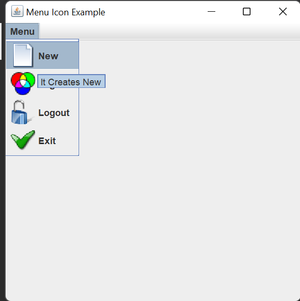

**JTextArea**
The object of a JTextArea class is a multi line region that displays text. It allows the editing of multiple line text. It inherits JTextComponent class

### Commonly used Constructors:

Code:
```java
import javax.swing.*;
public class App {
    public static void main(String[] args)
    {
        JFrame f=new JFrame();
        JTextArea area=new JTextArea("Welcome to javatpoint");
        area.setBounds(10,30, 200,200);
        f.add(area);
        f.setSize(300,300);
        f.setLayout(null);
        f.setVisible(true);
    }
}
```

Output


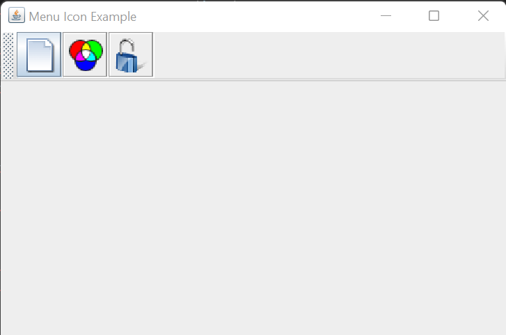

### JScrollPane

A JscrollPane is used to make scrollable view of a component. When screen size is limited, we use a scroll pane to display a large component or a component whose size can change dynamically.

### Commonly Used Method

```java
import javax.swing.*;
import java.awt.FlowLayout;
public class App {
    App()
    {
        JFrame f=new JFrame();
        f.setSize(500, 500);
        f.setVisible(true);
        f.setDefaultCloseOperation(JFrame.EXIT_ON_CLOSE);
        f.getContentPane().setLayout(new FlowLayout());
        JTextArea textArea = new JTextArea(20, 20);
        JScrollPane scrollableTextArea = new JScrollPane(textArea);
        scrollableTextArea.setHorizontalScrollBarPolicy(JScrollPane.HORIZONTAL_SCROLLBAR_ALWAYS);
        scrollableTextArea.setVerticalScrollBarPolicy(JScrollPane.VERTICAL_SCROLLBAR_ALWAYS);
        f.getContentPane().add(scrollableTextArea);
    }
    public static void main(String[] args)
    {
        javax.swing.SwingUtilities.invokeLater(new Runnable() {
            public void run() {
               new App();
            }
        });
    }
}
```

Output:


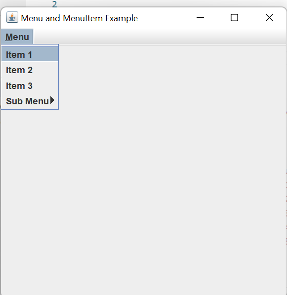

Border Swing Control in Java

The border is an interface using which we can apply a border to every component. To create the borders we have to use the methods available in BorderFactory class. We can apply the created border to any component by using the SetBorder() method.
Syntax: Component.setBorder(Border);

Methods of Border:
- **Border createLineBorder(Color, int):** It is used to create a line border. Here, the Color object specifies the color of the line and int specifies the width in pixels of the line.
- **Border createEtchedBorder(int, Color, Color):** It is used to create an etched border. Here, Color arguments specify the highlight and shadow colors to be used. Here, int arguments allow the border methods to be specified as either EtchedBorder.RAISED or EtchedBorder.LOWERED. The methods without the int arguments create a lowered etched border.
- **Border createBevelBorder(int, Color, Color):** It is used to create a raised or lowered beveled border, specifying the colors to use. Here, the integer argument can be either BevelBorder.RAISED or BevelBorder.LOWERED. Here, Color specifies the highlight and shadow colors.
- **MatteBorder createMatteBorder(int, int, int, int, Icon):** It is used to create a matte border. Here, the integer arguments specify the number of pixels that the border occupies at the top, left, bottom, and right (in that order) of whatever component uses it. Here, the color argument specifies the color which with the border should fill its area. Here, the icon argument specifies the icon which with the border should tile its area.
- **TitledBorder createTitledBorder(Border, String, int, int, Font, Color):** Create a titled border. Here, the string argument specifies the title to be displayed. Here, the optional font and color arguments specify the font and color to be used for the title's text. Here, the border argument specifies the border that should be displayed along with the title. Here, the integer arguments specify the number of pixels that the border occupies at the top, left, bottom, and right (in that order) of whatever component uses it.
- **CompoundBorder createCompoundBorder(Border, Border):** Combine two borders into one. Here, the first argument specifies the outer border; the second, the inner border.

Code:
```java
import javax.swing.*;
public class App {
    public static void main(String[] args)
    {
        JFrame f=new JFrame();
        JPanel j=new JPanel();
        JTextArea area=new JTextArea("Welcome to Samriddhi");
        area.setBorder(BorderFactory.createTitledBorder("Group Box"));
        area.setBounds(10,30, 200,200);
        f.add(j);
        f.add(area);
        f.setSize(300,300);
        f.setLayout(null);
        f.setVisible(true);
    }
}
```

Output:


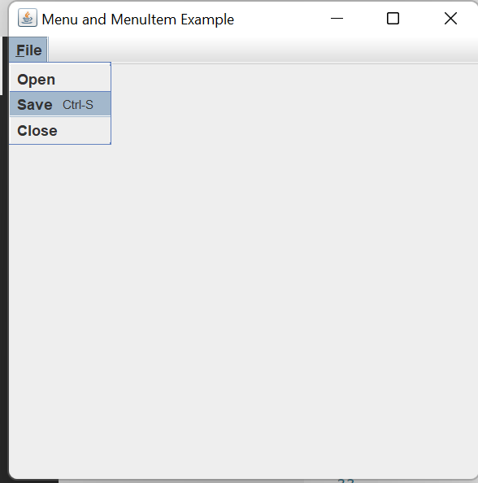

### Menu and MenuItem

```java
import javax.swing.*;
public class App {
    public static void main(String[] args)
    {
        JMenu menu, submenu;
        JMenuItem i1, i2, i3, i4, i5;
        JFrame f= new JFrame("Menu and MenuItem Example");
        JMenuBar mb=new JMenuBar();
        menu=new JMenu("Menu");
        submenu=new JMenu("Sub Menu");
        i1=new JMenuItem("Item 1");
        i2=new JMenuItem("Item 2");
        i3=new JMenuItem("Item 3");
        i4=new JMenuItem("Item 4");
        i5=new JMenuItem("Item 5");
        menu.add(i1);
        menu.add(i2);
        menu.add(i3);
        submenu.add(i4);
        submenu.add(i5);
        menu.add(submenu);
        mb.add(menu);
        f.setJMenuBar(mb);
        f.setSize(400,400);
        f.setLayout(null);
        f.setVisible(true);
    }
}
```

**Output:**

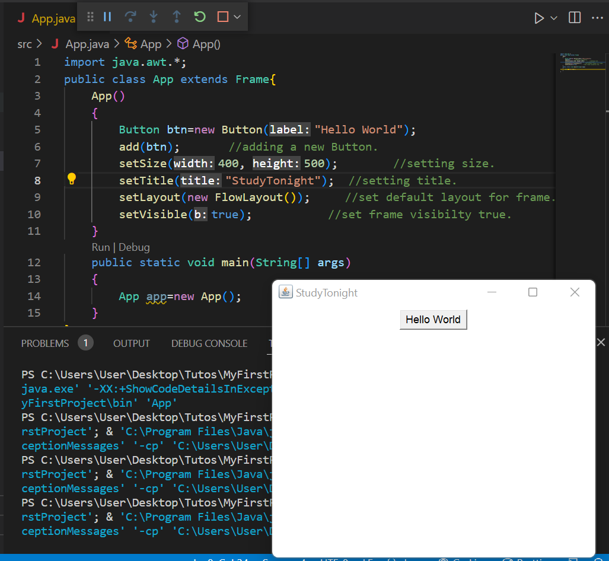

### JPopup Menu

```java
import javax.swing.*;
import java.awt.event.*;
public class App {
    public static void main(String[] args)
    {
        JFrame f= new JFrame("PopupMenu Example");
        JPopupMenu popupmenu = new JPopupMenu("Edit");
         JMenuItem cut = new JMenuItem("Cut");
         JMenuItem copy = new JMenuItem("Copy");
         JMenuItem paste = new JMenuItem("Paste");
         popupmenu.add(cut);
         popupmenu.add(copy);
         popupmenu.add(paste);
         f.addMouseListener(new MouseAdapter() {
            public void mouseClicked(MouseEvent e) {
                popupmenu.show(f , e.getX(), e.getY());
            }
         });
         f.add(popupmenu);
         f.setSize(300,300);
         f.setLayout(null);
         f.setVisible(true);
    }
}
```

**Output:**

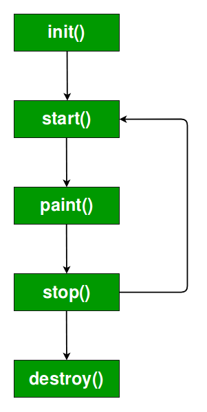

### Adding Icon in Menu

```java
import javax.swing.*;
public class App {
    public static void main(String[] args) {
    JFrame f=new JFrame("Menu Icon Example");
      ImageIcon img=new ImageIcon("new.png");
      ImageIcon img2=new ImageIcon("Login.png");
      ImageIcon img3=new ImageIcon("Logout.png");
      ImageIcon img4=new ImageIcon("Exit.png");
      JMenu menu;
        JMenuItem i1, i2, i3, i4;
        JMenuBar mb=new JMenuBar();
        menu=new JMenu("Menu");
        i1=new JMenuItem("New",img);
        i2=new JMenuItem("Login",img2);
        i3=new JMenuItem("Logout",img3);
        i4=new JMenuItem("Exit",img4);
        menu.add(i1);
        menu.add(i2);
        menu.add(i3);
        menu.add(i4);
        mb.add(menu);
        f.setJMenuBar(mb);
        f.setSize(400,400);
        f.setLayout(null);
        f.setVisible(true);
    }
}
```

**Output:**

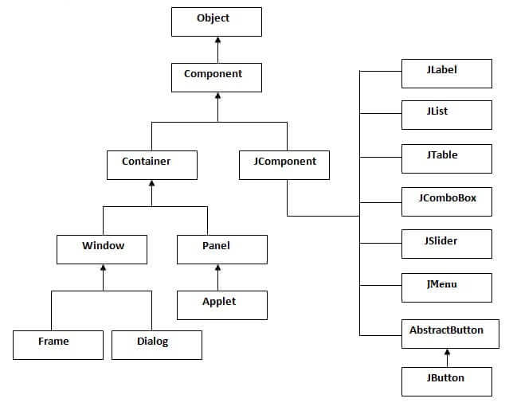

### Disable Menu Item

```java
i1.setEnabled(false);
```

**Code:**
```java
import javax.swing.*;
public class App {
    public static void main(String[] args) {
    JFrame f=new JFrame("Menu Icon Example");
      ImageIcon img=new ImageIcon("new.png");
      ImageIcon img2=new ImageIcon("Login.png");
      ImageIcon img3=new ImageIcon("Logout.png");
      ImageIcon img4=new ImageIcon("Exit.png");
      JMenu menu;
        JMenuItem i1, i2, i3, i4;
        JMenuBar mb=new JMenuBar();
        menu=new JMenu("Menu");
        i1=new JMenuItem("New",img);
        i2=new JMenuItem("Login",img2);
        i3=new JMenuItem("Logout",img3);
        i4=new JMenuItem("Exit",img4);
        menu.add(i1);
        menu.add(i2);
        menu.add(i3);
        menu.add(i4);
        i1.setEnabled(false);
        mb.add(menu);
        f.setJMenuBar(mb);
        f.setSize(400,400);
        f.setLayout(null);
        f.setVisible(true);
    }
}
```

### Adding Tooltip

```java
i1.setToolTipText("It Creates New");
```

**Code:**
```java
import javax.swing.*;
public class App {
    public static void main(String[] args) {
    JFrame f=new JFrame("Menu Icon Example");
      ImageIcon img=new ImageIcon("new.png");
      ImageIcon img2=new ImageIcon("Login.png");
      ImageIcon img3=new ImageIcon("Logout.png");
      ImageIcon img4=new ImageIcon("Exit.png");
      JMenu menu;
        JMenuItem i1, i2, i3, i4;
        JMenuBar mb=new JMenuBar();
        menu=new JMenu("Menu");
        i1=new JMenuItem("New",img);
        i2=new JMenuItem("Login",img2);
        i3=new JMenuItem("Logout",img3);
        i4=new JMenuItem("Exit",img4);
        menu.add(i1);
        menu.add(i2);
        menu.add(i3);
        menu.add(i4);
        i1.setToolTipText("It Creates New");
        mb.add(menu);
        f.setJMenuBar(mb);
        f.setSize(400,400);
        f.setLayout(null);
        f.setVisible(true);
    }
}
```

Output:


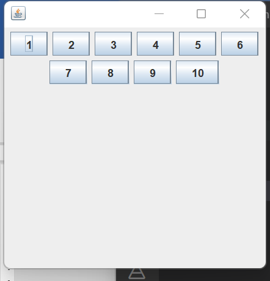

### Toolbar

```java
import javax.swing.*;
import java.awt.*;
public class App {
    public static void main(String[] args) {
    JFrame f=new JFrame("Menu Icon Example");
      ImageIcon img1=new ImageIcon("new.png");
      ImageIcon img2=new ImageIcon("Login.png");
      ImageIcon img3=new ImageIcon("Logout.png");
      JToolBar toolbar = new JToolBar();
      JPanel p = new JPanel();
      JButton newBtn = new JButton(img1);
      JButton openBtn = new JButton(img2);
      JButton saveBtn = new JButton(img3);
      toolbar.add(newBtn);
      toolbar.add(openBtn);
      toolbar.add(saveBtn);
      toolbar.add(p);
      f.add(toolbar, BorderLayout.NORTH);
      f.setSize(500, 500);
      f.setVisible(true);
    }
}
```

**Output:**

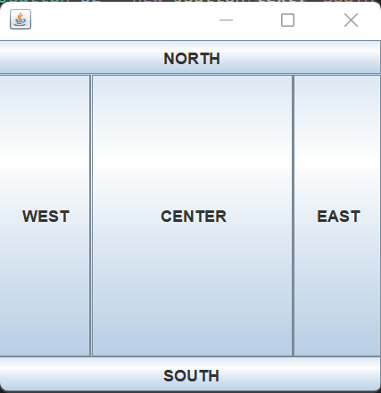

### Keyboard Mnemonics

A menu **mnemonic is a single-letter abbreviation** for a menu command. When the menu has already been pulled down, the user can type this single key to invoke that menu item. The mnemonic for a menu item is typically indicated by **underlining the letter of the shortcut** in the menu item name, which means that you must select a shortcut letter that appears in the menu item label. Mnemonics must be **unique** within a menu, You specify a mnemonic for a menu or a menu item with the **setMnemonic()** method.
Example:
```java
import javax.swing.*;
public class App {
    public static void main(String[] args) {
        JMenu menu, submenu;
        JMenuItem i1, i2, i3, i4, i5;
        JFrame f= new JFrame("Menu and MenuItem Example");
        JMenuBar mb=new JMenuBar();
        menu=new JMenu("Menu");
        menu.setMnemonic('M');
        submenu=new JMenu("Sub Menu");
        i1=new JMenuItem("Item 1");
        i2=new JMenuItem("Item 2");
        i3=new JMenuItem("Item 3");
        i4=new JMenuItem("Item 4");
        i5=new JMenuItem("Item 5");
        menu.add(i1);
        menu.add(i2);
        menu.add(i3);
        submenu.add(i4);
        submenu.add(i5);
        menu.add(submenu);
        mb.add(menu);
        f.setJMenuBar(mb);
        f.setSize(400,400);
        f.setLayout(null);
        f.setVisible(true);
    }
}
```


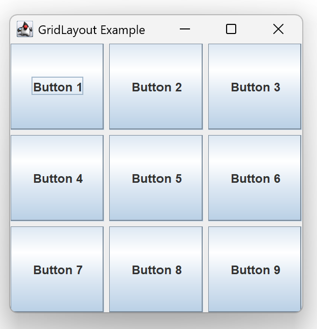

### Menu Accelerators

A menu accelerator is a **unique keyboard** command that can be used to invoke a menu item even when the menu is not displayed. An accelerator is represented by a **javax.swing.KeyStroke** object and usually includes a keyboard modifier such as **Ctrl or Alt**. Unlike mnemonics, accelerators can be applied only to **menu items**, not to menus in a menu bar. You can create an accelerator for a menu item by calling **setAccelerator().** To obtain an appropriate **KeyStroke** object, call the static **KeyStroke.getKeyStroke()** method with the keycode and modifier mask for the keyboard command you want to use:
Example:
```java
import javax.swing.*;
import java.awt.event.*;
public class App {
    public static void main(String[] args) {
        JMenu menu;
        JMenuItem i1, i2, i3;
        JFrame f= new JFrame("Menu and MenuItem Example");
        JMenuBar mb=new JMenuBar();
        menu=new JMenu("File");
        menu.setMnemonic('F');
        i1=new JMenuItem("Open");
        i2=new JMenuItem("Save");
        i3=new JMenuItem("Close");
        i2.setAccelerator( KeyStroke.getKeyStroke(KeyEvent.VK_S, ActionEvent.CTRL_MASK));
        menu.add(i1);
        menu.add(i2);
        menu.add(i3);
        mb.add(menu);
        f.setJMenuBar(mb);
        f.setSize(400,400);
        f.setLayout(null);
        f.setVisible(true);
    }
}
```


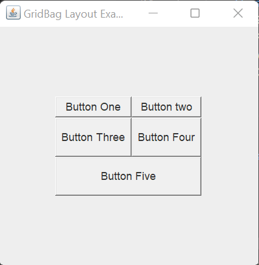


---

### Table 1

| AWT | Swing |
| --- | --- |
| AWT stands for “Abstract Windows Toolkit”. | Swing is derived from Java Foundation Classes (JFC) |
| AWT components are heavyweight as AWT directly makes subroutine calls to subroutines of the Operating System. | Swing components are written on top of AWT and as such the components are light-weight. |
| AWT components are part of the java.awt package. | Swing components are part of javax.swing package. |
| AWT is platform - dependent. | Swing components are written in Java and are platform-independent. |
| AWT doesn’t have its look and feel. It adapts the look and feel of the platform on which it runs. | Swing provides a different look and feel of its own. |
| AWT only has basic features and does not support advanced features like the table, tabbed panel, etc. | Swing provides advanced features like JTabbed panel, JTable, etc. |
| AWT is as good as a thin layer of classes sitting on top of the Operating system which makes it platform-dependent. | Swing is larger and also contains rich functionality. |
| AWT makes us write a lot of things. | Swing has most of the features built-in. |


### Table 2

| FlowLayout.LEFT | Aligns components to the left |
| --- | --- |


### Table 3

| FlowLayout.RIGHT | Aligns components to the right |
| --- | --- |


### Table 4

| FlowLayout.CENTER | Aligns components at the center (default) |
| --- | --- |


### Table 5

| FlowLayout.LEADING | Aligns components to the start of the container (depends on orientation) |
| --- | --- |


### Table 6

| FlowLayout.TRAILING | Aligns components to the end of the container (depends on orientation) |
| --- | --- |
|  |  |


### Table 7

| Constructor | Description |
| --- | --- |
| JPasswordField() | Constructs a new JPasswordField, with a default document, null starting text string, and 0 column width. |
| JPasswordField(int columns) | Constructs a new empty JPasswordField with the specified number of columns. |
| JPasswordField(String text) | Constructs a new JPasswordField initialized with the specified text. |
| JPasswordField(String text, int columns) | Construct a new JPasswordField initialized with the specified text and columns. |


### Table 8

| Constructor | Description |
| --- | --- |
| JCheckBox() | Creates an initially unselected check box button with no text, no icon. |
| JCheckBox(String s) | Creates an initially unselected check box with text. |
| JCheckBox(String text, boolean selected) | Creates a check box with text and specifies whether or not it is initially selected. |
| JCheckBox(Action a) | Creates a check box where properties are taken from the Action supplied. |


### Table 9

| Constructor | Description |
| --- | --- |
| JTextArea() | Creates a text area that displays no text initially. |
| JTextArea(String s) | Creates a text area that displays specified text initially. |
| JTextArea(int row, int column) | Creates a text area with the specified number of rows and columns that displays no text initially. |
| JTextArea(String s, int row, int column) | Creates a text area with the specified number of rows and columns that displays specified text. |


### Table 10

| Constructor | Purpose |
| --- | --- |
| JScrollPane() | It creates a scroll pane. The Component parameter, when present, sets the scroll pane's client. The two int parameters, when present, set the vertical and horizontal scroll bar policies (respectively). |
| JScrollPane(Component) | It creates a scroll pane. The Component parameter, when present, sets the scroll pane's client. The two int parameters, when present, set the vertical and horizontal scroll bar policies (respectively). |
| JScrollPane(int, int) | It creates a scroll pane. The Component parameter, when present, sets the scroll pane's client. The two int parameters, when present, set the vertical and horizontal scroll bar policies (respectively). |
| JScrollPane(Component, int, int) | It creates a scroll pane. The Component parameter, when present, sets the scroll pane's client. The two int parameters, when present, set the vertical and horizontal scroll bar policies (respectively). |


---

## GridLayout & GridBagLayout

*Source: `Unit_2(GridbBag,GridLayout).docx`*

> 📷 *This document contains images/diagrams — see the original .docx for visual content*

Create a Simple Login Form using GridLayout in Java.

```java
import javax.swing.*;
import java.awt.*;
import java.awt.event.*;
public class App implements ActionListener{
    private JFrame f;
    private JLabel userLabel;
    private JTextField userText;
    private JLabel passwordLabel;
    private JPasswordField passwordText;
    private JButton loginButton;
    private JButton resetButton;
    private JLabel messageLabel;
    App()
    {
        f=new JFrame();
        f.setTitle("Login Form");
        f.setLayout(new GridLayout(4, 2, 10, 10));
        userLabel = new JLabel("Username");
        userLabel.setHorizontalAlignment(JLabel.CENTER);
        f.add(userLabel);
        userText = new JTextField();
        f.add(userText);
        passwordLabel = new JLabel("Password");
        passwordLabel.setHorizontalAlignment(JLabel.CENTER);
        f.add(passwordLabel);
        passwordText = new JPasswordField();
        f.add(passwordText);
        loginButton = new JButton("Login");
        loginButton.addActionListener(this);
        f.add(loginButton);
        resetButton = new JButton("Reset");
        resetButton.addActionListener(this);
        f.add(resetButton);
        messageLabel = new JLabel("");
        messageLabel.setHorizontalAlignment(JLabel.CENTER);
        f.add(messageLabel);
        f.setSize(300,200);
        f.setVisible(true);
    }
    public static void main(String[] args) throws Exception {
        new App();
    }
    @Override
    public void actionPerformed(ActionEvent e) {
        if (e.getSource() == loginButton) {
            String username = userText.getText();
            String password = new String(passwordText.getPassword());
            if (username.equals("admin") && password.equals("admin")) {
                messageLabel.setText("Login successful");
            } else {
                messageLabel.setText("Invalid username or password");
            }
        } else if (e.getSource() == resetButton) {
            userText.setText("");
            passwordText.setText("");
            messageLabel.setText("");
        }
    }
}
```


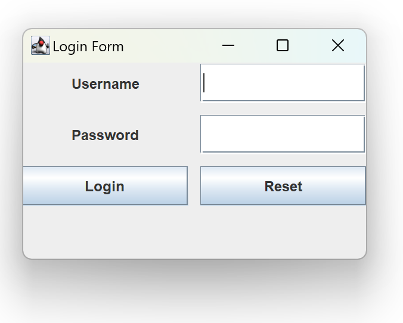

Create a Simple Login Form using GridBagLayout in Java.

```java
import javax.swing.*;
import java.awt.*;
import java.awt.event.*;
public class App implements ActionListener{
    private JFrame f;
    private JLabel userLabel;
    private JTextField userText;
    private JLabel passwordLabel;
    private JPasswordField passwordText;
    private JButton loginButton;
    private JButton resetButton;
    private JLabel messageLabel;
    App()
    {
        f=new JFrame();
        f.setTitle("Login Form");
        f.setLayout(new GridBagLayout());
        GridBagConstraints gbc = new GridBagConstraints();
        gbc.insets = new Insets(5, 5, 5, 5);
        gbc.fill = GridBagConstraints.HORIZONTAL;
        userLabel = new JLabel("Username");
        gbc.gridx = 0;
        gbc.gridy = 0;
        f.add(userLabel, gbc);
        userText = new JTextField();
        gbc.gridx = 1;
        gbc.gridy = 0;
        f.add(userText, gbc);
        passwordLabel = new JLabel("Password");
        gbc.gridx = 0;
        gbc.gridy = 1;
        f.add(passwordLabel, gbc);
        passwordText = new JPasswordField();
        gbc.gridx = 1;
        gbc.gridy = 1;
        f.add(passwordText, gbc);
        loginButton = new JButton("Login");
        loginButton.addActionListener(this);
        gbc.gridx = 0;
        gbc.gridy = 2;
        f.add(loginButton, gbc);
        resetButton = new JButton("Reset");
        resetButton.addActionListener(this);
        gbc.gridx = 1;
        gbc.gridy = 2;
        f.add(resetButton, gbc);
        messageLabel = new JLabel("");
        messageLabel.setHorizontalAlignment(JLabel.CENTER);
        gbc.gridwidth = 2;
        gbc.gridx = 0;
        gbc.gridy = 3;
        f.add(messageLabel, gbc);
        f.setSize(300,200);
        f.setVisible(true);
    }
    public static void main(String[] args) throws Exception {
        new App();
    }
    @Override
    public void actionPerformed(ActionEvent e) {
        if (e.getSource() == loginButton) {
            String username = userText.getText();
            String password = new String(passwordText.getPassword());
            if (username.equals("admin") && password.equals("admin")) {
                messageLabel.setText("Login successful");
            } else {
                messageLabel.setText("Invalid username or password");
            }
        } else if (e.getSource() == resetButton) {
            userText.setText("");
            passwordText.setText("");
            messageLabel.setText("");
        }
    }
}
```


---

## Swing Dialogs (Continued)

*Source: `Unit-2_Cont.docx`*

> 📷 *This document contains images/diagrams — see the original .docx for visual content*

### Option Dialog:

**JOptionPane **class is used to display four types of dialog boxes
**MessageDialog **-  dialog box that displays a message making it possible to add icons to alert the user.
**ConfirmDialog  **-  dialog box that besides sending a message, enables the user to answer a question.
**InputDialog       **-  dialog box that besides sending a message, allows entry of a text.
**OptionDialog    **-  dialog box that covers the three previous types.
Example:
```java
import javax.swing.*;
public class App {
    public static void main(String[] args) {
        JFrame frame = new JFrame("Main Window");
        JOptionPane.showMessageDialog(frame, "Hello Java");
        JOptionPane.showMessageDialog(frame,"Successfully Updated.","Alert",JOptionPane.WARNING_MESSAGE);
        String name=JOptionPane.showInputDialog(frame,"Enter Name");
        int result = JOptionPane.showConfirmDialog(null, "Do you want to remove item now?");
        frame.setSize(350,350);
        frame.setDefaultCloseOperation(JFrame.EXIT_ON_CLOSE);
        frame.setVisible(true);
    }
}
```

Program to create a simple JDialog
```java
import javax.swing.*;
import java.awt.event.*;
public class App extends JFrame implements ActionListener {
    static JFrame f;
    public static void main(String[] args) {
      f = new JFrame("frame");
      App s = new App();
      JButton b = new JButton("click");
      b.setBounds(100,120,100,40);
      b.addActionListener(s);
      f.add(b);
      f.setSize(400, 400);
      f.setLayout(null);
      f.setVisible(true);
    }
    public void actionPerformed(ActionEvent e)
    {
        String s = e.getActionCommand();
        if (s.equals("click")) {
            JDialog d = new JDialog(f, "dialog Box");
            JLabel l = new JLabel("this is a dialog box");
            d.add(l);
            d.setSize(100, 100);
            d.setVisible(true);
        }
    }
}
```

Output:


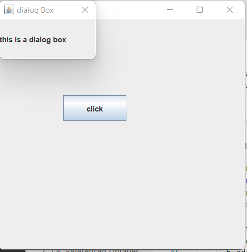

**showMessageDialog** — Displays a modal dialog with one button, which is labeled "OK" (or the localized equivalent). You can easily specify the message, icon, and title that the dialog displays. Here are some examples of using showMessageDialog:

**showOptionDialog** — Displays a modal dialog with the specified buttons, icons, message, title, and so on. With this method, you can change the text that appears on the buttons of standard dialogs. You can also perform many other kinds of customization.

**JOptionPane (constructor)** — Creates a JOptionPane with the specified buttons, icons, message, title, and so on. You must then add the option pane to a JDialog, register a property-change listener on the option pane, and show the dialog. See Stopping Automatic Dialog Closing for details.

**Example:**

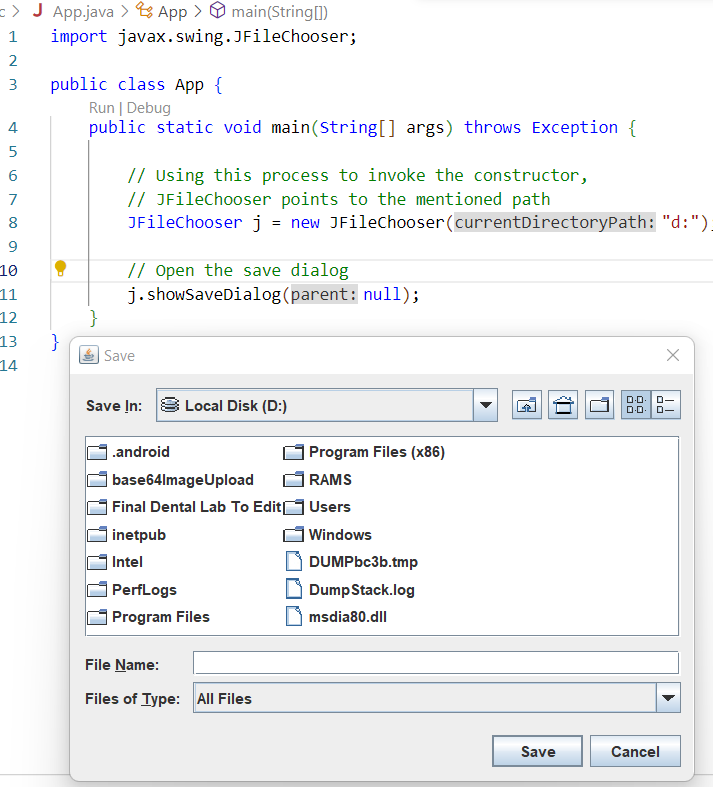

### Color Chooser

```java
import java.awt.event.*;
import java.awt.*;
import javax.swing.*;
public class App extends JFrame implements ActionListener{
    JButton b = new JButton("color");
    Container c = getContentPane();
    App()
    {
        c.setLayout(new FlowLayout());
        b.addActionListener(this);
        c.add(b);
        setSize(400, 400);
        setVisible(true);
        setDefaultCloseOperation(EXIT_ON_CLOSE);
    }
    public void actionPerformed(ActionEvent e)
    {
        Color initialcolor = Color.RED;
        Color color = JColorChooser.showDialog(this,
                    "Select a color", initialcolor);
        c.setBackground(color);
    }
    public static void main(String[] args) throws Exception {
        App ch = new App();
    }
}
```

Output:

After Choosing Color Yellow Pressing Ok:
```

```java
public class App extends JFrame implements ActionListener{
    // create a button
    JButton b = new JButton("color");
    Container c = getContentPane();
    // Constructor
    App()
    {
        // set Layout
        c.setLayout(new FlowLayout());
        // add Listener
        b.addActionListener(this);
        // add button to the Container
        c.add(b);
        setSize(400, 400);
        setVisible(true);
        setDefaultCloseOperation(EXIT_ON_CLOSE);
    }
    public void actionPerformed(ActionEvent e)
    {
        Color initialcolor = Color.RED;
        // color chooser Dialog Box
        Color color = JColorChooser.showDialog(this,
                    "Select a color", initialcolor);
        // set Background color of the Container
        c.setBackground(color);
    }
    public static void main(String[] args) throws Exception {
        App ch = new App();
```

```java
    }
}
Output:
```


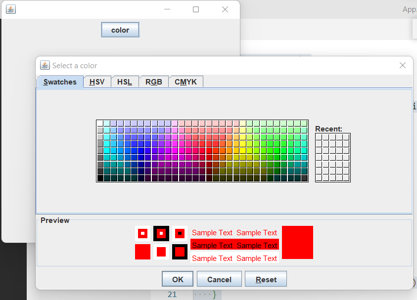

```java
After Choosing Color Yellow Pressing Ok:
```


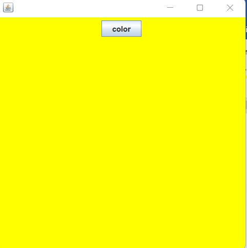

### Internal Frame

JInternalFrame is a part of Java Swing . JInternalFrame is a container that provides many features of a frame which includes displaying title, opening, closing, resizing, support for menu bar, etc. 

Code:

```java
import java.awt.*;
import javax.swing.*;
public class App extends JFrame{
    static JFrame f;
    static JLabel l, l1;
    public static void main(String[] args) throws Exception {
       f = new JFrame("frame");
       f.setLayout(new FlowLayout());
       JInternalFrame in = new JInternalFrame("frame 1",
        true, true, true, true);
       JButton b = new JButton("button");
       l = new JLabel("This is a JInternal Frame no 1  ");
       JPanel p = new JPanel();
       p.add(l);
       p.add(b);
       in.setVisible(true);
       in.add(p);
       f.add(in);
       f.setSize(300, 300);
       f.setVisible(true);
    }
}
```

Output:


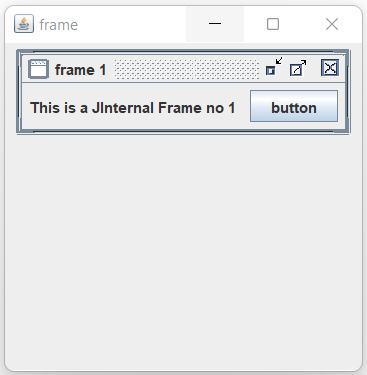

### Tables

In Java, tables are used to arrange data into *columns* and *rows*. A column is space that runs horizontally on a table, while a row is a space that runs horizontally in your table. The intersection between a column and a row is called a *cell* and is used to hold singular piece of data.
In Java, developers can use the **JTable** method to create a table in their applications. **JTable** is a Swing component that inherits from the **JComponent** class.
```java
JTable table = new JTable (row, column);
```


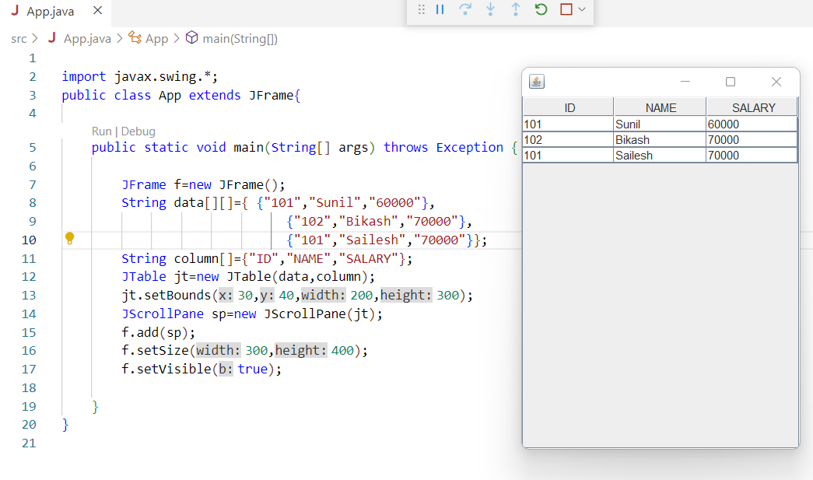

Write a program to develop a Java Swing application that contains a form with Name and Email text fields and Gender radio buttons (Male and Female). The form should include a Save button to insert the entered data into a database using JDBC when clicked, and a Reset button to clear all input fields. The application should also display all saved records in a JTable. The records must be loaded from the database when the form loads and the JTable should automatically refresh after saving a new record.

```java
import java.sql.*;
import javax.swing.*;
import javax.swing.table.DefaultTableModel;
import java.awt.event.*;
public class App extends JFrame implements ActionListener {
    JTextField txtName, txtEmail;
    JRadioButton rbMale, rbFemale;
    JButton btnSave, btnReset;
    JTable table;
    DefaultTableModel model;
    Connection con;
    public App() {
        setTitle("User Form");
        setSize(600, 500);
        setLayout(null);
        JLabel lblName = new JLabel("Name:");
        lblName.setBounds(50, 30, 100, 30);
        add(lblName);
        JLabel lblEmail = new JLabel("Email:");
        lblEmail.setBounds(50, 70, 100, 30);
        add(lblEmail);
        JLabel lblGender = new JLabel("Gender:");
        lblGender.setBounds(50, 110, 100, 30);
        add(lblGender);
        txtName = new JTextField();
        txtName.setBounds(150, 30, 200, 30);
        add(txtName);
        txtEmail = new JTextField();
        txtEmail.setBounds(150, 70, 200, 30);
        add(txtEmail);
        rbMale = new JRadioButton("Male");
        rbMale.setBounds(150, 110, 80, 30);
        rbFemale = new JRadioButton("Female");
        rbFemale.setBounds(230, 110, 100, 30);
        ButtonGroup bg = new ButtonGroup();
        bg.add(rbMale);
        bg.add(rbFemale);
        add(rbMale);
        add(rbFemale);
        btnSave = new JButton("Save");
        btnSave.setBounds(150, 160, 90, 30);
        add(btnSave);
        btnReset = new JButton("Reset");
        btnReset.setBounds(260, 160, 90, 30);
        add(btnReset);
        model = new DefaultTableModel();
        model.addColumn("ID");
        model.addColumn("Name");
        model.addColumn("Email");
        model.addColumn("Gender");
        table = new JTable(model);
        JScrollPane sp = new JScrollPane(table);
        sp.setBounds(50, 220, 480, 200);
        add(sp);
        loadData();
        btnSave.addActionListener(this);
        btnReset.addActionListener(this);
        setVisible(true);
    }
    public void actionPerformed(ActionEvent e) {
        if(e.getSource()==btnSave) {
            saveData();
            loadData();
        } else {
            clearForm();
        }
    }
    public void saveData() {
        try {
            Class.forName("com.mysql.cj.jdbc.Driver");
            con = DriverManager.getConnection(
                    "jdbc:mysql://localhost:3306/samdb",
                    "root",
                    "root");
            String name = txtName.getText();
            String email = txtEmail.getText();
            String gender = rbMale.isSelected() ? "Male" : "Female";
            PreparedStatement pst = con.prepareStatement(
                    "INSERT INTO tblstudent(name,email,gender) VALUES(?,?,?)");
            pst.setString(1, name);
            pst.setString(2, email);
            pst.setString(3, gender);
            pst.executeUpdate();
            con.close();
            JOptionPane.showMessageDialog(this, "Record Saved");
        } catch (Exception e) {
            e.printStackTrace();
        }
    }
    public void loadData() {
        try {
            model.setRowCount(0);
            Class.forName("com.mysql.cj.jdbc.Driver");
            con = DriverManager.getConnection(
                    "jdbc:mysql://localhost:3306/samdb",
                    "root",
                    "root");
            Statement st = con.createStatement();
            ResultSet rs = st.executeQuery("SELECT * FROM tblstudent");
            while (rs.next()) {
                model.addRow(new Object[]{
                        rs.getInt("id"),
                        rs.getString("name"),
                        rs.getString("email"),
                        rs.getString("gender")
                });
            }
            con.close();
        } catch (Exception e) {
            e.printStackTrace();
        }
    }
    public void clearForm() {
        txtName.setText("");
        txtEmail.setText("");
        rbMale.setSelected(true);
        rbFemale.setSelected(false);
        txtName.requestFocus();
    }
    public static void main(String[] args) {
        new App();
    }
}
```

Write a program to develop a Java Swing application to create a Login form using GridLayout. The form should contain fields for Username and Password along with a Login button. Validate the entered username and password from a database using JDBC. If the login credentials are correct, display a message "Authorized". If the credentials are incorrect, display a message "Invalid Username and Password".

```java
import java.sql.*;
import javax.swing.*;
import java.awt.*;
import java.awt.event.*;
public class LoginApp extends JFrame implements ActionListener {
    JTextField txtUsername;
    JPasswordField txtPassword;
    JButton btnLogin, btnReset;
    Connection con;
    public LoginApp() {
        setTitle("Login Form");
        setSize(350, 200);
        setLayout(new GridLayout(3, 2, 10, 10));
        JLabel lblUsername = new JLabel("Username:");
        JLabel lblPassword = new JLabel("Password:");
        txtUsername = new JTextField();
        txtPassword = new JPasswordField();
        btnLogin = new JButton("Login");
        btnReset = new JButton("Reset");
        add(lblUsername);
        add(txtUsername);
        add(lblPassword);
        add(txtPassword);
        add(btnLogin);
        add(btnReset);
        btnLogin.addActionListener(this);
        btnReset.addActionListener(this);
        setVisible(true);
    }
    public void actionPerformed(ActionEvent e) {
        if (e.getSource() == btnLogin) {
            validateLogin();
        } else {
            clearForm();
        }
    }
    public void validateLogin() {
        try {
            Class.forName("com.mysql.cj.jdbc.Driver");
            con = DriverManager.getConnection(
                    "jdbc:mysql://localhost:3306/samdb",
                    "root",
                    "root");
            String username = txtUsername.getText();
            String password = new String(txtPassword.getPassword());
            PreparedStatement pst = con.prepareStatement(
                    "SELECT * FROM tbluser WHERE username=? AND password=?");
            pst.setString(1, username);
            pst.setString(2, password);
            ResultSet rs = pst.executeQuery();
            if (rs.next()) {
                JOptionPane.showMessageDialog(this, "Authorized");
            } else {
                JOptionPane.showMessageDialog(this,
                        "Invalid Username and Password");
            }
            con.close();
        } catch (Exception ex) {
            ex.printStackTrace();
        }
    }
    public void clearForm() {
        txtUsername.setText("");
        txtPassword.setText("");
        txtUsername.requestFocus();
    }
    public static void main(String[] args) {
        new LoginApp();
    }
}
```

### Tree
The JTree class is used to display the tree structured data or hierarchical data. JTree is a complex component. It has a 'root node' at the top most which is a parent for all nodes in the tree. It inherits JComponent class.

```java
import javax.swing.*;
import javax.swing.tree.DefaultMutableTreeNode;
public class App{
    public static void main(String[] args) throws Exception {
        JFrame f=new JFrame();
        DefaultMutableTreeNode style=new DefaultMutableTreeNode("Style");
        DefaultMutableTreeNode color=new DefaultMutableTreeNode("color");
        DefaultMutableTreeNode font=new DefaultMutableTreeNode("font");
        style.add(color);
        style.add(font);
        DefaultMutableTreeNode red=new DefaultMutableTreeNode("red");
        DefaultMutableTreeNode blue=new DefaultMutableTreeNode("blue");
        DefaultMutableTreeNode black=new DefaultMutableTreeNode("black");
        DefaultMutableTreeNode green=new DefaultMutableTreeNode("green");
        color.add(red); color.add(blue); color.add(black); color.add(green);
        JTree jt=new JTree(style);
        f.add(jt);
        f.setSize(200,200);
        f.setVisible(true);
    }
}
```

Output:


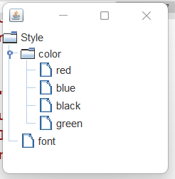


---

### Table 1

|  | //default title and icon
JOptionPane.showMessageDialog(frame,
    "Eggs are not supposed to be green."); |
| --- | --- |
|  | //custom title, warning icon
JOptionPane.showMessageDialog(frame,
    "Eggs are not supposed to be green.",
    "Inane warning",
    JOptionPane.WARNING_MESSAGE); |
|  | //custom title, error icon
JOptionPane.showMessageDialog(frame,
    "Eggs are not supposed to be green.",
    "Inane error",
    JOptionPane.ERROR_MESSAGE); |
|  | //custom title, no icon
JOptionPane.showMessageDialog(frame,
    "Eggs are not supposed to be green.",
    "A plain message",
    JOptionPane.PLAIN_MESSAGE); |
|  | //custom title, custom icon
JOptionPane.showMessageDialog(frame,
    "Eggs are not supposed to be green.",
    "Inane custom dialog",
    JOptionPane.INFORMATION_MESSAGE,
    icon); |


### Table 2

|  |
| --- |
| //Custom button text
Object[] options = {"Yes, please",
                    "No, thanks",
                    "No eggs, no ham!"};
int n = JOptionPane.showOptionDialog(frame,
    "Would you like some green eggs to go "
    + "with that ham?",
    "A Silly Question",
    JOptionPane.YES_NO_CANCEL_OPTION,
    JOptionPane.QUESTION_MESSAGE,
    null,
    options,
    options[2]); |


### Table 3

|  |
| --- |
| final JOptionPane optionPane = new JOptionPane(
    "The only way to close this dialog is by\n"
    + "pressing one of the following buttons.\n"
    + "Do you understand?",
    JOptionPane.QUESTION_MESSAGE,
    JOptionPane.YES_NO_OPTION);


### File Chooser

```java
import javax.swing.JFileChooser;

public class App {
    public static void main(String[] args) throws Exception {
        
        // Using this process to invoke the constructor,
        // JFileChooser points to user's default directory
        JFileChooser j = new JFileChooser();
        
        // Open the save dialog
        j.showSaveDialog(null);
    }
}
```

Output:


---
