# Chapter 3_Event Handling

> *Source: Sunil Sir's Lecture Notes — B.Sc. CSIT (Tribhuvan University)*

---

## Unit 3: Event Handling

*Source: `UNIT-3.docx`*

> 📷 *This document contains images/diagrams — see the original .docx for visual content*

### UNIT-3

### Event Handling

The change in the **state of an object** or **behavior** by performing actions is referred to as **an Event** in Java. Actions include button click, keypress, page scrolling, or cursor movement.
Java provides a package java.awt.event that contains several event classes.
We can classify the events in the following two categories:
Foreground Events
Background Events

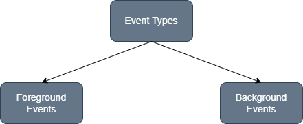

### Foreground Events

**Foreground events** are those events that require user interaction to generate. In order to generate these foreground events, the user interacts with components in GUI. When a user clicks on a button, moves the cursor, and scrolls the scrollbar, an event will be fired.

### Background Events

**Background events** don't require any user interaction. These events automatically generate in the background. OS failure, OS interrupts, operation completion, etc., are examples of background events.

### Delegation Event Model

A mechanism that control the events and decide what should happen if an event occur. Java follows the **Delegation Event Model** for handling the events.
The **Delegation Event Model** consists **of Source** and **Listener**.

### Source

Buttons, checkboxes, list, menu-item, choice, scrollbar, etc., are the sources from which events are generated.

### Listeners

The events which are generated from the source are handled by the **listeners**. Each and every listener represents interfaces that are responsible for handling events.

### Delegation Event Model in Java

The Delegation Event model is defined to **handle events in GUI **. The  stands for Graphical User Interface, where a user graphically/visually interacts with the system. The GUI programming is naturally event-driven; whenever a user initiates an activity such as a mouse activity, clicks, scrolling, etc., each is known as an event that is mapped to a code to respond to functionality to the user. This is known as event handling.
In this section, we will discuss event processing and how to implement the delegation event model in Java
. We will also discuss the different components of an Event Model.

### Event Processing in Java


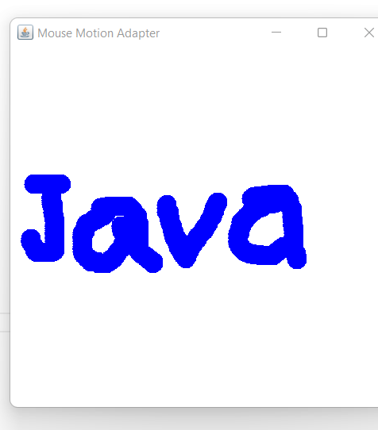

The key advantage of the Delegation Event Model is that the application logic is completely separated from the interface logic.
In this model, the listener must be connected with a source to receive the event notifications. Thus, the events will only be received by the listeners who wish to receive them
Basically, an Event Model is based on the following three components:
Events
Events Sources
Events Listeners

### Events

The Events are the objects that define state change in a source. An event can be generated as a reaction of a user while interacting with GUI elements. Some of the event generation activities are moving the mouse pointer, clicking on a button, pressing the keyboard key, selecting an item from the list, and so on. We can also consider many other user operations as events.

### Event Sources

A source is an object that causes and generates an event. It generates an event when the internal state of the object is changed. The sources are allowed to generate several different types of events.
A source must register a listener to receive notifications for a specific event. Each event contains its registration method. Below is an example:
**public** **void** addTypeListener (TypeListener e1)  

### Event Listeners

An event listener is an object that is invoked when an event triggers. The listeners require two things; first, it must be registered with a source; however, it can be registered with several resources to receive notification about the events. Second, it must implement the methods to receive and process the received notifications. For example, 
the **MouseMotionListener** interface provides two methods when the mouse is dragged and moved. Any object can receive and process these events if it implements the MouseMotionListener interface.

### These are some of the most used Event classes:

### ActionListener:

The Java **ActionListener** is notified whenever you click on the button or menu item. It is notified against **ActionEvent**. The **ActionListener** interface is found in **java.awt.event** package. It has only one method: **actionPerformed().**

### ActionListener Example:

```java
import java.awt.*;
import java.awt.event.*;
//1st Step Implement ActionListner
public class App implements ActionListener{
   TextField tf; Button b;
   App()
   {
    Frame f=new Frame(); tf=new TextField();
    tf.setBounds(50,50, 150,20); b=new Button("Click Here");
    b.setBounds(50,100,60,30);
    //2nd step register
    b.addActionListener(this);
    f.add(b); f.add(tf);
    f.setSize(400,400);
    f.setLayout(null); f.setVisible(true);
   }
   //3rd Step listener implementation
```

**    public void actionPerformed(ActionEvent e)**
**    {             **
**        tf.setText("Hello World");        **
**    }**
```java
    public static void main(String[] args) throws Exception {
```

```java
      new App();
```

```java
    }
}
Output:
```


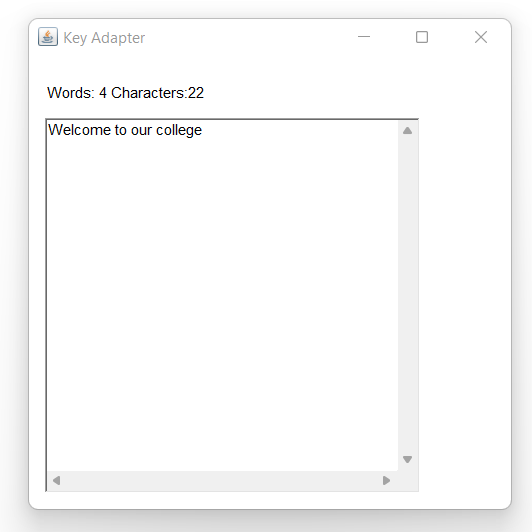

**MouseListener:**
The Java **MouseListener** is notified whenever you change the **state of mouse**. It is notified against **MouseEvent**. The **MouseListener** interface is found in **java.awt.event** package. It has **five** methods.
**mouseClicked(), mousePressed(), mouseEntered(), mouseExited() and mouseReleased()** 

### Mouse Listener Example:

```java
import java.awt.*;
import java.awt.event.*;
//1st Step Implement ActionListner
public class App implements MouseListener{
    Label l;
   App()
   {
     Frame f=new Frame();
     l=new Label();
     l.setBounds(20,50,100,20);
    f.add(l);
    f.addMouseListener(this);
    f.setSize(300,300);
    f.setLayout(null);
    f.setVisible(true);
   }
   public void mouseClicked(MouseEvent e) {
    l.setText("Mouse Clicked");
    }
    public void mouseEntered(MouseEvent e) {
    l.setText("Mouse Entered");
    }
    public void mouseExited(MouseEvent e) {
    l.setText("Mouse Exited");
    }
    public void mousePressed(MouseEvent e) {
    l.setText("Mouse Pressed");
    }
    public void mouseReleased(MouseEvent e) {
    l.setText("Mouse Released");
    }
```

```java
    public static void main(String[] args) throws Exception {
```

```java
      new App();
```

```java
    }
}
```

**Output:**

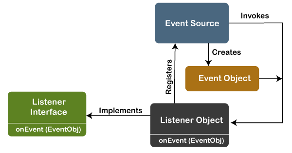

### MouseMotionListener:

The Java **MouseMotionListener** is notified whenever you **move** or **drag** mouse. It is notified against **MouseEvent**. The **MouseMotionListener** interface is found in **java.awt.event** package. It has two methods.
The signature of 2 methods found in MouseMotionListener interface are given below:
```java
mouseDragged(MouseEvent e);
mouseMoved(MouseEvent e);
```

**MouseMotionListener Example:**
```java
import java.awt.*;
import java.awt.event.*;
public class App implements MouseMotionListener{
    Frame f;
   App()
   {
     f=new Frame();
    f.addMouseMotionListener(this);
    f.setSize(300,300);
    f.setLayout(null);
    f.setVisible(true);
   }
   public void mouseDragged(MouseEvent e) {
    Graphics g=f.getGraphics();
    g.setColor(Color.BLUE);
    g.fillOval(e.getX(),e.getY(),20,20);
    }
    public void mouseMoved(MouseEvent e) {}
    public static void main(String[] args) throws Exception {
      new App();
    }
}
```

**Output:**

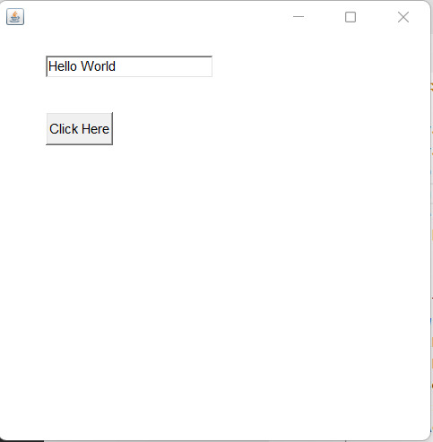

### ItemListener:

The Java **ItemListener** is notified whenever you click on the checkbox. It is notified against **ItemEvent**. The **ItemListener** interface is found in **java.awt.event** package. It has only one method: **itemStateChanged().**
Eample:
```java
import java.awt.*;
import java.awt.event.*;
public class App implements ItemListener{
    Checkbox checkBox1,checkBox2;
    Label label;
   App()
   {
     Frame f=new Frame();label = new Label();
     label.setAlignment(Label.CENTER);
     label.setSize(400,100);
     checkBox1 = new Checkbox("C++"); checkBox1.setBounds(100,100, 50,50);
     checkBox2 = new Checkbox("Java");  checkBox2.setBounds(100,150, 50,50);
     f.add(checkBox1); f.add(checkBox2); f.add(label);
    checkBox1.addItemListener(this); checkBox2.addItemListener(this);
    f.setSize(300,300); f.setLayout(null);f.setVisible(true);
   }
   public void itemStateChanged(ItemEvent e) {
        if(e.getSource()==checkBox1)
        label.setText("C++ Checkbox: Checked");
        if(e.getSource()==checkBox2)
        label.setText("Java Checkbox: Checked");
    }
    public static void main(String[] args) throws Exception {
```

```java
      new App();
```

```java
    }
}
Output:
```


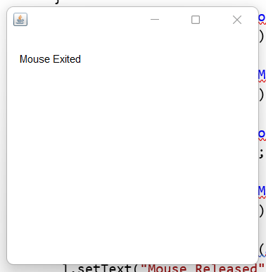

**KeyListener:**
The Java **KeyListener** is notified whenever you change the **state of key**. It is notified against **KeyEvent**. The **KeyListener** interface is found in **java.awt.event** package. It has three methods.
```java
keyPressed(KeyEvent e);
keyReleased(KeyEvent e);
keyTyped(KeyEvent e);
```

**Example:**
```java
import java.awt.*;
import java.awt.event.*;
public class App implements KeyListener{
    Label l; TextArea area;
 App()
   {
     Frame f=new Frame();l = new Label();
     l.setBounds(20,50,100,20);
     area=new TextArea();
    area.setBounds(20,80,300, 300);
    area.addKeyListener(this);
    f.add(l); f.add(area);
    f.setSize(300,300); f.setLayout(null);f.setVisible(true);
   }
   public void keyPressed(KeyEvent e) {
    l.setText("Key Pressed");
    }
    public void keyReleased(KeyEvent e) {
    l.setText("Key Released");
    }
    public void keyTyped(KeyEvent e) {
    l.setText("Key Typed");
    }
    public static void main(String[] args) throws Exception {
```

```java
      new App();
```

```java
    }
}
```

**Output:**

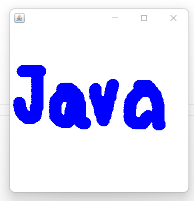

### WindowListener:

The Java **WindowListener** is notified whenever you change the state of window. It is notified against **WindowEvent**. The WindowListener interface is found in **java.awt.event** package. It has 7 methods.
windowsActivated(), windowDeactivated(), windowOpened(), windowClosed(), windowClosing(), windowIconfied() and windowDeiconified().

```java
import java.awt.*;
import java.awt.event.*;
public class App implements WindowListener{
```

```java
    Frame f;
   {
     f=new Frame();
```

```java
    f.addWindowListener(this);
```

```java
    f.setSize(300,300);
    f.setLayout(null);
    f.setVisible(true);
   }
```

```java
    public void windowActivated(WindowEvent arg0) {
    System.out.println("activated");
    }
    public void windowClosed(WindowEvent arg0) {
    System.out.println("closed");
    }
    public void windowClosing(WindowEvent arg0) {
    System.out.println("closing");
    f.dispose();
    }
    public void windowDeactivated(WindowEvent arg0) {
    System.out.println("deactivated");
    }
    public void windowDeiconified(WindowEvent arg0) {
    System.out.println("deiconified");
    }
    public void windowIconified(WindowEvent arg0) {
    System.out.println("iconified");
    }
    public void windowOpened(WindowEvent arg0) {
    System.out.println("opened");
    }
    public static void main(String[] args) throws Exception {
```

```java
      new App();
```

```java
    }
}
```


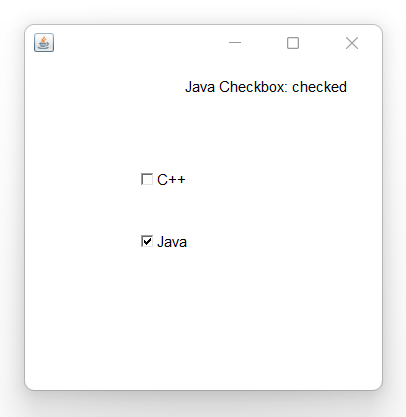

**Java Adapter Classes:**
Java adapter classes provide the default implementation of listener interfaces. If you inherit the adapter class, you will not be forced to provide the implementation of all the methods of listener interfaces. So it saves code. 
The adapter classes are found in **java.awt.event**, **java.awt.dnd ***(drag and drop)* and **javax.swing.event** packages. The Adapter classes with their corresponding listener interfaces are given below.

### java.awt.event Adapter classes

### java.awt.dnd Adapter classes

### javax.swing.event Adapter classes

### Example:

```java
import java.awt.*;
import java.awt.event.*;
public class App{
```

```java
    Frame f;
    App(){
    f=new Frame("Window Adapter");
    f.addWindowListener(new WindowAdapter()
{
       	public void windowClosing(WindowEvent e)
{
       	f.dispose();
     		}
    });
```

```java
    f.setSize(400,400);
    f.setLayout(null);
    f.setVisible(true);
    }
    public static void main(String[] args) throws Exception {
```

```java
      new App();
```

```java
    }
}
```

**MouseAdapter Example:**
```java
import java.awt.*;
import java.awt.event.*;
public class App extends MouseAdapter{
```

```java
    Frame f;
    App(){
    f=new Frame("Mouse Adapter");
    f.addMouseListener(this);
```

```java
    f.setSize(400,400);
    f.setLayout(null);
    f.setVisible(true);
    }
    public void mouseClicked(MouseEvent e) {
        Graphics g=f.getGraphics();
        g.setColor(Color.BLUE);
        g.fillOval(e.getX(),e.getY(),20,20);
    }
    public static void main(String[] args) throws Exception {
```

```java
      new App();
```

```java
    }
}
```

**Output:**

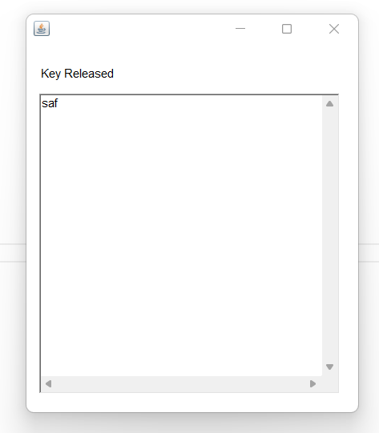

### Java MouseMotionAdapter:

```java
import java.awt.*;
import java.awt.event.*;
public class App extends MouseMotionAdapter{
```

```java
    Frame f;
    App(){
    f=new Frame("Mouse Motion Adapter");
    f.addMouseMotionListener(this);
```

```java
    f.setSize(400,400);
    f.setLayout(null);
    f.setVisible(true);
    }
    public void mouseDragged(MouseEvent e) {
        Graphics g=f.getGraphics();
        g.setColor(Color.BLUE);
        g.fillOval(e.getX(),e.getY(),20,20);
    }
    public static void main(String[] args) throws Exception {
```

```java
      new App();
```

```java
    }
}
```

**Output:**

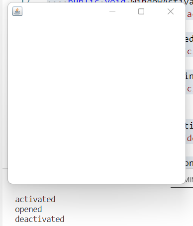

**Write a program to count word and character from textarea using keyadapter class.**

### Java KeyAdapter Example:

```java
import java.awt.*;
import java.awt.event.*;
public class App extends KeyAdapter{
    Frame f;
    Label l;
    TextArea area;
    App(){
    f=new Frame("Key Adapter");
    l=new Label();
    l.setBounds(20,50,200,20);
    area=new TextArea();
    area.setBounds(20,80,300, 300);
    area.addKeyListener(this);
    f.add(l);f.add(area);
    f.setSize(400,400);
    f.setLayout(null); f.setVisible(true);
    }
    public void keyReleased(KeyEvent e) {
        String text=area.getText();
        String words[]=text.split("\\s");
        l.setText("Words: "+words.length+" Characters:"+text.length());
        }
    public static void main(String[] args) throws Exception {
```

```java
      new App();
```

```java
    }
}
```

**Output:**

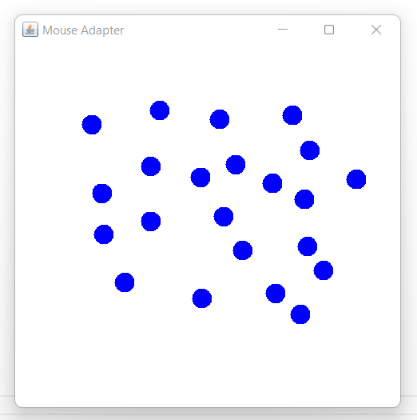

How can you handle events using adapter classes? Discuss.
Discuss the role of event listeners to handle events with suitable example.
Discuss any five event classes in java.
Discuss any three Adapter Event Classes in Java.
Why is it important to handle events.
What is action event? Discuss
Define event delegation model. Why do we need adapter class in event handling?
How can we use listener interface to handle events? Compare listener interface with adapter class.

---

**Table 1:**

| Event Class | Listener Interface | Methods | Descriptions |
| --- | --- | --- | --- |
| ActionEvent | ActionListener | actionPerformed() | ActionEvent indicates that a component-defined action occurred. |
| FocusEvent | FocusListener | focusLost() and focusGained() | Focus events include focus, focusout, focusin, and blur. |
| ItemEvent | ItemListener | itemStateChanged() | Item event occurs when an item is selected. |
| KeyEvent | KeyListener | keyPressed(), keyReleased(), and keyTyped(). | A key event occurs when the user presses a key on the keyboard. |
| MouseEvent | MouseListener and MouseMotionListener | mouseClicked(), mousePressed(), mouseEntered(), mouseExited() and mouseReleased() are the mouseListener methods. mouseDragged() and mouseMoved() are the MouseMotionListener() methods. | A mouse event occurs when the user interacts with the mouse. |
| MouseWheelEvent | MouseWheelListener | mouseWheelMoved(). | MouseWheelEvent occurs when the mouse wheel rotates in a component. |
| TextEvent | TextListener | textChanged() | TextEvent occurs when an object's text change. |
| WindowEvent | WindowListener | windowActivated(), windowDeactivated(), windowOpened(), windowClosed(), windowClosing(), windowIconfied() and windowDeiconified(). | Window events occur when a window's status is changed. |


**Table 2:**

| Adapter class | Listener interface |
| --- | --- |
| WindowAdapter | WindowListener |
| KeyAdapter | KeyListener |
| MouseAdapter | MouseListener |
| MouseMotionAdapter | MouseMotionListener |
| FocusAdapter | FocusListener |
| ComponentAdapter | ComponentListener |
| ContainerAdapter | ContainerListener |
| HierarchyBoundsAdapter | HierarchyBoundsListener |


**Table 3:**

| Adapter class | Listener interface |
| --- | --- |
| DragSourceAdapter | DragSourceListener |
| DragTargetAdapter | DragTargetListener |


**Table 4:**

| Adapter class | Listener interface |
| --- | --- |
| MouseInputAdapter | MouseInputListener |
| InternalFrameAdapter | InternalFrameListener |


---
