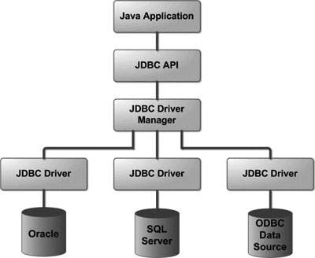
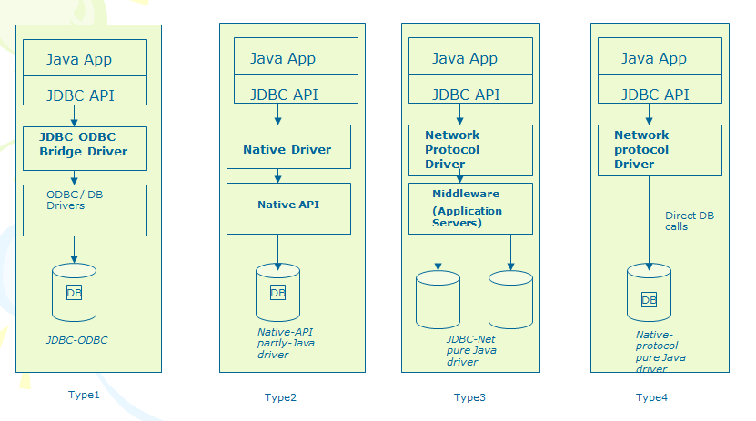
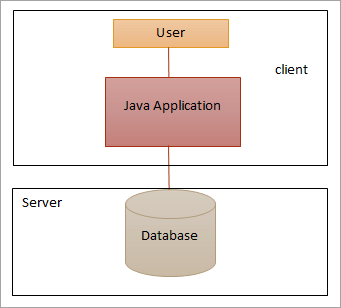
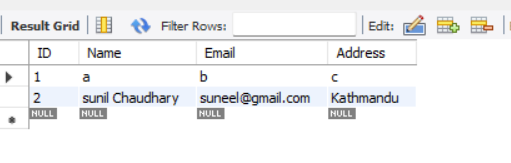

# Chapter 4_JDBC

> *Source: Sunil Sir's Lecture Notes — B.Sc. CSIT (Tribhuvan University)*

---

## Unit 4: JDBC (Database Connectivity)

*Source: `Unit-4.docx`*

> 📷 *This document contains images/diagrams — see the original .docx for visual content*

Java Database Connectivity (JDBC) is a java-based API for connection to and interacting with relational databases. JDBC provides a standard interface that enables java applications to execute SQL queries and manage database connection.
It Java that helps users to interact or communicate with various databases.
The **classes** and **interfaces** of **JDBC API** allow the application to send the request to the specified database.
The JDBC API is a Java API that can access any kind of tabular data, especially data stored in a Relational Database. 
JDBC helps to write Java applications that manage these three programming activities: 
*Connect to a data source, like a database *
*Send queries and update statements to the database *
*Retrieve and process the results received from the database in answer to your query*

### Applications of JDBC

JDBC is fundamentally a specification that provides a complete set of interfaces. These interfaces allow for portable access to an underlying database.
We can use Java to write different types of executables, such as:
Java Applications
Java Applets
Enterprise JavaBeans (EJBs)
Java Servlets
Java ServerPages (JSPs)

### Components of JDBC

1. JDBC API: JDBC API provides various interfaces and methods to establish easy connection with different databases.
```java
javax.sql.*;
java.sql.*;
```

2. JDBC Driver Manager: The Driver Manager of JDBC loads database-specific drivers in an application. This driver manager establishes a connection with a database. It also makes a database-specific call to the database so that it can process the user request.
3. JDBC Test suite: JDBC Test suite facilitates the programmer to test the various operations such as deletion, updation, insertion that are being executed by the JDBC Drivers.
4. JDBC-ODBC Bridge Drivers: JDBC-ODBC Bridge Drivers are used to connect the database drivers to the database. The bridge does the translation of the JDBC method calls into the ODBC method call. It makes the usage of the sun.jdbc.odbc package that includes the native library in order to access the ODBC (Open Database Connectivity) characteristics.

### Architecture of JDBC
The following figure shows the JDBC architecture:



1) Application: It is the Java Servelet or an applet that communicates with the data source.
2) The JDBC API: It allows the Java Programs to perform the execution of the SQL statements and then get the results.
A few of the crucial interfaces and classes defined in the JDBC API are the following:
Drivers
DriverManager
Statement
Connection
CallableStatement
PreparedStatement
ResultSet
SQL data

**DriverManager** − This class manages a list of database drivers. Matches connection requests from the java application with the proper database driver using communication protocol. JDBC will be used to establish a database Connection.
**Driver** − This interface handles the communications with the database server. You will interact directly with Driver objects very rarely. Instead, you use DriverManager objects, which manages objects of this type. It also abstracts the details associated with working with Driver objects.
**Connection** − This interface with all methods for contacting a database. The connection object represents communication context, i.e., all communication with database is through connection object only.
**Statement** − You use objects created from this interface to submit the SQL statements to the database. Some derived interfaces accept parameters in addition to executing stored procedures.
**ResultSet** − These objects hold data retrieved from a database after you execute an SQL query using Statement objects. It acts as an iterator to allow you to move through its data.
**SQLException** − This class handles any errors that occur in a database application.
3) DriverManager: DriverManager plays a crucial role in the architecture of JDBC.
It uses **database-specific drivers** to connect the enterprise applications to various databases.
4) JDBC drivers: To interact with a data source with the help of the JDBC, one needs a JDBC driver which conveniently interacts with the respective data source.

### JDBC Driver Types

JDBC drivers are classified into the following types:

JDBC Driver is a software component that enables java application to interact with the database. There are 4 types of JDBC drivers:
JDBC-ODBC bridge driver: Type1
Native-API driver: Type 2
Network Protocol driver :Type3
Thin driver :Type4

### 1) JDBC-ODBC bridge driver

The JDBC-ODBC bridge driver uses ODBC driver to connect to the database. The JDBC-ODBC bridge driver converts JDBC method calls into the ODBC function calls. This is now discouraged because of thin driver.



Oracle does not support the JDBC-ODBC Bridge from Java 8. Oracle recommends that you use JDBC drivers provided by the vendor of your database instead of the JDBC-ODBC Bridge.
Requires ODBC driver installed
Low performance, legacy systems only

### Advantages:

easy to use.
can be easily connected to any database.

### Disadvantages:

Performance degraded because JDBC method call is converted into the ODBC function calls.
The ODBC driver needs to be installed on the client machine.

### 2) Native-API driver

Uses native DB code (e.g., Oracle libraries)
Better performance than Type 1
OS-dependent
The Native API driver uses the client-side libraries of the database. The driver converts JDBC method calls into native calls of the database API. It is not written entirely in java.

### Advantage:

performance upgraded than JDBC-ODBC bridge driver.

### Disadvantage:

The Native driver needs to be installed on the each client machine.

### 3) Network Protocol driver

The Network Protocol driver uses middleware (application server) that converts JDBC calls directly or indirectly into the vendor-specific database protocol. It is fully written in java.
No native library on client
Scalable, good for cloud-based systems
Requires middleware configuration

### Advantage:

No client side library is required because of application server that can perform many tasks like auditing, load balancing, logging etc.

### Disadvantages:

Network support is required on client machine.
Requires database-specific coding to be done in the middle tier.

### 4) Thin driver

The thin driver converts JDBC calls directly into the **vendor-specific database **protocol. That is why it is known as thin driver. It is fully written in Java language.

- 100% Java — no native or middleware required
- Best performance
- Great for microservices and modern cloud apps

### Advantage:

Better performance than all other drivers.
No software is required at client side or server side.

### Disadvantage:

Drivers depend on the Database.

### Advantages of Using JDBC

It is capable of reading any database. The only requirement for it to do so is the proper installation of all the drivers.
It automatically creates the  of data from the database.
It does not require the content to be converted.
It provides full support to query and stored procedure.
It provides support to both Synchronous and Asynchronous processing.

### Architecture And Components Of JDBC

### JDBC Architecture

It supports two types of processing models to access the DB.

### These are:

Two-tier Architecture
Three-tier Architecture

1) Two-tier Architecture:
It helps Java application to directly connect with the database. It needs a JDBC driver for the communication with a particular DB. The user sends the requests to DB and receives the response directly without any mediator except JDBC Driver. The database, either in the same machine or on a remote machine is connected via a network. It can be called as a client-server architecture.



2) Three-tier Architecture:
It is the opposite of two-tier architecture. There is no direct communication between the user and the database. The user sends the request to the middle tier (Application Server) from which the request is again sent to Database. Then the database processes the request and sends the result to the middle-tier from which the user receives the result/ response.
It simplifies deployment and management. Management Information System (MIS) directors use this architecture as it makes it simple to maintain access control and updates to corporate data.

### Steps For Connectivity Between Java Program and Database
Import the Packages
Load the drivers using the *forName**() method *
Register the drivers *using **DriverManager** *
Establish a connection* using the Connection class object*
Create a statement
Execute the query
Close the connections

Let us discuss these steps in brief before implementing by writing suitable code to illustrate connectivity steps for JDBC/
Step 1: Import the Packages
Step 2: Loading the drivers 
In order to begin with, you first need to load the driver or register it before using it in the program. Registration is to be done once in your program. You can register a driver in one of two ways mentioned below as follows:

### Import Packages

First, we need to import the existing packages to use it in our Java program. Import will make sure that JDBC API classes are available for the program. We can then use the classes and subclasses of the packages.
Irrespective of the JDBC Driver, add the following import statement in the Java program.

```java
import java.sql.*;
```

Import the other classes based on the functionality which you will use in the program. Download the appropriate Jar files for the database.

### JDBC API 4.0
java.sql
javax.sql

### Load Driver

First, we should load/register the driver in the program before connecting to the Database. You need to register it only once per database in the program.
We can load the driver in the following 2 ways:
Class.forName()
DriverManager.registerDriver()

### Class.forName()

In this way, the driver’s class file loads into the memory at runtime. It implicitly loads the driver. While loading, the driver will register with JDBC automatically.

### DriverManager.registerDriver()

DriverManager is an inbuilt class that is available in the java.sql package. It acts as a mediator between Java application and database which you want to connect. Before you connect with the database, you need to register the driver with DriverManager. The main function of DriverManager is to load the driver class of the Database and create a connection with DB.
**Public static void registerDriver(driver)** – This method will register the driver with the Driver Manager. If the driver is already registered, then it won’t take any action.
It will throw **SQLException** if the database error occurs.
It will throw **NullPointerException** if the driver is null.

DriverManager.registerDriver(new oracle.jdbc.driver.OracleDriver())
DriverManager.registerDriver(new com.microsoft.sqlserver.jdbc.SQLServerDriver())

### 3) Establish Connection

After loading the driver, the next step is to create and establish the connection. Once required, packages are imported and drivers are loaded and registered, then we can go for establishing a Database connection.
DriverManager class has the getConnection method, we will use this method to get the connection with Database. To call getConnection() method, we need to pass 3 parameters. The 3 parameters are string data type URL, a username, and a password to access the database.

### The getConnection() method is an overloaded method. The 2 methods are:

**getConnection(URL,username,password);** – It has 3 parameters URL, username, password.
**getConnection(URL);** – It has only one parameter. URL has a username and password also.

The following table lists the JDBC connection strings for the different databases:

### 4) Create And Execute Statement

Now we will create the statement object that runs the query with the connected database. We use the createStatement method of the **Connection** class to create the query.

#### (i) Create Statement

#### a) Statement

This interface is used to implement simple SQL statements with no parameter. It returns the ResultSet object.

```java
Statement statemnt1 = conn.createStatement();
```

**b) PreparedStatement**

It is used to implement parameterized and precompiled SQL statements. The performance of the application increases because it compiles the query only once.

```java
String select_query = "Select * from states where state_id = 1";
PreparedStatement prpstmt = conn.prepareStatement(select_query);
```

**c) CallableStatement**

It is used to implement a parameterized SQL statement that invokes procedure or function in the database. A stored procedure works like a method or function in a class.

```java
CallableStatement callStmt = con.prepareCall("{call procedures(?,?)}");
```

### Execute The Query
There are 4 important methods to execute the query in Statement interface. These are explained below:
ResultSet executeQuery(String sql)
```java
int executeUpdate(String sql)
boolean execute(String sql)
int []executeBatch()
```

### ResultSet executeQuery(String sql)
The executeQuery() method in Statement interface is used to execute the SQL query and retrieve the values from DB. It returns the ResultSet object. Normally, we will use this method for the SELECT query.

#### b) executeUpdate(String sql)

The executeUpdate() method is used to execute value specified queries like INSERT, UPDATE, DELETE (DML statements), or DDL statements that return nothing. Mostly, we will use this method for inserting and updating.

#### c) execute(String sql)

The execute() method is used to execute the SQL query. It returns true if it executes the SELECT query. And, it returns false if it executes INSERT or UPDATE query.

#### d) executeBatch()

This method is used to execute a batch of SQL queries to the Database and if all the queries get executed successfully, it returns an array of update counts. We will use this method to insert/update the bulk of records.

### 5) Retrieve Results

When we execute the queries using the **executeQuery()** method, the result will be stored in the **ResultSet** object. The returned **ResultSet** object will never be null even if there is no matching record in the table. **ResultSet** object is used to access the data retrieved from the Database.
```java
ResultSet rs 1= statemnt1.executeQuery(QUERY));
```

### 6) Close Connection

```java
conn.close();
```

**Question:** How do you execute SQL queries in JDBC?

**Answer:** To process an SQL statement, you need to follow the steps given below:
1. Establish the connection.
2. Create a statement.
3. Execute the statement/query.
4. Process the result.
5. Close the connection.

1. Establishing a Connection
To process SQL statements first of all you need to establish connection with the desired DBMS or, file System or, other data sources.
To do so, Register the JDBC driver class, corresponding to the DataSource you need to the DriverManager using the **registerDriver()** method.
```java
Driver myDriver = new com.mysql.jdbc.Driver();
DriverManager.registerDriver(myDriver);
```

You can also register the driver using the `forName()` method. This method loads the specified class in to the memory and it automatically gets registered.

```java
Class.forName("com.mysql.jdbc.Driver");
```

After registering the Driver class, get the Connection object using the `getConnection()` method. This method accepts a database URL (an address that points to your database), Username and, password and, returns a connection object.

```java
Connection con = DriverManager.getConnection("jdbc:mysql://localhost:3306/collegedb?useSSL=false","root","root");
```

2.Creating a Statement
The Statement interface represents an SQL statement and JDBC provides 3 kinds of Statements
**Statement**: A general purpose statement which does not accept any parameters.
**PreparedStatement**: A precompiled SQL statement which accepts input parameters.
**Callable Statement:** This is used to call the stored procedures.

```java
conn.createStatement();
            conn.prepareStatement(query);
            conn.prepareCall(query)
```

3.Executing the Statements
After creating the statement objects, you need to execute them. To execute the statements, the Statement interface provides three methods namely, **execute(), executeUpdate()** and, **executeQuery().**
**execute():** Used to execute SQL DDL statements, it returns a boolean value specifying whether the ResultSet object can be retrieved.
**executeUpdate():** Used to execute statements such as insert, update, delete. It returns an integer value representing the number of rows affected.
**executeQuery():** Used to execute statements that returns tabular data (example select). It returns an object of the class ResultSet.

```java
stmt.execute(query);
stmt.executeQuery(query);
stmt.execute(query);
```

4. Processing the Result
Once you execute the statements/queries you will get the result of the respective query as a return value from execute() (boolean value) or, executeQuery() (ResultSet) or, executeUpdate() (integer value) methods.
```java
 while(rs.next())
            System.out.println(rs.getInt(1)+"  "+rs.getString(2)+"  "+rs.getString(3));
            con.close();
            }
```

5.Close Connection
```java
conn.close();
```

### Connection with MySqlDatabase Example

### DML Operation in JAVA

### Executing Select Statement

```java
import java.sql.*;
public class App {
    public static void main(String[] args) throws Exception {
        try {
            Class.forName("com.mysql.jdbc.Driver");
            Connection con=DriverManager.getConnection("jdbc:mysql://localhost:3306/collegedb?useSSL=false","root","root");
            Statement stmt=con.createStatement();
            ResultSet rs=stmt.executeQuery("select * from tblemployee");
            while(rs.next())
            System.out.println(rs.getInt(1)+"  "+rs.getString(2)+"  "+rs.getString(3));
            con.close();
            }
            catch(Exception e){ System.out.println(e);}
            }
    }
Output:
1  Sunil Chaudhary  Kathmandu
2  Bikash Shrestha  Kathmandu
3  Dinesh Gautam  Kathmandu
4  Hira Kahdma  Kathmandu
```

### Insert Statement

```java
import java.sql.*;
public class App {
    public static void main(String[] args) throws Exception {
        try {
            Class.forName("com.mysql.jdbc.Driver");
            Connection con=DriverManager.getConnection("jdbc:mysql://localhost:3306/samriddhidb?useSSL=false","root","root");
            String sql="insert into emp(Name,Email,Address) values(?,?,?)";
            PreparedStatement ps = con.prepareStatement(sql);
            ps.setString(1, "Suman");
            ps.setString(2, "tony@gmail.com");
            ps.setString(3, "Kathmandu");
            ps.executeUpdate();
            con.close();
            System.out.println("Data Inserted");
            }
            catch(Exception e){ System.out.println(e);}
            }
    }
```

### Update Statement

```java
import java.sql.*;
public class App {
    public static void main(String[] args) throws Exception {
        try {
            Class.forName("com.mysql.jdbc.Driver");
            Connection con=DriverManager.getConnection("jdbc:mysql://localhost:3306/samriddhidb?useSSL=false","root","root");
            String sql="update emp set email = ? where id = ?";
            PreparedStatement ps = con.prepareStatement(sql);
            ps.setInt(2, 5);
            ps.setString(1, "suman@gmail.com");
            ps.executeUpdate();
            con.close();
            System.out.println("Data Updated");
            }
            catch(Exception e){ System.out.println(e);}
            }
    }
```

### Select statement with where clause

```java
import java.sql.*;
public class App {
    public static void main(String[] args) throws Exception {
        try {
            Class.forName("com.mysql.jdbc.Driver");
            Connection con=DriverManager.getConnection("jdbc:mysql://localhost:3306/swastik?useSSL=false","root","root");
            PreparedStatement statement = con.prepareStatement("select * from student where id=?");
            statement.setInt(1,2);
            ResultSet rs=statement.executeQuery();
            while(rs.next())
            System.out.println(rs.getInt(1)+"  "+rs.getString(2)+"  "+rs.getString(3));
            con.close();
            }
            catch(Exception e){ System.out.println(e);}
            }
}
```

### Delete Statement

```java
import java.sql.*;
public class App {
    public static void main(String[] args) throws Exception {
        try {
            Class.forName("com.mysql.jdbc.Driver");
            Connection con=DriverManager.getConnection("jdbc:mysql://localhost:3306/samriddhidb?useSSL=false","root","root");
            String sql="delete from emp where id = ?";
            PreparedStatement ps = con.prepareStatement(sql);
            ps.setInt(1, 5);
            ps.executeUpdate();
            con.close();
            System.out.println("Data Deleted");
            }
            catch(Exception e){ System.out.println(e);}
            }
    }
```

### DDL Operation in JAVA
(Create,Alter,Drop,Truncate)
**Data Definition Language (DDL)** is a unique set of SQL commands that lets you manipulate the structure of the database. 

### CREATE Command

SQL Queries:

Create Database:

```sql
CREATE DATABASE database_name;
```

Create Table:

```sql
CREATE TABLE table_name (
    Column_1 data_type,
    Column_2 data_type,
    ...
);
```

### DROP Command

DROP is used to delete a whole database or just a table. The DROP statement destroys the objects like an existing database, table, index, or view. A DROP statement in SQL removes a component from a relational database management system (RDBMS)

Drop Database:

```sql
DROP DATABASE database_name;
```

The syntax to DROP a table from the database is as follow:

Drop Table:

```sql
DROP TABLE table_name;
```

### The ALTER Command
when the data exists in the table(s) of our database, modifying the structure is easier through other means, such as ALTER is used to *add*, *change*, or *remove* columns or fields in the table. It can also be used to rename the table.
Adding column(s)
Modifying column(s)
Removing columns

### Add Column:

```sql
ALTER TABLE table_name ADD COLUMN column_name_1 data_type, column_name_2 data_type;
```

### Modify Column

```sql
ALTER TABLE table_name MODIFY COLUMN column_name data_type;
```

### Remove a Column

```sql
ALTER TABLE table_name DROP COLUMN column_name;
```

### The RENAME Command

The RENAME command is used to change the name of an existing database object (like Table, Column) to a new name. Renaming a table does not make it lose any data that is contained within it.

```sql
RENAME TABLE current_table_name TO new_table_name;
```

### TRUNCATE TABLE

The TRUNCATE TABLE command deletes the data inside a table, but not the table itself. The following SQL truncates the table "Categories":

```sql
TRUNCATE TABLE Categories;
```

### CREATE DATABASE JAVA CODE

```java
import java.sql.*;
public class App {
    public static void main(String[] args) throws Exception {
        try {
            String Database_Name="NEW_DB";
            Class.forName("com.mysql.jdbc.Driver");
            Connection con=DriverManager.getConnection("jdbc:mysql://localhost:3306/samriddhidb?useSSL=false","root","root");
            Statement st=con.createStatement();
            String sql="CREATE DATABASE "+Database_Name;
            st.executeUpdate(sql);
            con.close();
            System.out.println("Database Created");
            }
            catch(Exception e){ System.out.println(e);}
            }
    }
```

### Creating Table

```java
import java.sql.*;
public class App {
    public static void main(String[] args) throws Exception {
        try {
            String Table_name="CREATE TABLE Persons (PersonID int,LastName varchar(255));";
            Class.forName("com.mysql.jdbc.Driver");
            Connection con=DriverManager.getConnection("jdbc:mysql://localhost:3306/samriddhidb?useSSL=false","root","root");
            Statement st=con.createStatement();
            String sql=Table_name;
            st.executeUpdate(sql);
            con.close();
            System.out.println("Table Created");
            }
            catch(Exception e){ System.out.println(e);}
            }
    }
```

### Prepared Statement

A PreparedStatement is a pre-compiled SQL statement. It is a subinterface of Statement. Prepared Statement objects have some useful additional features than Statement objects. Instead of hard coding queries, PreparedStatement object provides a feature to execute a **parameterized query.**

When PreparedStatement is created, the SQL query is passed as a parameter. This Prepared Statement contains a pre-compiled SQL query, so when the PreparedStatement is executed, DBMS can just run the query instead of first compiling it.

Steps to use PreparedStatement:

1. Create Connection to Database

```java
Connection con=DriverManager.getConnection("jdbc:mysql://localhost:3306/samriddhidb?useSSL=false","root","root");
```

2. Prepare Statement

```java
String sql="delete from emp where id = ?";
PreparedStatement ps = con.prepareStatement(sql);
```

3. Set parameter values for type and position

```java
ps.setInt(2, 5);
ps.setString(1, "suman@gmail.com");
```

4. Execute the Query

```java
ps.executeUpdate();
```

### Methods of PreparedStatement

- `setInt(int, int)`: This method can be used to set integer value at the given parameter index.
- `setString(int, string)`: This method can be used to set string value at the given parameter index.
- `setFloat(int, float)`: This method can be used to set float value at the given parameter index.
- `setDouble(int, double)`: This method can be used to set a double value at the given parameter index.
- `executeUpdate()`: This method can be used to create, drop, insert, update, delete etc. It returns int type.
- `executeQuery()`: It returns an instance of ResultSet when a select query is executed.

### Multiple Result

When working with inline SQL or SQL Server stored procedures that return more than one result set, the Microsoft JDBC Driver for SQL Server provides the `getResultSet` method in the class for retrieving each set of data returned. To determine if more result sets are available, you can call the `getMoreResults` method, which returns a `boolean` value of `true` if more result sets are available.

```java
import java.sql.*;
public class App {
    public static void main(String[] args) throws Exception {
        try {
            String sql="select * from emp; select * from emp;";
            Class.forName("com.mysql.jdbc.Driver");
            Connection con=DriverManager.getConnection("jdbc:mysql://localhost:3306/samriddhidb?useSSL=false","root","root");
            Statement st=con.createStatement();
            boolean results = st.execute(sql);
            int rsCount = 0;
            do {
                if(results) {
                   ResultSet rs = st.getResultSet();
                   rsCount++;
                   //Show data from the result set.
                   System.out.println("RESULT SET #" + rsCount);
                   while (rs.next()) {
                      System.out.println(rs.getString("Name") + ", " + rs.getString("Email"));
                   }
                   rs.close();
                }
                System.out.println();
                results = st.getMoreResults();
                } while(results);
              st.close();
            }
            catch(Exception e){ System.out.println(e);}
            }
    }
```

### Scrollable ResultSet

Let's first make the ResultSet object scrollable. **Scrollable** means that once the **ResultSet** object has been created, we can traverse through fetched records in any direction, forward and backward, as we like. This provides the ability to read the last record, first record, next record, and the previous record.
**Scroll type constant** 
There are 3 scroll type constants can be used with ResultSets. 
*ResultSet.TYPE\_FORWARD\_ONLY*
Default type.. only allows forward only fetching
*ResultSet.TYPE\_SCROLL\_INSENSITIVE*
Allows both forward and backward movement. Not sensitive to ResultSet updates.
*ResultSet.TYPE\_SCROLL\_SENSITIVE*
Syntax :
```java
PreparedStatement pstmt = conn.prepareStatement(sql,Scroll type constant,Concurrency constant);
Statement stmt = conn.createStatement(Scroll type constant,Concurrency constant);
```

**Concurrency constant**

We can use following Concurrency constants for the ResultSets.

- `ResultSet.CONCUR_READ_ONLY` — Default value, ResultSet can not be updated.
- `ResultSet.CONCUR_UPDATABLE` — Signifies an updatable ResultSet.

Example:

```java
Statement stmt = con.createStatement(ResultSet.TYPE_SCROLL_INSENSITIVE,
                                      ResultSet.CONCUR_UPDATABLE);
PreparedStatement pstmt = conn.prepareStatement(sql,ResultSet.TYPE_SCROLL_INSENSITIVE, ResultSet.CONCUR_READ_ONLY);
```

### Example

```java
import java.sql.*;
public class App {
    public static void main(String[] args) throws Exception {
        try {
            String sql="select * from emp";
            Class.forName("com.mysql.jdbc.Driver");
            Connection con=DriverManager.getConnection("jdbc:mysql://localhost:3306/samriddhidb?useSSL=false","root","root");
            PreparedStatement pstmt = con.prepareStatement(sql,ResultSet.TYPE_SCROLL_INSENSITIVE,ResultSet.CONCUR_READ_ONLY);
            ResultSet rs = pstmt.executeQuery();
              //First Record
            rs.first();
            System.out.println("ID : " + rs.getInt("id") + ", Name : " + rs.getString("name") + ", Email : " + rs.getString("Email"));
            //Last Record
            rs.last();
            System.out.println("ID : " + rs.getInt("id") + ", Name : " + rs.getString("name") + ", Email : " + rs.getString("Email"));
            //Previous Record
            rs.previous();
            System.out.println("ID : " + rs.getInt("id") + ", Name : " + rs.getString("name") + ", Email : " + rs.getString("Email"));
            //Next Record
            rs.next();
            System.out.println("ID : " + rs.getInt("id") + ", Name : " + rs.getString("name") + ", Email : " + rs.getString("Email"));
            }
            catch(Exception e){ System.out.println(e);}
            }
    }
```




Output:
```
ID : 1, Name : a, Email : b
ID : 2, Name : sunil Chaudhary, Email : suneel@gmail.com
ID : 1, Name : a, Email : b
ID : 2, Name : sunil Chaudhary, Email : suneel@gmail.com
```

### Updatable ResultSet

Creating an updatable ResultSet means that the record it points to is not only be traversable but also be updatable. The changes will immediately be persisted in the database and reflected by the ResultSet object in real time.

```java
import java.sql.*;
public class App {
    public static void main(String[] args) throws Exception {
        try {
            String sql="select * from emp where id=?";
            Class.forName("com.mysql.jdbc.Driver");
            Connection con=DriverManager.getConnection("jdbc:mysql://localhost:3306/samriddhidb?useSSL=false","root","root");
            PreparedStatement pstmt = con.prepareStatement(sql,ResultSet.TYPE_SCROLL_SENSITIVE,ResultSet.CONCUR_UPDATABLE);
            pstmt.setInt(1,1);
            ResultSet rs = pstmt.executeQuery();
            while(rs.next())
            {
                System.out.println("ID : " + rs.getInt("id") + ", Name : " + rs.getString("name") + ", Email : " + rs.getString("Email"));
                String name=rs.getString("name");
                System.out.println("Updating name "+name+" to Subham");
                rs.updateString("name", "Subham");
                rs.updateRow();
            }
            }
            catch(Exception e){ System.out.println(e);}
            }
    }
```

The updatable ResultSet is particularly useful when we want to update certain values after doing some comparison by traversing back and forth through the fetched records. The process of creation is similar to the preceding program, but the ResultSet constants used here are `TYPE_SCROLL_SENSITIVE` and `CONCUR_UPDATABLE`.

### RowSet

A row set is an object which encapsulates a set of rows. These rows are accessible though the `javax.sql.RowSet` interface.

Three kinds of row set are supported by Java:
Cached row set
JDBC row set
Web row set
A JDBC **RowSet** facilitates a mechanism to keep the data in tabular form. It happens to make the data more flexible as well as easier as compared to a **ResultSet**. The connection between the data source and the **RowSet** object is maintained throughout its life cycle. The **RowSet** supports development models that are component-based such as JavaBeans
Example:
```java
JdbcRowSet rowSet = RowSetProvider.newFactory().createJdbcRowSet();
rowSet.setUrl("jdbc:oracle:thin:@localhost:1521:xe");
rowSet.setUsername("root");
rowSet.setPassword("root");
```

```java
rowSet.setCommand("select * from emp400");
rowSet.execute();
```

### Advantage of RowSet
The advantages of using RowSet are given below:
It is easy and flexible to use.
It is Scrollable and Updatable by default.

```java
import javax.sql.rowset.JdbcRowSet;
import javax.sql.rowset.RowSetProvider;
public class App {
    public static void main(String[] args) throws Exception {
        try {
            JdbcRowSet rowSet = RowSetProvider.newFactory().createJdbcRowSet();
            rowSet.setUrl("jdbc:mysql://localhost:3306/samriddhidb?useSSL=false");
            rowSet.setUsername("root");
            rowSet.setPassword("root");
            rowSet.setCommand("select * from emp");
            rowSet.execute();
            while(rowSet.next())
            {
                System.out.println("ID : " + rowSet.getInt("id") + ", Name : " + rowSet.getString("name") + ", Email : " + rowSet.getString("Email"));
            }
            }
            catch(Exception e){ System.out.println(e);}
            }
    }
```

### CacheRowSet

The CachedRowSet is the base implementation of disconnected row sets. It connects to the data source, reads data from it, disconnects with the data source and the processes the retrieved data, reconnects to the data source and writes the modifications.

### Creating a CachedRowSet

You can create a Cached RowSet object using the createCachedRowSet() method of the **RowSetFactory**.
You can create a **RowSetFactory** object using the newfactory() method of the **RowSetProvider** method.
```java
//Creating the RowSet object
RowSetFactory factory = RowSetProvider.newFactory();
CachedRowSet rowSet = factory.createCachedRowSet();
```

```java
import javax.sql.rowset.CachedRowSet;
import javax.sql.rowset.RowSetFactory;
import javax.sql.rowset.RowSetProvider;
public class App {
    public static void main(String[] args) throws Exception {
        try {
            RowSetFactory factory = RowSetProvider.newFactory();
            CachedRowSet rowSet = factory.createCachedRowSet();
            rowSet.setUrl("jdbc:mysql://localhost:3306/samriddhidb?useSSL=false");
            //Setting the user name
            rowSet.setUsername("root");
            //Setting the password
            rowSet.setPassword("root");
            //Setting the query/command
            rowSet.setCommand("select * from emp");
            rowSet.execute();
            while(rowSet.next())
            {
                System.out.println("ID : " + rowSet.getInt("id") + ", Name : " + rowSet.getString("name") + ", Email : " + rowSet.getString("Email"));
            }
            }
            catch(Exception e){ System.out.println(e);}
            }
    }
```

### What Is a Transaction

Transactions in Java, as in general refer to. Hence, if one or more action fails, all other actions must back out leaving the state of the application unchanged. This is necessary to ensure that the integrity of the application state is never compromised.
Also, these transactions may involve one or more resources like database, message queue, giving rise to different ways to perform actions under a transaction. These include performing resource local transactions with individual resources. Alternatively, multiple resources can participate in a global transaction.

```java
        try {
            Connection connection = DriverManager.getConnection(CONNECTION_URL, USER, PASSWORD);
            try {
            connection.setAutoCommit(false);
            PreparedStatement firstStatement = connection .prepareStatement("firstQuery");
            firstStatement.executeUpdate();
            PreparedStatement secondStatement = connection .prepareStatement("secondQuery");
            secondStatement.executeUpdate();
            connection.commit();
            } catch (Exception e)
            {
            connection.rollback();
            }
        }
```

### SQL Escape Sequences for JDBC
Language features, such as outer joins and scalar function calls, are commonly implemented by database systems. The syntax for these features is often database-specific, even when a standard syntax has been defined. JDBC defines escape sequences that contain the standard syntax for the following language features:
Date, time, and timestamp literals
Scalar functions such as numeric, string, and data type conversion functions
Outer joins
Escape characters for wildcards used in LIKE clauses
Procedure calls
The escape sequence used by JDBC is:

```
{extension}
```

The escape sequence is recognized and parsed by the Type 4 JDBC drivers, which replace the escape sequences with data store-specific grammar.

### Date, Time, and Timestamp Escape Sequences

The escape sequence for date, time, and timestamp literals is:

```
{literal-type 'value'}
```

where `literal-type` is one of the following:

Example:

```sql
UPDATE Orders SET OpenDate={d '1995-01-15'} WHERE OrderID=1023
```

### Scalar Functions

You can use scalar functions in SQL statements with the following syntax:

```
{fn scalar-function}
```

where `scalar-function` is a scalar function supported by the Type 4 JDBC drivers.

Example:

```sql
SELECT id, name FROM emp WHERE name LIKE {fn UCASE('Smith')}
```

### Outer Join Escape Sequences

JDBC supports the SQL92 left, right, and full outer join syntax. The escape sequence for outer joins is:
   {oj *outer-join*}
where outer-join is:
   table-reference {LEFT | RIGHT | FULL} OUTER JOIN 
   {*table-reference* | outer-join} ON *search-condition*
where:
   table-reference is a database table name.
   search-condition is the join condition you want to use for the tables.
Example:
   SELECT Customers.CustID, Customers.Name, Orders.OrderID, Orders.Status
      FROM {oj Customers LEFT OUTER JOIN
         Orders ON Customers.CustID=Orders.CustID}
      WHERE Orders.Status='OPEN'
Below Table lists the outer join escape sequences supported by Type 4 JDBC drivers for each data store.

### LIKE Escape Character Sequence for Wildcards

You can specify the character to be used to escape wildcard characters (% and \_, for example) in LIKE clauses. The escape sequence for escape characters is:
{escape '*escape-character*'}
where *escape-character* is the character used to escape the wildcard character.
For example. the following SQL statement specifies that an asterisk (*) be used as the escape character in the LIKE clause for the wildcard character %:
SELECT col1 FROM table1 WHERE col1 LIKE '*%%' {escape '*'}

### Procedure Call Escape Sequences

A procedure is an executable object stored in the data store. Generally, it is one or more SQL statements that have been precompiled. The escape sequence for calling a procedure is:

```
{[?=]call procedure-name[([parameter][,parameter]...)]}
```

where:
- `procedure-name` specifies the name of a stored procedure.
- `parameter` specifies a stored procedure parameter.


---

### Table 1

| DB Name | JDBC Driver Name |
| --- | --- |
| MySQL | com.mysql.jdbc.Driver |
| Oracle | oracle.jdbc.driver.OracleDriver |
| Microsoft SQL Server | com.microsoft.sqlserver.jdbc.SQLServerDriver |
| MS Access | net.ucanaccess.jdbc.UcanaccessDriver |
| PostgreSQL | org.postgresql.Driver |
| IBM DB2 | com.ibm.db2.jdbc.net.DB2Driver |
| Sybase | com.sybase.jdbcSybDriver |
| TeraData | com.teradata.jdbc.TeraDriver |


### Table 2

| Database | Connection String/DB URL |
| --- | --- |
| MySQL | jdbc:mysql://HOST_NAME:PORT/DATABASE_NAME |
| Oracle | jdbc:oracle:thin:@HOST_NAME:PORT:SERVICE_NAME |
| Microsoft SQL Server | jdbc:sqlserver://HOST_NAME:PORT;DatabaseName=< DATABASE_NAME> |
| MS Access | jdbc:ucanaccess://DATABASE_PATH |
| PostgreSQL | jdbc:postgresql://HOST_NAME:PORT/DATABASE_NAME |
| IBM DB2 | jdbc:db2://HOSTNAME:PORT/DATABASE_NAME |
| Sybase | jdbc:Sybase:Tds:HOSTNAME:PORT/DATABASE_NAME |
| TeraData | jdbc:teradata://HOSTNAME/database=< DATABASE_NAME>,tmode=ANSI,charset=UTF8 |


### Table 3

| Table C-1 Literal Types for Date, Time, and Timestamp Escape Sequences | Table C-1 Literal Types for Date, Time, and Timestamp Escape Sequences | Table C-1 Literal Types for Date, Time, and Timestamp Escape Sequences |
| --- | --- | --- |
| literal-type | Description | Value Format |
| d | Date | yyyy-mm-dd |
| t | Time | hh:mm:ss [1] |
| ts | Timestamp | yyyy-mm-dd hh:mm:ss[.f...] |


### Table 4

| Table C-2 Scalar Functions Supported | Table C-2 Scalar Functions Supported | Table C-2 Scalar Functions Supported | Table C-2 Scalar Functions Supported | Table C-2 Scalar Functions Supported |
| --- | --- | --- | --- | --- |
| Data Store | String
Functions | Numeric
Functions | Timedate
Functions | System
Functions |
| SQL Server | ASCII
CHAR
CONCAT
DIFFERENCE
INSERT
LCASE
LEFT
LENGTH
LOCATE
LTRIM
REPEAT
REPLACE
RIGHT
RTRIM
SOUNDEX
SPACE
SUBSTRING
UCASE | ABS
ACOS
ASIN
ATAN
ATAN2
CEILING
COS
COT
DEGREES
EXP
FLOOR
LOG
LOG10
MOD
PI
POWER
RADIANS
RAND
ROUND
SIGN
SIN
SQRT
TAN
TRUNCATE | DAYNAME
DAYOFMONTH
DAYOFWEEK
DAYOFYEAR
EXTRACT
HOUR
MINUTE
MONTH
MONTHNAME
NOW
QUARTER
SECOND
TIMESTAMPADD
TIMESTAMPDIFF
WEEK
YEAR | DATABASE
IFNULL
USER |


### Table 5

| Outer Join Escape Sequences Supported | Outer Join Escape Sequences Supported |
| --- | --- |
| Data Store | Outer Join Escape Sequences |
| SQL Server | Left outer joins
Right outer joins
Full outer joins
Nested outer joins |


---
