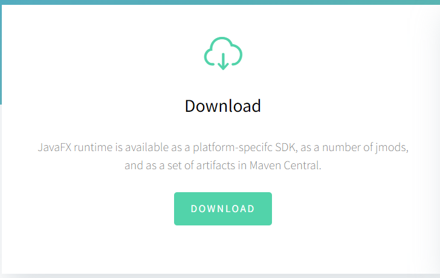
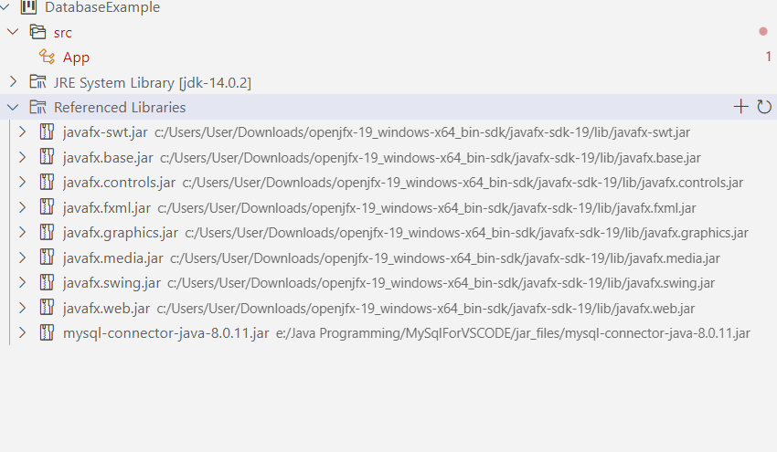
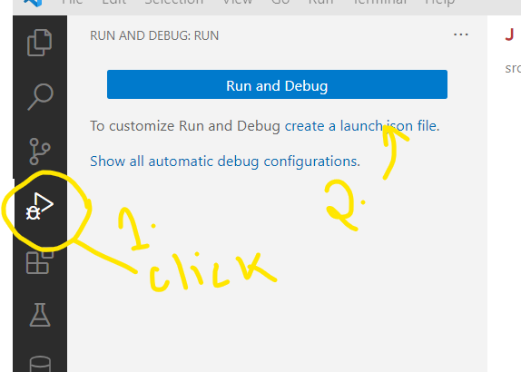
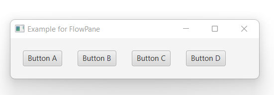
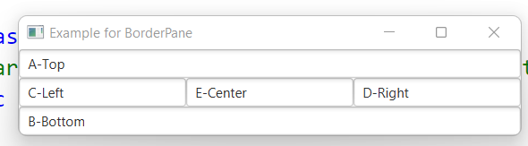
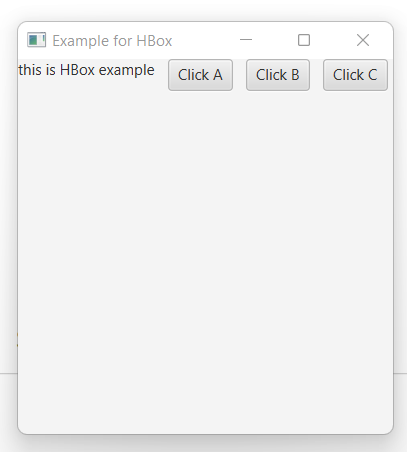
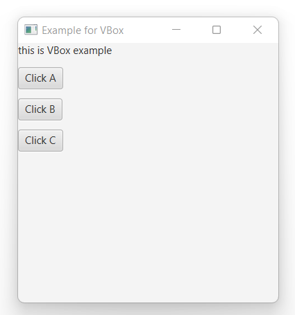
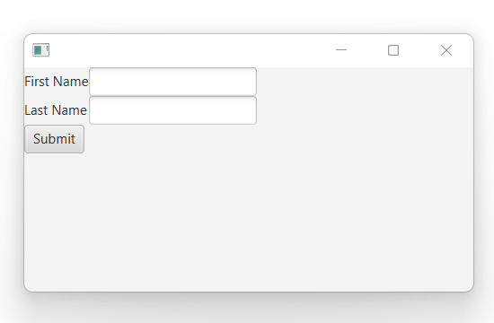

# Chapter 6_JavaFX

> *Source: Sunil Sir's Lecture Notes — B.Sc. CSIT (Tribhuvan University)*

---

## Unit 6: JavaFX

*Source: `UNIT-6.docx`*

> 📷 *This document contains images/diagrams — see the original .docx for visual content*

### UNIT-6

### Introduction:

JavaFX is a Java library that is used to develop Desktop applications as well as Rich Internet Applications (RIA). The applications built in JavaFX, can run on multiple platforms including **Web, Mobile and Desktops.**
Our JavaFX library such as Fundamentals, 2D Shapes, 3D Shapes, Effects, Animation, Text, Layouts, UI Controls, Transformations, Charts, JavaFX with CSS, JavaFX with Media etc.
JavaFX is intended to replace swing in Java applications as a GUI framework. However, It provides more functionalities than swing. Like Swing, JavaFX also provides its own components and doesn't depend upon the operating system. It is lightweight and hardware accelerated. It supports various operating systems including Windows, Linux and Mac OS.

### History of JavaFX

JavaFX was developed by **Chris Oliver**. Initially the project was named as **Form Follows Functions (F3)** . 
It is intended to provide the richer functionalities for the GUI application development. Later, Sun Micro-systems acquired **F3 project** as JavaFX in June, 2005.
Sun Micro-systems announces it officially in 2007 at W3 Conference. In October 2008, JavaFX 1.0 was released. In 2009, ORACLE corporation acquires Sun Micro-Systems and released JavaFX 1.2. the latest version of JavaFX is JavaFX 1.8 which was released on 18th March 2014.

### Installing JavaFX in Visual Studio Code

Update VS Code to Version 1.49.3 or above
Need to download and install **open** JDK 11.0 Version
Step:1 Update vs code to version 1.49.3 above
Step:2 Install JavaFx and FXML Viewer Extension in VS Code
Step:3 Download and install open jdk and configure java runtime in VS code
	Download javafx sdk 11.0.2()



Step:4 JavaFX SDK and setup in VS Code



After Referencing Open Visual Studio Code



It will Open Lunch.json (Add Highlighted Line)
```java
{
    // Use IntelliSense to learn about possible attributes.
    // Hover to view descriptions of existing attributes.
    // For more information, visit: https://go.microsoft.com/fwlink/?linkid=830387
    "version": "0.2.0",
    "configurations": [
        {
            "type": "java",
            "name": "Launch Current File",
            "request": "launch",
            "mainClass": "${file}"
        },
        {
            "type": "java",
            "name": "Launch App",
            "request": "launch",
            "mainClass": "App",
            "projectName": "JavaFX_Example_9c70ee94",
		"vmArgs": "--module-path \"C:\\Users\\User\\Downloads\\openjfx-19_windows-x64_bin-sdk\\javafx-sdk-19\\lib\" --add-modules javafx.controls,javafx.fxml"
```

```java
        }
    ]
}
```

**Java Swing and Java FX Comparison**

### JavaFX Layouts

### FlowPane:

FlowPane permits the user to layout the nodes in a consecutive manner and wraps the nodes at the boundary. Here, the nodes can be in the vertical direction (columns) or horizontal direction (rows).

```java
import javafx.application.Application;//Application
import javafx.collections.ObservableList;
import javafx.geometry.Insets;
import javafx.scene.Scene;
import javafx.scene.control.Button;//Button
import javafx.scene.layout.FlowPane;//Flowpane
import javafx.stage.Stage;
```

```java
public class App extends Application {
    // start method helps in launching the application
        public void start(Stage stage)
        {
        //create buttons
        Button b1 = new Button("Button A");
        Button b2 = new Button("Button B");
        Button b3 = new Button("Button C");
        Button b4 = new Button("Button D");
        //Flow Pane creation
        FlowPane fp = new FlowPane();
        //Set horizontal gap
        fp.setHgap(25);
        //Set margin
        fp.setMargin(b1, new Insets(20, 0, 20, 20));
        ObservableList list = fp.getChildren();
        //Add nodes to the flow pane
        list.addAll(b1, b2, b3, b4);
        // Scene creation
        Scene scene = new Scene(fp);
        // Title set
        stage.setTitle("Example for FlowPane");
        // Scene setting
        stage.setScene(scene);
        stage.show();
        }
    public static void main(String[] args) throws Exception {
        launch(args);
        }
    }
Output:
```




** BorderPane**
In this, layout structure has five regions such as TOP, BOTTOM, CENTRE, LEFT, and RIGHT.

```java
import javafx.application.Application;
import javafx.scene.Scene;
import javafx.scene.control.*;
import javafx.scene.layout.*;
import javafx.stage.Stage;
public class App extends Application {
    // start method helps in launching the application
    public void start(Stage stage)
    {
    BorderPane bp = new BorderPane();
    bp.setTop(new TextField("A-Top"));
    bp.setBottom(new TextField("B-Bottom"));
    bp.setLeft(new TextField("C-Left"));
    bp.setRight(new TextField("D-Right"));
    bp.setCenter(new TextField("E-Center"));// Scene creation
    Scene scene = new Scene(bp);// Title set
    stage.setTitle("Example for BorderPane");
    // Scene setting
    stage.setScene(scene);
    stage.show();
    }
    public static void main(String[] args) throws Exception {
       //method to launch the JavaFX application
        launch(args);
        }
    }
Output:
```




**HBox**
HBox works in the opposite concept of VBox. That is, nodes will be organized horizontally. Following is a program that helps in understanding HBox.
```java
// Java Program to create an HBox
import javafx.application.Application;
import javafx.scene.Scene;
import javafx.scene.control.*;
import javafx.scene.layout.*;
import javafx.stage.Stage;
public class App extends Application {
        // start method helps in launching the application
        public void start(Stage stage)
        {
        // Title set
        stage.setTitle("Example for HBox");
        // HBox creation
        HBox hb = new HBox(10);
        // Label creation
        Label lb = new Label("this is HBox example");
        // Add the created label to Hbox
        hb.getChildren().add(lb);
        // add the buttons to Hbox
        hb.getChildren().add(new Button("Click A"));
        hb.getChildren().add(new Button("Click B"));
        hb.getChildren().add(new Button("Click C"));// Scene creation
        Scene scene = new Scene(hb, 300, 300);
        // Scene setting
        stage.setScene(scene);
        stage.show();
        }
        // Main Method
    public static void main(String args[])
    {
    //method to launch the JavaFX application
    launch(args);
    }
}
```

```java
Output:
```




**VBox**
VBox helps in organizing the node in a vertical column. In this, the content area’s default height can display the children in its preferred height and default width is the greatest of the children’s width. Even though the locations cannot be set for the children since it is automatically computed, it can be controlled to an extent by customization of VBox properties.
```java
// Java Program to create a VBox
import javafx.application.Application;
import javafx.scene.Scene;
import javafx.scene.control.*;
import javafx.scene.layout.*;
import javafx.stage.Stage;
public class App extends Application {
// start method helps in launching the application
        public void start(Stage stage)
        {
        // Title set
        stage.setTitle("Example for VBox");
        // VBox creation
        VBox vb = new VBox(10);
        // Label creation
        Label lb = new Label("this is VBox example");
        // Add the created label to vbox
        vb.getChildren().add(lb);
        // add the buttons to VBox
        vb.getChildren().add(new Button("Click A"));
        vb.getChildren().add(new Button("Click B"));
        vb.getChildren().add(new Button("Click C"));
        // Scene creation
        Scene scene = new Scene(vb, 300, 300);
        // Scene setting
        stage.setScene(scene);
        stage.show();
        }
        // Main Method
    public static void main(String args[])
    {
    //method to launch the JavaFX application
    launch(args);
    }
}
```

```java
Output:
```




**Grid Pane:**
GridPane Layout pane allows us to add the multiple nodes in multiple rows and columns. It is seen as a flexible grid of rows and columns where nodes can be placed in any cell of the grid. It is represented by javafx.scence.layout.GridPane class. We just need to instantiate this class to implement GridPane.
```java
import javafx.application.Application;
import javafx.scene.Scene;
import javafx.scene.control.Button;
import javafx.scene.control.Label;
import javafx.scene.control.TextField;
import javafx.scene.layout.GridPane;
import javafx.stage.Stage;
public class App extends Application {
    public void start(Stage stage) throws Exception {
        Label first_name=new Label("First Name");
        Label last_name=new Label("Last Name");
        TextField tf1=new TextField();
        TextField tf2=new TextField();
        Button Submit=new Button ("Submit");
        GridPane root=new GridPane();
        Scene scene = new Scene(root,400,200);
        root.addRow(0, first_name,tf1);
        root.addRow(1, last_name,tf2);
        root.addRow(2, Submit);
        stage.setScene(scene);
        stage.show();
    }
    public static void main(String[] args) {
        launch(args);
    }
}
Output:
```





---

**Table 1:**

|  | Java Swing | Java FX |
| --- | --- | --- |
| Components | Swing has a number of components to it | Less component as compared to legacy Swing APIs |
| User Interface | Standard UI components can be designed with Swing | Rich GUI components can be created with an advanced look and feel |
| Development | Swing APIs are being used to write UI components | JavaFX scripts and fast UI development with screen builder |
| Functionality | No new functionality introduction for future | JavaFX has a rich new toolkit, expected to grow in future |
| Category | Legacy UI library fully featured | Up and coming to feature-rich UI components |
| MVC Support | MVC support across components lack consistency | Friendly with MVC pattern |


**Table 2:**

| Class | Description |
| --- | --- |
| BorderPane | Organizes nodes in top, left, right, centre and the bottom of the screen. |
| FlowPane | Organizes the nodes in the horizontal rows according to the available horizontal spaces. Wraps the nodes to the next line if the horizontal space is less than the total width of the nodes |
| GridPane | Organizes the nodes in the form of rows and columns. |
| HBox | Organizes the nodes in a single row. |
| VBox | Organizes nodes in a vertical column. |


---
