# Chapter 7 Servlets

> *Source: Sunil Sir's Lecture Notes — B.Sc. CSIT (Tribhuvan University)*

---

## Unit 7: Servlets & JSP

*Source: `UNIT-7.docx`*

> 📷 *This document contains images/diagrams — see the original .docx for visual content*

### UNIT-7

### What is a Servlet?

Servlet can be described in many ways, depending on the context.
Servlet is a **server side technology** which is used to create a **web application**.
It runs on java enabled web server like (tomcat and apache)
Servlet is an **API** that provides many **interfaces (like Servlet, ServletRequest, ServletResponse)** and **classes like  (GenericServlet, HttpServlet)** 
Servlet is an **interface** that must be implemented for creating any Servlet.
Servlet is a **class** that extends the capabilities of the servers and responds to the incoming requests. It can respond to any requests.
Servlet is a **web component** that is deployed on the **server** to create a dynamic web page.

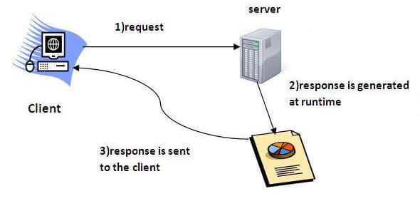

Execution of Servlets basically** **involves six basic steps: 
 Client Sends Request
The client (usually a web browser) sends an HTTP request (GET/POST) to the web server.
Example: A user visits http://localhost:8080/SamriddhiApp/MyServlet.
Web Server Receives the Request
The web server (e.g.,Tomcat) receives this request.
It checks the URL and determines which servlet should handle it.
Request Passed to Corresponding Servlet
The web server passes the request to the appropriate Servlet via the Servlet Container.
If the servlet is not already loaded, the container loads it and calls **init().**
Servlet Processes the Request
The servlet processes the request using **service(),** and based on the method (**GET/POST**), it calls **doGet()** or **doPost()**.
It may access databases, process form data, or apply business logic.
Servlet Sends Response to Web Server
The servlet generates the output (usually HTML) and sends it back to the web server using **HttpServletResponse**.
Web Server Sends Response to Client
The web server sends the response to the client browser, which displays the result to the user.

The web container creates threads for handling the multiple requests to the Servlet. Threads have many benefits over the Processes such as they share a common memory area, lightweight, cost of communication between the threads are low. The advantages of Servlet are as follows:
**Better performance:** because it creates a thread for each request, not process.
**Portability:** because it uses Java language.
**Robust:**  manages Servlets, so we don't need to worry about the memory leak, , etc.
**Secure:** because it uses java language.

### Servlet API

The **javax.servlet** and **javax.servlet.http** packages represent interfaces and classes for servlet api.
The **javax.servlet** package contains many interfaces and classes that are used by the servlet or web container. 
The **javax.servlet.http** package contains interfaces and classes that are responsible for http requests only.
**Servlets API’s:** 
Servlets are build from two packages: 
javax.servlet(Basic)
javax.servlet.http(Advance)
Various classes and interfaces present in these packages are: 

### Web container

A **web container** is the component of a **web server** that interacts with **Java servlets**.
A web container manages the life cycle of servlets; It maps a URL to a particular servlet while ensuring that the requester has relevant access-rights.


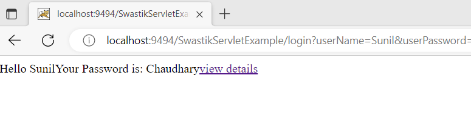

Java servlets do not have a defined `main()` method, so a container is required to load them. The servlet gets deployed on the container.

### Servlet Life Cycle
There are three life cycle methods of a Servlet :
init()
service()
destroy()

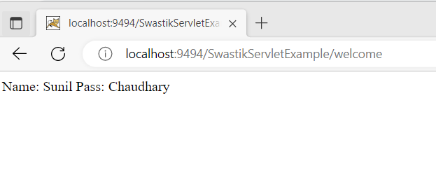

### init()

The **Servlet.init()** method is called by the Servlet container to indicate that this Servlet instance is instantiated successfully and is about to put into service.
```java
public void init(ServletConfig config) throws ServletException {
    //initialization code
}
```

### service()

The service() method of the Servlet is invoked to inform the Servlet about the client requests. This method uses ServletRequest object to collect the data requested by the client. This method uses ServletResponse object to generate the output content.

```java
public void service(ServletRequest req, ServletResponse res)
    throws ServletException, IOException {
    // request handling code
}
```

### destroy()

The destroy() method runs only once during the lifetime of a Servlet and signals the end of the Servlet instance.

```java
public void destroy()
```

As soon as the destroy() method is activated, the Servlet container releases the Servlet instance.

### Writing Servlet Programs
To get started with Servlets, let’s first start with a simple Servlet application *i.e* **LifeCycle** application, that will demonstrate the implementation of the **init()**, **service()** and **destroy()** methods.
First of all it is important to understand that if we are developing any Servlet application, it will handle some client’s request so, whenever we talk about Servlets we need to develop a index.html page (can be any other name also) which will request a particular Servlet to handle the request made by the client (in this case index.html page).
To be simple, lets first describe the steps to develop the **LifeCycle** application : 
Creating the index.html page
Creating the **LifeCycle** Servlet
Creating deployment descriptor

### Creating the index.html page

For the sake of simplicity, this page will just have a **button invoke life cycle**. When you will click this button it will call **LifeCycleServlet** (which is mapped according to the entry in web.xml file). 
```html
    <form action="myServlet">
        <input type="submit" value="invoke life cycle servlet">
    </form>
```

The name of the Servlet is given in action attribute of form tag to which the request will be send on clicking the button, in this case FirstServlet.

### Creating the Servlet (FirstServlet)

Now, its time to create the LifeCycleServlet which implements **init(),** **service()** and **destroy()** methods to demonstrate the lifecycle of a Servlet.
```java
// importing the javax.servlet package
// importing java.io package for PrintWriter
import javax.servlet.*;
import java.io.*;
// now creating a servlet by implementing Servlet interface
public class LifeCycleServlet implements Servlet {
    ServletConfig config = null; 
    // init method
    public void init(ServletConfig sc)
    {
        config = sc;
        System.out.println("in init");
    } 
    // service method
    public void service(ServletRequest req, ServletResponse res)
        throws ServletException, IOException
    {
        res.setContentType("text/html");
        PrintWriter pw = res.getWriter();
        pw.println("<h2>hello from life cycle servlet</h2>");
        System.out.println("in service");
    }
    // destroy method
    public void destroy()
    {
        System.out.println("in destroy");
    }
    public String getServletInfo()
    {
        return "LifeCycleServlet";
    }
    public ServletConfig getServletConfig()
    {
        return config; // getServletConfig
    }
}
Output:
```


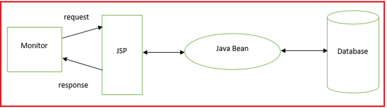

Write a program to demonstrate life cycle of servlet.

### Reading Form Parameters

### GET Method

The GET method sends the encoded user information appended to the page request. The page and the encoded information are separated by the **?** (**question mark**) symbol as follow
*localhost:9494/ReadingParameterExample/getParameterExample?name=Sunil+Chaudhary&location=Tinkune%2C+Kathmandu&Submit=Submit*
The **GET** method is the default method to pass information from browser to web server and it produces a long string that appears in your browser's Location: box. Never use the GET method if you have **password** or other **sensitive** information to pass to the server. The GET method has size limitation: only **1024** characters can be used in a request string.
This information is passed using header and will be accessible through QUERY\_STRING environment **QUERY\_STRING** variable and Servlet handles this type of requests using **doGet()** method.

### POST Method

A generally more reliable method of passing information to a backend program is the **POST** method. This packages the information in exactly the same way as **GET** method, but instead of sending it as a text string after a ? (question mark) in the URL it sends it as a separate message. This message comes to the backend program in the form of the standard input which you can parse and use for your processing. Servlet handles this type of requests using **doPost()** method.

### Reading Form Data using Servlet

Servlets handles form data parsing automatically using the following methods depending on the situation −
**getParameter()** − You call request.getParameter() method to get the value of a form parameter.
**getParameterValues()** − Call this method if the parameter appears more than once and returns multiple values, for example checkbox.
**getParameterNames()** − Call this method if you want a complete list of all parameters in the current request.

### GET METHOD EXAMPLE:

### Index.html


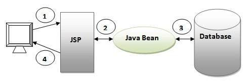

### HTML Code

```html
<html>
    <head>
        <title>TODO supply a title</title>
        <meta charset="UTF-8">
        <meta name="viewport" content="width=device-width, initial-scale=1.0">
    </head>
    <body>
        <form method="GET" action="myNewServlet">
        <table align="center">
       <tr>
        <td>Name : </td>
        <td><input type="text" name="name"/></td>
        </tr>
        <tr>
        <td>Location : </td>
        <td><input type="text" name="location"/></td>
        </tr>
        <tr>
        <td colspan="2"><input type="submit" name="Submit" value="Submit"/></td>
        </tr>
        </table>
        </form>
    </body>
</html>
```

### Servlet File (getParameterExample.java)

```java
protected void processRequest(HttpServletRequest request, HttpServletResponse response)
            throws ServletException, IOException {
        response.setContentType("text/html;charset=UTF-8");
        try (PrintWriter out = response.getWriter()) {       
            out.println("<!DOCTYPE html>");
            out.println("<html>");
            out.println("<head>");
            out.println("<title>Servlet getParameterExample</title>");       
            out.println("</head>");
            out.println("<body>");
            out.println("<h1>Servlet getParameterExample</h1>");
            out.println("<ul>");
            out.println("<li>"+request.getParameter("name")+"</li>");
            out.println("<li>"+request.getParameter("location")+"</li>");
            out.println("</ul>");
            out.println("</body>");
            out.println("</html>");
        }
    }
protected void doGet(HttpServletRequest request, HttpServletResponse response)
            throws ServletException, IOException {
        processRequest(request, response);
    }
```

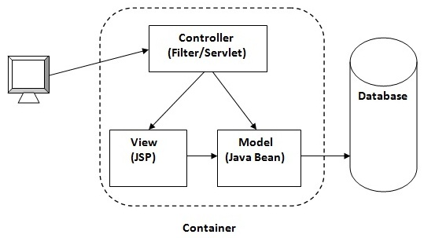

### POST Method Example Using Form

### Similar to Get Method

```html
<form method="POST" action="getParameterExample">
<table align="center">
<tr>
<td>Name : </td>
<td><input type="text" name="name"/></td>
</tr>
<tr>
<td>Location : </td>
<td><input type="text" name="location"/></td>
</tr>
<tr>
<td colspan="2"><input type="submit" name="Submit" value="Submit"/></td>
</tr>
</table>
</form>
```

### Servlet File (getParameterExample.java)

```java
protected void processRequest(HttpServletRequest request, HttpServletResponse response)
            throws ServletException, IOException {
        response.setContentType("text/html;charset=UTF-8");
        try (PrintWriter out = response.getWriter()) {
            out.println("<!DOCTYPE html>");
            out.println("<html>");
            out.println("<head>");
            out.println("<title>Servlet getParameterExample</title>");
            out.println("</head>");
            out.println("<body>");
            out.println("<h1>Servlet ParameterExample </h1>");
            out.println("<ul>");
            out.println("<li>"+request.getParameter("name")+"</li>");
            out.println("<li>"+request.getParameter("location")+"</li>");
            out.println("</ul>");
            out.println("</body>");
            out.println("</html>");
        }
    }
protected void doPost(HttpServletRequest request, HttpServletResponse response)
            throws ServletException, IOException {
        processRequest(request, response);
}
```

### DataAccess In Servlet

### Index.html

```html
<form method="POST" action="DataAccssController">
     <table align="center">
         <tr>
     <td>ID : </td>
     <td><input type="text" name="id"/></td>
     </tr>
     <tr>
     <td>Name : </td>
     <td><input type="text" name="name"/></td>
     </tr>
      <tr>
     <td>Email : </td>
     <td><input type="text" name="email"/></td>
     </tr>
     <tr>
     <td>Address : </td>
     <td><input type="text" name="address"/></td>
     </tr>
     <tr>
     <td colspan="2"><input type="submit" name="Submit" value="Submit"/></td>
     </tr>
     </table>
     </form>
```

### DataAccessController (Servlet)

```java
protected void processRequest(HttpServletRequest request, HttpServletResponse response)
            throws ServletException, IOException, ClassNotFoundException {
        try{
            Class.forName("com.mysql.jdbc.Driver");
            Connection con=DriverManager.getConnection("jdbc:mysql://localhost:3306/samriddhidb","root","root");
            String sql="insert into emp(Name,Email,Address) values(?,?,?)";
            PreparedStatement ps = con.prepareStatement(sql);
            ps.setInt(1,Integer.valueOf(request.getParameter("id")));
            ps.setString(2, request.getParameter("name"));
            ps.setString(3, request.getParameter("email"));
            ps.setString(4, request.getParameter("address"));
            ps.executeUpdate();
            con.close();
            PrintWriter out = response.getWriter();
            out.println("<html><body><b>Successfully Inserted" + "</b></body></html>");
        } catch(SQLException ex) {
        }
    }
```


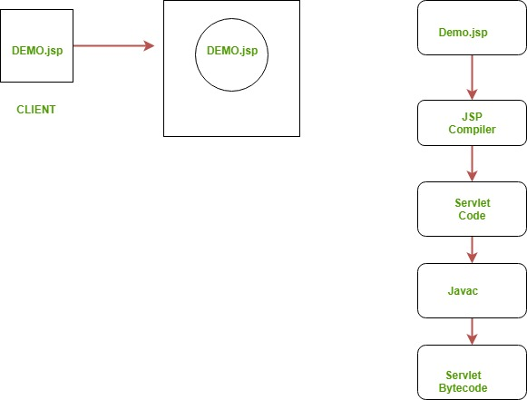

### Process to deploy the servlet
After installing Tomcat Server on your machine follow the below mentioned steps :
Create directory structure for your application.
Create a Servlet
Compile the Servlet
Create Deployement Descriptor for your application
Start the server and deploy the application

### Session in Servlet

The **HttpSession **object is used for session management. A session contains information specific to a particular user across the whole application. 
We all know that **HTTP** is a **stateless** protocol. All **requests** and **responses** are independent. But sometimes you need to keep track of client's activity across multiple requests. For eg. When a User logs into your website, not matter on which web page he visits after logging in, his credentials will be with the server, until he logs out. So this is managed by creating a session.
**Session Management** is a mechanism used by the **Web container** to store session information for a particular user. 

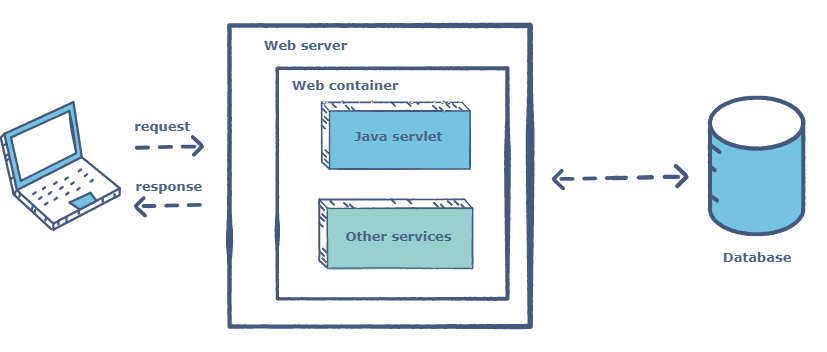

### Session Example

### Write a program to store and retrieve session in servlet

### index.html

```html
<form action="login">
  User Name:<input type="text" name="userName"/><br/>
  Password:<input type="password" name="userPassword"/><br/>
  <input type="submit" value="submit"/>
</form>
```

### MyServlet1.java

```java
import java.io.*;
import javax.servlet.*;
import javax.servlet.http.*;
public class MyServlet1 extends HttpServlet {
   public void doGet(HttpServletRequest request, HttpServletResponse response){
     try{
      response.setContentType("text/html");
      PrintWriter pwriter = response.getWriter();
      String name = request.getParameter("userName");
      String password = request.getParameter("userPassword");
      pwriter.print("Hello "+name);
      pwriter.print("Your Password is: "+password);
      HttpSession session=request.getSession();//Creating session
      session.setAttribute("uname",name);//Adding session with key value
      session.setAttribute("upass",password);
      pwriter.print("<a href='welcome'>view details</a>");
      pwriter.close();
    }catch(Exception exp){
       System.out.println(exp);
     }
  }
}
```

### MyServlet2.java
```java
import java.io.*;
import javax.servlet.*;
import javax.servlet.http.*;
public class MyServlet2 extends HttpServlet {
  public void doGet(HttpServletRequest request, HttpServletResponse response){
  try{
      response.setContentType("text/html");
      PrintWriter pwriter = response.getWriter();
      HttpSession session=request.getSession(false);
// The FALSE parameter indicates that you do not want to create a new session if one doesn't already exist.
      String myName=(String)session.getAttribute("uname");
      String myPass=(String)session.getAttribute("upass");
      pwriter.print("Name: "+myName+" Pass: "+myPass);
      pwriter.close();
  }catch(Exception exp){
      System.out.println(exp);
   }
  }
}
```
  }
}
```

### web.xml

```xml
<web-app>
<servlet>
   <servlet-name>Servlet1</servlet-name>
   <servlet-class>MyServlet1</servlet-class>
</servlet>
<servlet-mapping>
   <servlet-name>Servlet1</servlet-name>
   <url-pattern>/login</url-pattern>
</servlet-mapping>
<servlet>
   <servlet-name>Servlet2</servlet-name>
   <servlet-class>MyServlet2</servlet-class>
</servlet>
<servlet-mapping>
   <servlet-name>Servlet2</servlet-name>
   <url-pattern>/welcome</url-pattern>
</servlet-mapping>
</web-app>
```

**Output:**

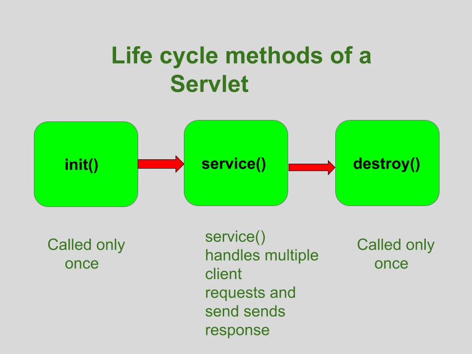

### After Submit Click:


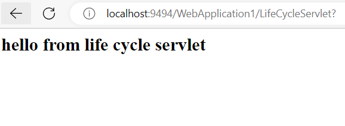

### After View Details Click:


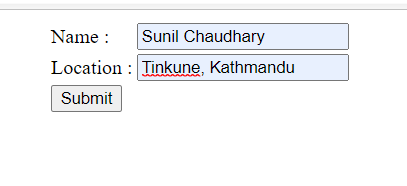

### cookies in Servlet:

A **cookie** is a small piece of information that is persisted between the multiple client requests.
A cookie has a name, a single value, and optional attributes such as a comment, path and domain qualifiers, a maximum age, and a version number.

### Types of Cookie

There are 2 types of cookies in servlets.
Non-persistent cookie
Persistent cookie

### Non-persistent cookie

It is **valid for single session** only. It is removed each time when user closes the browser.

### Persistent cookie

It is **valid for multiple session** . It is not removed each time when user closes the browser. It is removed only if user logout or signout.

### Advantage of Cookies

Simplest technique of maintaining the state.
Cookies are maintained at client side.

### Disadvantage of Cookies

It will not work if cookie is disabled from the browser.
Only textual information can be set in Cookie object.

### Cookie class

javax.servlet.http.Cookie class provides the functionality of using cookies. It provides a lot of useful methods for cookies.
Constructor of Cookie class
Useful Methods of Cookie class
There are given some commonly used methods of the Cookie class.

### Step to Create Cookie

1) Create a Cookie object:
```java
Cookie c = new Cookie("userName","Sunil");
```
2) Set the maximum Age:
```java
c.setMaxAge(1800);
```
3) Place the Cookie in HTTP response header:
```java
response.addCookie(c);
```

### Example of Cookies in java servlet

### index.html

```html
<form action="login">
 User Name:<input type="text" name="userName"/><br/>
 Password:<input type="password" name="userPassword"/><br/>
 <input type="submit" value="submit"/>
</form>
```

### MyServlet1.java

```java
import java.io.*;
import javax.servlet.*;
import javax.servlet.http.*;
public class MyServlet1 extends HttpServlet
{
   public void doGet(HttpServletRequest request,
      HttpServletResponse response) {
      try{
          response.setContentType("text/html");
          PrintWriter pwriter = response.getWriter();
          String name = request.getParameter("userName");
          String password = request.getParameter("userPassword");
          pwriter.print("Hello "+name);
          pwriter.print("Your Password is: "+password);
          //Creating two cookies
          Cookie c1=new Cookie("userName",name);
          Cookie c2=new Cookie("userPassword",password);
          //Adding the cookies to response header
          response.addCookie(c1);
          response.addCookie(c2);
          pwriter.print("<br><a href='welcome'>View Details</a>");
          pwriter.close();
   }catch(Exception exp){
       System.out.println(exp);
    }
  }
}
```

### MyServlet2.java

```java
import java.io.*;
import javax.servlet.*;
import javax.servlet.http.*;
public class MyServlet2 extends HttpServlet {
 public void doGet(HttpServletRequest request,
    HttpServletResponse response){
    try{
       response.setContentType("text/html");
       PrintWriter pwriter = response.getWriter();
       //Reading cookies
       Cookie c[]=request.getCookies();
       //Displaying User name value from cookie
       pwriter.print("Name: "+c[1].getValue());
       //Displaying user password value from cookie
       pwriter.print("Password: "+c[2].getValue());
       pwriter.close();
    }catch(Exception exp){
       System.out.println(exp);
     }
  }
}
```

### web.xml

```xml
<web-app>
<servlet>
 <servlet-name>Servlet1</servlet-name>
 <servlet-class>MyServlet1</servlet-class>
</servlet>
<servlet-mapping>
 <servlet-name>Servlet1</servlet-name>
 <url-pattern>/login</url-pattern>
</servlet-mapping>
<servlet>
 <servlet-name>Servlet2</servlet-name>
 <servlet-class>MyServlet2</servlet-class>
</servlet>
<servlet-mapping>
 <servlet-name>Servlet2</servlet-name>
 <url-pattern>/welcome</url-pattern>
</servlet-mapping>
</web-app>
```

### How to read cookies
```java
Cookie c[]=request.getCookies();
//c.length gives the cookie count
for(int i=0;i<c.length;i++){
 out.print("Name: "+c[i].getName()+" & Value: "+c[i].getValue());
}
```


```


### Write a program to store, retrieve and delete cookies

### How to create Cookie?

Let's see the simple code to create cookie.
```java
Cookie ck=new Cookie("user","sunil chaudhary");//creating cookie object
response.addCookie(ck);//adding cookie in the response
```

### How to delete Cookie
```java
Cookie ck=new Cookie("user","");//deleting value of cookie
ck.setMaxAge(0);//changing the maximum age to 0 seconds
response.addCookie(ck);//adding cookie in the response
```

### How to get Cookies

```java
Cookie ck[]=request.getCookies();
for(int i=0;i<ck.length;i++){
 out.print("<br>"+ck[i].getName()+" "+ck[i].getValue());//printing name and value of cookie
}
```

### Example

### Index.html
```html
<form action="servlet1" method="post">  
Name:<input type="text" name="userName"/><br/>  
<input type="submit" value="go"/>  
</form>
```

### FirstServlet.java

```java
import java.io.*;
import javax.servlet.*;
import javax.servlet.http.*;
public class FirstServlet extends HttpServlet {
  public void doPost(HttpServletRequest request, HttpServletResponse response){
    try{
    response.setContentType("text/html");
    PrintWriter out = response.getWriter();
    String n=request.getParameter("userName");
    out.print("Welcome "+n);
    Cookie ck=new Cookie("uname",n);//creating cookie object
    response.addCookie(ck);//adding cookie in the response
    //creating submit button
    out.print("<form action='servlet2'>");
    out.print("<input type='submit' value='go'>");
    out.print("</form>");
    out.close();
    }catch(Exception e){System.out.println(e);}
  }
}
```

### SecondServlet.java

```java
import java.io.*;
import javax.servlet.*;
import javax.servlet.http.*;
public class SecondServlet extends HttpServlet {
public void doPost(HttpServletRequest request, HttpServletResponse response){
    try{
    response.setContentType("text/html");
    PrintWriter out = response.getWriter();
    Cookie ck[]=request.getCookies();
    out.print("Hello "+ck[0].getValue());
    out.close();
         }catch(Exception e){System.out.println(e);}
    }
}
```

### Introduction to JSP
It stands for **Java Server Pages**.
It is a server side technology.
It is used for creating web application.
It is used to create dynamic web content.
In this JSP tags are used to insert JAVA code into HTML pages.
It is an advanced version of Servlet Technology.
It is a Web based technology helps us to create dynamic and platform independent web pages.
In this, Java code can be inserted in HTML/ XML pages or both.
JSP is first converted into servlet by JSP container before processing the client’s request.

### JAVA Beans

Java Beans is a reusable software component that can be visually manipulated in builder tool.
Their primary goal of java bean is WORA(Write once run anywhere)
Java beans should follow to portability, reusability and interoperability.
A JavaBean is a Java class that should follow the following conventions:
It should have a no-arg constructor.
It should be Serializable.
It should provide methods to set and get the values of the properties, known as **getter** and **setter** methods.

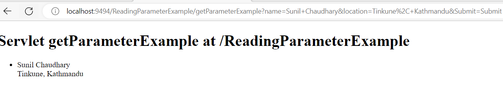

### Why use JavaBean?

According to Java white paper, it is a reusable software component. A bean encapsulates many objects into one object so that we can access this object from multiple places. Moreover, it provides easy maintenance.
```java
public class Employee implements java.io.Serializable{
private int id;
private String name;
public Employee(){}
public void setId(int id){this.id=id;}
public int getId(){return id;}
public void setName(String name){this.name=name;}
public String getName(){return name;}
}
```

### How to access the JavaBean class

```java
public class Test{
public static void main(String args[]){
Employee e=new Employee();//object is created
e.setName("Arjun");//setting value to the object
System.out.println(e.getName());
}}
```

A JavaBean property may be read, write, read-only, or write-only. JavaBean features are accessed through two methods in the JavaBean's implementation class:

1. getPropertyName ()
For example, if the property name is firstName, the method name would be getFirstName() to read that property. This method is called the accessor.

2. setPropertyName ()

For example, if the property name is firstName, the method name would be setFirstName() to write that property. This method is called the mutator.

### Design patterns for JavaBean Properties
A property is a subset of a Bean’s state. A bean property is a named attribute of a bean that can affect its behavior or appearance. Examples of bean properties include color, label, font, font size, and display size. Properties are the private data members of the JavaBean classes. Properties are used to accept input from an end user in order to customize a JavaBean. Properties can retrieve and specify the values of various attributes, which determine the behavior of a JavaBean.

### Types of JavaBeans Properties

Simple properties 
Boolean properties
Indexed properties

### Simple Properties

Simple properties are read/write with getter, setter methods. The naming convention is:
```java
T getX();
void setX(T arg);
```
### Example

```java
class MyDriver{
   private String name;
   // ...
   public String getName(){
      return name;
   }
   public void setName(String name){
      this.name=name;
   }
   // ...
}
```

### Boolean Properties
A Boolean property is a property which is used to represent the values True or False.
Syntax:
```java
public boolean isN( );
public boolean getN( );
public void setN(boolean value);
```

**Example:**
```java
public class Line {
private boolean dotted = false;
public boolean isDotted( ) {
return dotted;
}
public void setDotted(boolean dotted) {
this.dotted = dotted;
}
}
```

### Indexed Properties
If the property contains multiple values, the pattern followed is this:
```java
private String data[];
   // ...
   public String getData(int index){
      return data[index];
   }
   public void setData(int index, String str){
      data[index]=str;
   }
   public String[] getData(){
      return data;
   }
   public void setData(String []sa){
      data=new String[sa.length];
      System.arraycopy(sa,0,data,0,sa.length);
   }
   // ...
}
```

### JavaBeans Vs Java Class
A JavaBean is basically a Java class which satisfies a few simple rules (it must have a public no-arg constructor, no public instance variables, properties have getters and setters; actually, you can get around the last rule by supplying a BeanInfo object for your bean). JavaBeans were originally conceived for graphical application builder tools, but that emphasis has shifted considerably and they're now used almost everywhere.
A Bean can have associated support classes: a BeanInfo class providing information about the bean, its properties and its events, and also property editors and a graphical customizer.
A Bean is a Java class, but a Java class does not have to be a bean. In other words a bean in a specific Java class and has rules that have to be followed before you have a bean.
A **class** is nothing but a blueprint or a template for creating different objects which defines its properties and behaviors. **Java class** objects exhibit the properties and behaviors defined by its **class**. A **class** can contain fields and methods to describe the behavior of an object.

### JSP Access Model

Before developing the web applications, we need to have idea about design models. There are two types of programming models (design models)
Model 1 Architecture
Model 2 (MVC) Architecture

### Model 1 Architecture

**JSP** overcomes almost all the problems of Servlet. It provides better separation of concern, now presentation and business logic can be easily separated. You don't need to redeploy the application if JSP page is modified. JSP provides support to develop web application using JavaBean, custom tags and JSTL so that we can put the business logic separate from our JSP that will be easier to test and debug.

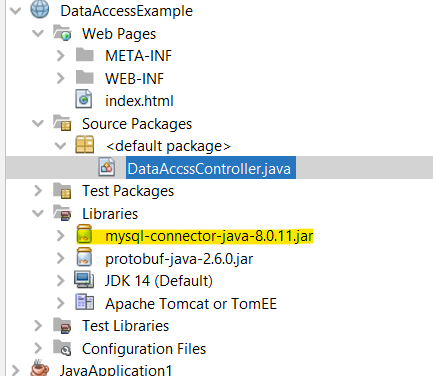

As you can see in the above figure, there is picture which show the flow of the model1 architecture.
Browser sends request for the JSP page
JSP accesses Java Bean and invokes business logic
Java Bean connects to the database and get/save data
Response is sent to the browser which is generated by JSP

### Model 2 (MVC) Architecture

Model 2 is based on the MVC (Model View Controller) design pattern. The MVC design pattern consists of three modules model, view and controller.
**Model** The model represents the state (data) and business logic of the application.
**View** The view module is responsible to display data i.e. it represents the presentation.
**Controller** The controller module acts as an interface between view and model. It intercepts all the requests i.e. receives input and commands to Model / View to change accordingly.

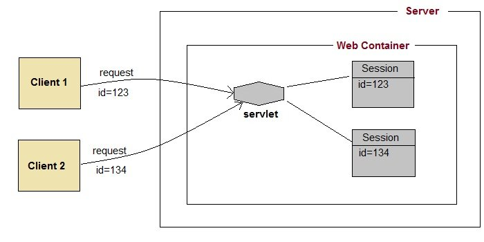

### Advantage of Model 2 (MVC) Architecture

**Navigation control is centralized** Now only controller contains the logic to determine the next page.
Easy to maintain
Easy to extend
Easy to test
Better separation of concerns

### Disadvantage of Model 2 (MVC) Architecture

We need to write the controller code self. If we change the controller code, we need to recompile the class and redeploy the application.

### JSP Syntax:

### Declaration Tag

It is used to declare variables.
Syntax: `<%! declaration %>`
Example:
```jsp
<%! int var=10; %>
```

### Java Scriplets

It allows us to add any number of JAVA code, variables and expressions.
Syntax: `<% code %>`
Example:
```jsp
<% num1 = num1+num2 %>
```

### JSP Comments

JAVA Comments contain the text that is added for information which has to be ignored.
Syntax:
```jsp
<%-- JSP Comments --%>
```

### JSP Declarations

A declaration declares one or more variables or methods that you can use in Java code later in the JSP file. You must declare the variable or method before you use it in the JSP file.
```jsp
<%! declaration; [ declaration; ]+ ... %>
```

### JSP Expression

A JSP expression element contains a scripting language expression that is evaluated, converted to a String, and inserted where the expression appears in the JSP file.
Because the value of an expression is converted to a String, you can use an expression within a line of text, whether or not it is tagged with HTML, in a JSP file.
The expression element can contain any expression that is valid according to the Java Language Specification but you cannot use a semicolon to end an expression.
```jsp
<%= expression %>
```

### JSP Directives

A JSP directive affects the overall structure of the servlet class. It usually has the following form −
```jsp
<%@ directive attribute="value" %>
```
There are three types of directive tag –

### Steps for Execution of JSP
Create html page from where request will be sent to server eg try.html.
To handle to request of user next is to create .jsp file Eg. new.jsp
Create project folder structure.
Create XML file eg my.xml.
Create WAR file.
Start Tomcat/GlassFish server
Run Application

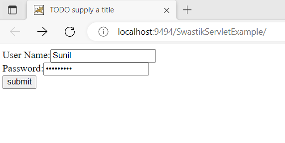

### demo.jsp

```jsp
<html>
<head>
<meta http-equiv="Content-Type" content="text/html; charset=ISO-8859-1">
<title>Hello World - JSP tutorial</title>
</head>
<body>
    <%= "Hello World!" %>
</body>
</html>
```

### JSP Implicit Objects

JSP supports nine automatically defined variables, which are also called implicit objects. These variables are –

### if...else Example

```jsp
<%! int day = 3; %>
<html>
   <head><title>IF...ELSE Example</title></head>
   <body>
      <% if (day == 1 || day == 7) { %>
         <p> Today is weekend</p>
      <% } else { %>
         <p> Today is not weekend</p>
      <% } %>
   </body>
</html>
```
Output: Today is not weekend

### switch...case Example

```jsp
<%! int day = 3; %>
<html>
   <head><title>SWITCH...CASE Example</title></head>
   <body>
      <%
         switch(day) {
            case 0:
               out.println("It\'s Sunday.");
               break;
            case 1:
               out.println("It\'s Monday.");
               break;
            case 2:
               out.println("It\'s Tuesday.");
               break;
            case 3:
               out.println("It\'s Wednesday.");
               break;
            case 4:
               out.println("It\'s Thursday.");
               break;
            case 5:
               out.println("It\'s Friday.");
               break;
            default:
               out.println("It's Saturday.");
         }
      %>
   </body>
</html>
```
Output: It's Wednesday.

### for Loop Example

```jsp
<%! int fontSize; %>
<html>
   <head><title>FOR LOOP Example</title></head>
   <body>
      <%for ( fontSize = 1; fontSize <= 3; fontSize++){ %>
         <font color = "green" size = "<%= fontSize %>">
            JSP Tutorial
      </font><br />
      <%}%>
   </body>
</html>
```

### while Loop Example

```jsp
<%! int fontSize; %>
<html>
   <head><title>WHILE LOOP Example</title></head>
   <body>
      <%while ( fontSize <= 3){ %>
         <font color = "green" size = "<%= fontSize %>">
            JSP Tutorial
         </font><br />
         <%fontSize++;%>
      <%}%>
   </body>
</html>
```

### JSP Scopes

Type of Scopes in JSP:
JSP provides 4 scopes to a variable. Developer can assign any one of them to a variable.
Page Scope.
Request Scope.
Session Scope.
Application Scope.

### JSP Page Scope Example

Page Scope makes variable available to the developer for the **current page only**. Once the current page is closed by user or forwarded internally by application or redirected by application, than the **variables having page scope will not be accessible on next page**.

### JSTL (JSP Standard Tag Library)

The JSP Standard Tag Library (JSTL) represents a set of tags to simplify the JSP development.

### Advantage of JSTL

**Fast Development** JSTL provides many tags that simplify the JSP.
**Code Reusability** We can use the JSTL tags on various pages.
**No need to use scriptlet tag** It avoids the use of scriptlet tag.

### Installing JSTL

### Edit in pom.xml

```xml
    <dependency>
            <groupId>jstl</groupId>
            <artifactId>jstl</artifactId>
            <version>1.2</version>
        </dependency>
```

### Index.jsp

```jsp
<%@ page language="java" contentType="text/html; charset=ISO-8859-1"
    pageEncoding="ISO-8859-1"%>
<%@ taglib uri="http://java.sun.com/jsp/jstl/core" prefix="c" %>
<!DOCTYPE html PUBLIC "-//W3C//DTD HTML 4.01 Transitional//EN" "http://www.w3.org/TR/html4/loose.dtd">
<html>
<head>
<title>JSP Page Scope Example</title>
</head>
<body>
 <c:set var="name" value="Dinesh" scope="page" />
 Local Variable : <c:out value="${name}" />
 <a href="test.jsp">Test Page</a>
</body>
</html>
Output :
Local Variable: Dinesh
Test Page
```

### Second JSP File (test.jsp)

```jsp
<%@ page language="java" contentType="text/html; charset=ISO-8859-1"
    pageEncoding="ISO-8859-1"%>
<%@ taglib uri="http://java.sun.com/jsp/jstl/core" prefix="c" %>
<!DOCTYPE html PUBLIC "-//W3C//DTD HTML 4.01 Transitional//EN" "http://www.w3.org/TR/html4/loose.dtd">
<html>
<head>
  <title>JSP Page Scope Example</title>
</head>
<body>
 Variable From previous page : <c:out value="${name}" />
</body>
</html>
Output: Variable from previous page:
```

### JSP Request Scope Example

Request Scope makes variable available to the developer for the current request only. Once the current request is over, than the variables having request scope will not be accessible on next request. Single request may include multiple pages using forward.

### Index.jsp

```jsp
<%@ page language="java" contentType="text/html; charset=ISO-8859-1"
    pageEncoding="ISO-8859-1"%>
<%@ taglib uri="http://java.sun.com/jsp/jstl/core" prefix="c" %>
<!DOCTYPE html PUBLIC "-//W3C//DTD HTML 4.01 Transitional//EN" "http://www.w3.org/TR/html4/loose.dtd">
<html>
<head>
<title>JSP Request Scope Example</title>
</head>
<body>
 <c:set var="name" value="Dinesh" scope="request" />
 <jsp:forward page="test.jsp"></jsp:forward>
</body>
</html>
```

### Test.jsp

```jsp
<%@ page language="java" contentType="text/html; charset=ISO-8859-1"
    pageEncoding="ISO-8859-1"%>
<%@ taglib uri="http://java.sun.com/jsp/jstl/core" prefix="c" %>
<!DOCTYPE html PUBLIC "-//W3C//DTD HTML 4.01 Transitional//EN" "http://www.w3.org/TR/html4/loose.dtd">
<html>
<head>
  <title>JSP Request Scope Example</title>
</head>
<body>
 Variable From previous page : <c:out value="${name}" />
</body>
</html>
Output: Variable from previous page: Dinesh
```

### JSP Session Scope Example

Session Scope makes variable available to the developer for the current session only. Once the current session is over or timed out, than the variables having session scope will not be accessible on next session.

### Index.jsp

```jsp
<%@ page language="java" contentType="text/html; charset=ISO-8859-1"
    pageEncoding="ISO-8859-1"%>
<%@ taglib uri="http://java.sun.com/jsp/jstl/core" prefix="c" %>
<!DOCTYPE html PUBLIC "-//W3C//DTD HTML 4.01 Transitional//EN" "http://www.w3.org/TR/html4/loose.dtd">
<html>
<head>
<title>JSP Session Scope Example</title>
</head>
<body>
 <c:set var="name" value="Dinesh" scope="session" />
 Local Variable : <c:out value="${name}" />
 <a href="test.jsp">Test Page</a>
</body>
</html>
Output:
Local Variable: Dinesh
Test Page
```

### Test.jsp

```jsp
<%@ page language="java" contentType="text/html; charset=ISO-8859-1"
    pageEncoding="ISO-8859-1"%>
<%@ taglib uri="http://java.sun.com/jsp/jstl/core" prefix="c" %>
<!DOCTYPE html PUBLIC "-//W3C//DTD HTML 4.01 Transitional//EN" "http://www.w3.org/TR/html4/loose.dtd">
<html>
<head>
  <title>JSP Session Scope Example</title>
</head>
<body>
 Variable From previous page : <c:out value="${name}" />
</body>
</html>
Output: Variable from previous page: Dinesh
```

### JSP Application Scope Example

Application Scope makes variable available to the developer for the full application. It remains available till application is running on server.

### Index.jsp

```jsp
<%@ page language="java" contentType="text/html; charset=ISO-8859-1"
    pageEncoding="ISO-8859-1"%>
<%@ taglib uri="http://java.sun.com/jsp/jstl/core" prefix="c" %>
<!DOCTYPE html PUBLIC "-//W3C//DTD HTML 4.01 Transitional//EN" "http://www.w3.org/TR/html4/loose.dtd">
<html>
<head>
<title>JSP Application Scope Example</title>
</head>
<body>
 <c:set var="name" value="Dinesh" scope="application" />
 Local Variable : <c:out value="${name}" />
 <a href="test.jsp">Test Page</a>
</body>
</html>
Output:
Local Variable: Dinesh
Test Page
```

### Test.jsp

```jsp
<%@ page language="java" contentType="text/html; charset=ISO-8859-1"
    pageEncoding="ISO-8859-1"%>
<%@ taglib uri="http://java.sun.com/jsp/jstl/core" prefix="c" %>
<!DOCTYPE html PUBLIC "-//W3C//DTD HTML 4.01 Transitional//EN" "http://www.w3.org/TR/html4/loose.dtd">
<html>
<head>
  <title>JSP Application Scope Example</title>
</head>
<body>
 Variable From previous page : <c:out value="${name}" />
</body>
</html>
Output: Variable from previous page: Dinesh
```

### JSP Form Processing

### Index.jsp

```jsp
<html>
   <body>
      <form action = "main.jsp" method = "GET">
         First Name: <input type = "text" name = "first_name">
         <br />
         Last Name: <input type = "text" name = "last_name" />
         <input type = "submit" value = "Submit" />
      </form>
   </body>
</html>
```

### Main.jsp

```jsp
<html>
   <head>
      <title>Using GET Method to Read Form Data</title>
   </head>
   <body>
      <h1>Using GET Method to Read Form Data</h1>
      <ul>
         <li><p><b>First Name:</b>
            <%= request.getParameter("first_name")%>
         </p></li>
         <li><p><b>Last  Name:</b>
            <%= request.getParameter("last_name")%>
         </p></li>
      </ul>
   </body>
</html>
```

### POST

```jsp
<html>
   <body>
      <form action = "main.jsp" method = "POST">
         First Name: <input type = "text" name = "first_name">
         <br />
         Last Name: <input type = "text" name = "last_name" />
         <input type = "submit" value = "Submit" />
      </form>
   </body>
</html>
```

### Main.jsp

```jsp
<html>
   <head>
      <title>Using GET and POST Method to Read Form Data</title>
   </head>
   <body>
      <center>
      <h1>Using POST Method to Read Form Data</h1>
      <ul>
         <li><p><b>First Name:</b>
            <%= request.getParameter("first_name")%>
         </p></li>
         <li><p><b>Last  Name:</b>
            <%= request.getParameter("last_name")%>
         </p></li>
      </ul>
   </body>
</html>
```

### Exam Asked Question

*Write a program to a JSP web form to take input of a student and submit it to second JSP file which may simply print the values of form submission*
*Create `index.jsp` and `PrintForm.jsp`*

### index.jsp

```jsp
<form action="PrintForm.jsp" method="POST">
            Name: <input type="text" name="name"><br><br>
            Roll No.: <input type="text" name="roll"><br><br>
            Address: <input type="text" name="address"><br><br>
            <input type="submit" value="Submit">   
</form>
```

### PrintForm.jsp

```jsp
  <h1>Student Details!</h1>
        Name: <%= request.getParameter("name") %><br>
        Roll No.: <%= request.getParameter("roll") %><br>
        Address: <%= request.getParameter("address") %><br>
```

### What is Framework in Java

**Java Framework** is the body or platform of pre-written codes used by Java developers to develop Java applications or web applications. In other words, **Java Framework** is a collection of predefined classes and functions that is used to process input, manage hardware devices interacts with system software. It acts like a skeleton that helps the developer to develop an application by writing their own code.

### What is a framework?

Framework are the bodies that contains the pre-written codes (classes and functions) in which we can add our code to overcome the problem. We can also say that frameworks use programmer's code because the framework is in control of the programmer. We can use the framework by calling its methods, inheritance, and supplying "callbacks", listeners, or other implementations of the Observer pattern.
Some of the most popular  frameworks are:
Spring
Hibernate
Grails
Play
JavaServer Faces (JSF)
Google Web Toolkit (GWT)
Quarkus

### Spring

It is a light-weighted, powerful Java application development framework. It is used for JEE. Its other modules are **Spring Security, Spring Batch, Spring ORM**, and others.

### Hibernate

**Hibernate** is an ORM (Object-Relation Mapping) framework that allows us to establish communication between the Java programming language and the RDBMS.

### Grails

It is a dynamic framework created by using Groovy. It is an OOPs language. Its purpose is to enhance the productivity. The syntax of Grails is matched with Java and the code is compiled to JVM bytecode. It also works with Java, JEE, Spring and Hibernate.

### Play

It is a unique Java framework because it does not follow JEE standards. It follows MVC architecture pattern. It is used when we want to develop highly scalable Java application. Using Play framework, we can develop lightweight and web-friendly Java application for both mobile and desktop.

### JavaServer Faces

It stands for JavaServer Faces. It is a component-based UI framework developed by Oracle that is used to build user interfaces for Java-based applications. It follows MVC design pattern. The application developed using JSF has an architecture that defines a distinction

### Google Web Toolkit (GWT)

It is an open-source framework that allows developers to write client-side Java code. With the help of GWT, we can rapidly develop complex browse application. The advantages to use GWT is that we can easily develop and debug Ajax application. The products of Google, such as Google AdSense, Blogger are developed using GWT.


---

**Table 1:**

| Component | Type | Package |
| --- | --- | --- |
| Servlet | Interface | javax.servlet.* |
| ServletRequest | Interface | javax.servlet.* |
| ServletResponse | Interface | javax.servlet.* |
| GenericServlet | Class | javax.servlet.* |
| HttpServlet | Class | javax.servlet.http.* |
| HttpServletRequest | Interface | javax.servlet.http.* |
| HttpServletResponse | Interface | javax.servlet.http.* |
| Filter | Interface | javax.servlet.* |
| ServletConfig | Interface | javax.servlet.* |


**Table 2:**

| Constructor | Description |
| --- | --- |
| Cookie() | constructs a cookie. |
| Cookie(String name, String value) | constructs a cookie with a specified name and value. |


**Table 3:**

| Method | Description |
| --- | --- |
| public void setMaxAge(int expiry) | Sets the maximum age of the cookie in seconds. |
| public String getName() | Returns the name of the cookie. The name cannot be changed after creation. |
| public String getValue() | Returns the value of the cookie. |
| public void setName(String name) | changes the name of the cookie. |
| public void setValue(String value) | changes the value of the cookie. |


**Table 4:**

| Servlet | JSP |
| --- | --- |
| Servlet is a java code. | JSP is a HTML based code. |
| Writing code for servlet is harder than JSP as it is HTML in java. | JSP is easy to code as it is java in HTML. |
| Servlet plays a controller role in the has MVC approach. | JSP is the view in the MVC approach for showing output. |
| Servlet is faster than JSP. | JSP is slower than Servlet because the first step in the has JSP lifecycle is the translation of JSP to java code and then compile. |
| Servlet can accept all protocol requests. | JSP only accepts HTTP requests. |
| In Servlet, we can override the service() method. | In JSP, we cannot override its service() method. |
| In Servlet by default session management is not enabled, user have to enable it explicitly. | In JSP session management is automatically enabled. |
| In Servlet we have to implement everything like business logic and presentation logic in just one servlet file. | In JSP business logic is separated from presentation logic by using JavaBeans client-side. |
| Modification in Servlet is a time-consuming compiling task because it includes reloading, recompiling, JavaBeans and restarting the server. | JSP modification is fast, just need to click the refresh button. |
| It does not have inbuilt implicit objects. | In JSP there are inbuilt implicit objects. |
| There is no method for running JavaScript on the client side in Servlet. | While running the JavaScript at the client side in JSP, the client-side validation is used. |
| Packages are to be imported on the top of the program. | Packages can be imported into the JSP program(i.e bottom , middleclient-side, or top ) |


**Table 5:**

| S.No. | Directive & Description |
| --- | --- |
| 1 | <%@ page ... %>
Defines page-dependent attributes, such as scripting language, error page, and buffering requirements. |
| 2 | <%@ include ... %>
Includes a file during the translation phase. |
| 3 | <%@ taglib ... %>
Declares a tag library, containing custom actions, used in the page |


**Table 6:**

| S.No. | Object & Description |
| --- | --- |
| 1 | request
This is the HttpServletRequest object associated with the request. |
| 2 | response
This is the HttpServletResponse object associated with the response to the client. |
| 3 | out
This is the PrintWriter object used to send output to the client. |
| 4 | session
This is the HttpSession object associated with the request. |
| 5 | application
This is the ServletContext object associated with the application context. |
| 6 | config
This is the ServletConfig object associated with the page. |
| 7 | pageContext
This encapsulates use of server-specific features like higher performance JspWriters. |
| 8 | page
This is simply a synonym for this, and is used to call the methods defined by the translated servlet class. |
| 9 | Exception
The Exception object allows the exception data to be accessed by designated JSP. |


---
