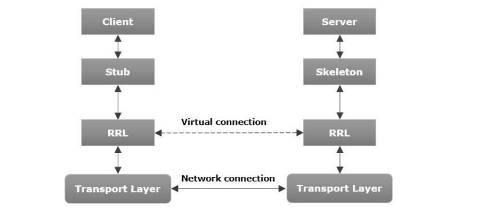
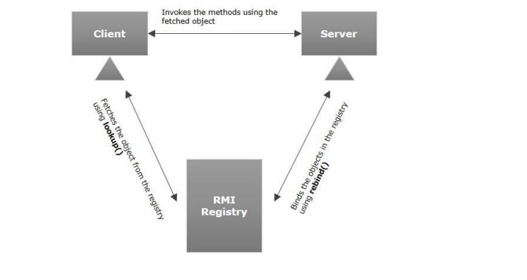
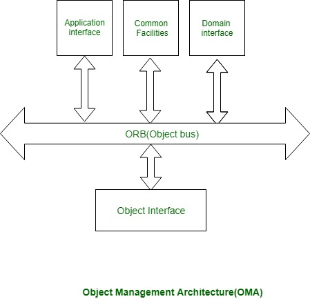
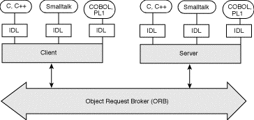
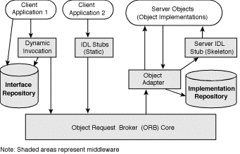
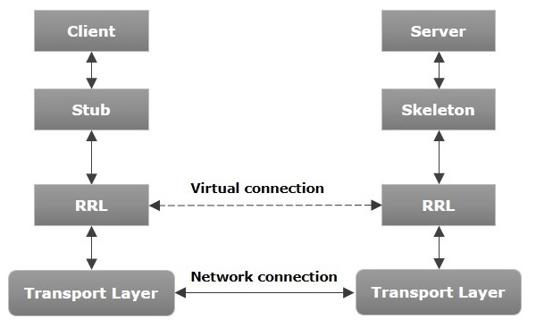
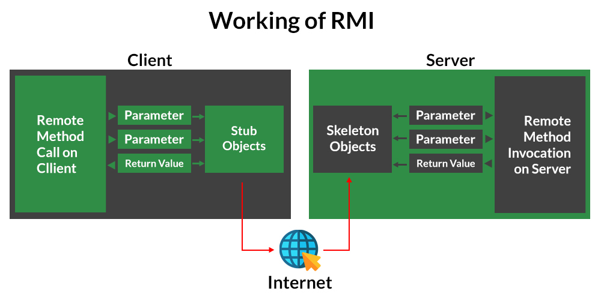
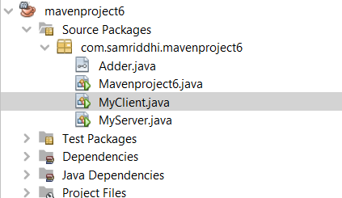

# Chapter 8_RMI

> *Source: Sunil Sir's Lecture Notes — B.Sc. CSIT (Tribhuvan University)*

---

## Unit 8: RMI (Remote Method Invocation)

*Source: `UNIT-8.docx`*

> 📷 *This document contains images/diagrams — see the original .docx for visual content*

### UNIT-8

### JAVA RMI(Remote Method Invocation)

RMI stands for **Remote Method Invocation**. It is a mechanism that allows an object residing in one system (JVM) to access/invoke an object running on another JVM. RMI is used to build distributed applications; it provides remote communication between Java programs. It is provided in the package **java.rmi**.

### Architecture of an RMI Application

In an RMI application, we write two programs, a **server program** (resides on the server) and a **client program** (resides on the client).
Inside the server program, a remote object is created and reference of that object is made available for the client (using the RMI registry). 
The client program requests the remote objects on the server and tries to invoke its methods.



**Let us now discuss the components of this architecture**. 
**Transport Layer** − This layer connects the client and the server. It manages the existing connection and also sets up new connections.
**Stub** − A stub is a representation  of the remote object at client. It resides in the client system; it acts as a gateway for the client program.
**Skeleton** − This is the object which resides on the server side. stub communicates with this skeleton to pass request to the remote object. 
**RRL(Remote Reference Layer)** − It is the layer which manages the references made by the client to the remote object.

### Working of an RMI Application

When the client makes a call to the remote object, it is received by the **stub** which eventually passes this request to the RRL. 
When the client-side RRL receives the request, it invokes a method called **invoke()** of the object **remoteRef**. It passes the request to the RRL on the server side. 
The RRL on the server side passes the request to the **Skeleton** (proxy on the server) which finally invokes the required object on the server. 
The result is passed all the way back to the client.

### Marshalling and Unmarshalling

Whenever a client invokes a method that accepts parameters on a remote object, the parameters are bundled into a message before being sent over the network. These parameters may be of **primitive type** or **objects**. In case of primitive type, the parameters are put together and a header is attached to it. In case the parameters are objects, then they are **serialized**. This process is known as **marshalling**. 
At the server side, the packed parameters are **unbundled** and then the required method is invoked. This process is known as **unmarshalling**.
**To write an RMI Java application, you would have to follow the steps given below **– 
Define the remote interface 
Develop the implementation class (remote object) 
Develop the server program 
Develop the client program 
Compile the application 
Execute the application

**RMI Registry** 
RMI registry is a namespace on which all server objects are placed. Each time the server creates an object, it registers this object with the **RMIregistry** (using **bind()** or **reBind()** methods). These are registered using a unique name known as **bind name**. To invoke a remote object, the client needs a reference of that object. 
At that time, the client fetches the object from the registry using its bind name (using **lookup()** method). The following illustration explains the entire process −



### Goal of RMI

To minimize the complexity of the application. 
To preserve type safety. 
Distributed garbage collection. 
Minimize the difference between working with local and remote objects.

### Developing the Server Program

An RMI server program should implement the remote interface or extend the implementation class. Here, we should create a remote object and bind it to the **RMIregistry**.

### To develop a server program

Create a client class from where you want invoke the remote object. 
**Create a remote object **by instantiating the implementation class as shown below. 
Export the remote object using the method **exportObject()** of the class named **UnicastRemoteObject** which belongs to the package **java.rmi.server**.
Get the RMI registry using the **getRegistry()** method of the **LocateRegistry** class which belongs to the package **java.rmi.registry**.
Bind the remote object created to the registry using the **bind()** method of the class named Registry. To this method, pass a string representing the bind name and the object exported, as parameters.
https://www.youtube.com/watch?v=xNkyaMRKnnk

### Write a java program to add two digit using RMI

### RMI Example:

### create the remote interface

```java
import java.rmi.*;
public interface Adder extends Remote {
    public int add(int x,int y)throws RemoteException;
}
```

**Create and run the server application(MyServer.Java)**
```java
import java.rmi.*;
import java.rmi.registry.*;
import java.rmi.server.UnicastRemoteObject;
public class MyServer extends UnicastRemoteObject implements Adder {
    public MyServer() throws RemoteException
    {
        super();
    }
       public static void main(String[] args) throws RemoteException
    {
        try {
            Registry reg=LocateRegistry.createRegistry(5000);
            reg.rebind("hi_server",new MyServer());
            System.out.println("Server is Now Ready..");
            }
            catch(RemoteException e)
            {
                System.out.println(e);
            }
    }
    @Override
    public int add(int x, int y) throws RemoteException {
         return x+y;
    }
```

```java
}
```

**MyClient.java**
```java
import java.rmi.*;
import java.rmi.registry.*;
public class MyClient {
    public static void main(String[] args) throws RemoteException
       {
           try{
               Registry reg=LocateRegistry.getRegistry("localhost",5000);
               Adder ad=(Adder)reg.lookup("hi_server");
               System.out.println("Addition:"+ad.add(20, 30));
```

```java
           }
           catch(NotBoundException|RemoteException e)
           {
                System.out.println(e);
           }
        }
```

```java
}
```

**(ServerSide) Output:**
**Server is Ready..**

### ClientSide Output:

### Addition:50

### CORBA:

The Common Object Request Broker Architecture (CORBA) is a standard developed by the Object Management Group (OMG) to provide interoperability among distributed objects. CORBA is the world’s leading application middleware solution enabling the exchange of information, independent of hardware platforms, programming languages, and operating systems. CORBA is essentially a design specification for an Object Request Broker (ORB), where an ORB provides the mechanism required for distributed objects to communicate with one another, whether locally or on remote devices, written in different languages, or at different locations on a network.
CORBA is a platform which support **multiple programming** to work together successfully
It is a mechanism in software for normalizing the method call semantic between application object residing either in the same address space or remote address space
It is a middleware neither 2 tier or 3 tier architecture.
The object request broker (ORB) enables client to invoke methods in a remote object
It is a technology to connect to objects of heterogeneous types.



What is Middleware?
Middleware, software that functions as a translation layer, sits between an application residing on one server and any number of clients that want access to that application. In short, middleware allows users to interact with one another and with applications in a heterogeneous computing environment.
It’s important to note that the functions middleware provides are hidden, so that applications and information can be easily – and smoothly – accessed across different architectures, protocols and networks.
**Interface Definition Language (IDL)**
A cornerstone of the CORBA standards is the Interface Definition Language. IDL is the OMG standard for defining language-neutral APIs and provides the platform-independent delineation of the interfaces of distributed objects. 
CORBA then specifies a *mapping* from IDL to a specific implementation language like C++ or Java. Standard mappings exist for Ada, C, C++, C++11, Lisp, Ruby, Smalltalk, Java, COBOL, PL/I and Python. There are also non-standard mappings for Perl, Visual Basic, Erlang, and Tcl implemented by object request brokers (ORBs) written for those languages.



There are two types of object in corba
Service provider object
Client object
Service provider object: that includes functionalities that can be used by other objects
Client Object: Object that requires services of the other object

### CORBA ARCHITECTURE:




**Object** -- This is a CORBA programming entity that consists of an *identity*, an *interface*, and an *implementation*, which is known as a *Servant*.
**Servant** -- This is an implementation programming language entity that defines the operations that support a CORBA IDL interface. Servants can be written in a variety of languages, including C, C++, Java, Smalltalk, and Ada.
**Client** -- This is the program entity that invokes an operation on an object implementation. 
**Object Request Broker (ORB)** -- The ORB provides a mechanism for transparently communicating client requests to target object implementations. When a client invokes an operation, the ORB is responsible for finding the object implementation.
**ORB Interface** -- An ORB is a logical entity that may be implemented in various ways (such as one or more processes or a set of libraries). 
**CORBA IDL stubs and skeletons** -- CORBA IDL stubs and skeletons serve as the ``glue'' between the client and server applications, respectively, and the ORB. 
**Dynamic Invocation Interface (DII)** -- This interface allows a client to directly access the underlying request mechanisms provided by an ORB. 
**Dynamic Skeleton Interface (DSI)** -- This is the server side's analogue to the client side's DII. The DSI allows an ORB to deliver requests to an object implementation that does not have compile-time knowledge of the type of the object it is implementing. 

### Simple Corba example:

### https://www.youtube.com/watch?v=chsR860gbsk


---

**Table 1:**

| RMI | CORBA |
| --- | --- |
| RMI is a Java-specific technology. | CORBA has implementation for many languages. |
| It uses Java interface for implementation. | It uses Interface Definition Language (IDL) to separate interface from implementation. |
| RMI objects are garbage collected automatically. | CORBA objects are not garbage collected because it is language independent and some languages like C++ does not support garbage collection. |
| RMI programs can download new classes from remote JVM’s. | CORBA does not support this code sharing mechanism. |
| RMI passes objects by remote reference or by value. | CORBA passes objects by reference. |
| Java RMI is a server-centric model. | CORBA is a peer-to-peer system. |
| RMI uses the Java Remote Method Protocol as its underlying remoting protocol. | CORBA use Internet Inter- ORB Protocol as its underlying remoting protocol. |
| The responsibility of locating an object implementation falls on JVM. | The responsibility of locating an object implementation falls on Object Adapter either Basic Object Adapter or Portable Object Adapter. |


---

## RMI — Additional Examples

*Source: `JAVA RMI.docx`*

> 📷 *This document contains images/diagrams — see the original .docx for visual content*

### JAVA RMI

RMI stands for **Remote Method Invocation**. It is a mechanism that allows an object residing in one system (JVM) to access/invoke an object running on another JVM. RMI is used to build distributed applications; it provides remote communication between Java programs. It is provided in the package **java.rmi**.

### Architecture of an RMI Application

In an RMI application, we write two programs, a **server program** (resides on the server) and a **client program** (resides on the client).
Inside the server program, a remote object is created and reference of that object is made available for the client (using the RMI registry). 
The client program requests the remote objects on the server and tries to invoke its methods.






**Stub Object: **The stub object on the **client machine** builds an information block and sends this information to the server.
The block consists of
An identifier of the remote object to be used.
Method name which is to be invoked
Parameters to the remote JVM
**Skeleton Object: **The skeleton object passes the request from the stub object to the remote object. It performs the following tasks.
It calls the desired method on the real object present on the server.
It forwards the parameters received from the stub object to the method.

**Let us now discuss the components of this architecture**. 
**Transport Layer** − This layer connects the client and the server. It **manages** **the existing connection **and **sets up new connections**.
**Stub** − A stub is a representation of the remote object at client. It resides in the client system; it acts as a gateway for the client program.
**Skeleton** − This is the object which resides on the server side. stub communicates with this skeleton to pass requests to the remote object. 
**RRL (Remote Reference Layer)** − It is the layer which manages the references made by the client to the remote object.

### Working of an RMI Application

When the client makes a call to the remote object, it is received by the stub which eventually passes this request to the RRL. 
When the client-side RRL receives the request, it invokes a method called **invoke()** of the object **remoteRef**. It passes the request to the RRL on the server side. 
The RRL on the server side passes the request to the Skeleton (proxy on the server) which finally invokes the required object on the server. 
The result is passed all the way back to the client.

### Marshalling and Unmarshalling

Whenever a client invokes a method that accepts parameters on a remote object, the parameters are bundled into a message before being sent over the network. These parameters may be of primitive type or objects. In case of primitive type, the parameters are put together, and a header is attached to it. In case the parameters are objects, then they are serialized. This process is known as **marshalling**.
At the server side, the packed parameters are unbundled and then the required method is invoked. This process is known as **unmarshalling**.
**To write an RMI Java application, you would have to follow the steps given below **– 
Define the remote interface 
Develop the implementation class (remote object) 
Develop the server program 
Develop the client program 
Compile the application 
Execute the application

**RMI Registry** 
RMI registry is a namespace on which all server objects are placed. Each time the server creates an object, it registers this object with the **RMIregistry** (using **bind()** or **reBind()** methods). These are registered using a unique name known as **bind name**. To invoke a remote object, the client needs a reference of that object. 
At that time, the client fetches the object from the registry using its bind name (using **lookup()** method). The following illustration explains the entire process −


### Goal of RMI

To minimize the complexity of the application. 
To preserve type safety. 
Distributed garbage collection. 
Minimize the difference between working with local and remote objects.

### Remote Object Activation:

Automatic activation of remote objects is a new feature in RMI as of Java 1.2. 
The activation subsystem in RMI provides you with two basic features: *the ability to have remote objects instantiated (activated) **on-demand** by client requests ***and** *the ability for remote object references to remain valid across server crashes, making the references persistent*. These features can be quite useful in certain types of distributed applications. 
**For example**, We might not want to keep the **AccountManager class** running on our server 24 hours a day; perhaps it consumes lots of server resources (memory, database connections, etc.), so we don't want it running unless it is being used. Using the RMI activation service, we can set up the **AccountManager class** so that it doesn't start running until the first client requests an **Account**. In addition, after some period of inactivity, we can have the **AccountManager** shut down to conserve server resources and then reactivated the next time a client asks for an **Account**.

### Developing the Server Program

An RMI server program should implement the remote interface or extend the implementation class. Here, we should create a remote object and bind it to the **RMIregistry**.

### To develop a server program

Create a client class from where you want to invoke the remote object. 
**Create a remote object **by instantiating the implementation class as shown below. 
Export the remote object using the method **exportObject()** of the class named **UnicastRemoteObject** which belongs to the package **java.rmi.server**.
Get the RMI registry using the **getRegistry()** method of the **LocateRegistry** class which belongs to the package **java.rmi.registry**.
Bind the remote object created to the registry using the **bind()** method of the class named Registry. To this method, pass a string representing the bind name and the object exported, as parameters.

### RMI Example:

### create the remote interface

```java
import java.rmi.*;
public interface Adder extends Remote {
            public int add(int x, int y) throws RemoteException;
}
```

**Create and run the server application(MyServer.Java)**
```java
import java.rmi.*;
import java.rmi.registry.LocateRegistry;
import java.rmi.registry.Registry;
import java.rmi.server.UnicastRemoteObject;
public class MyServer extends UnicastRemoteObject implements Adder {
    public MyServer() throws RemoteException
    {
        super();
    }
    public static void main(String[] args) throws RemoteException
    {
        try {
            Registry reg=LocateRegistry.createRegistry(5000);
            reg.rebind("hi_server",new MyServer());
            System.out.println("Server is Now Ready..");
            }
            catch(RemoteException e)
            {
                System.out.println(e);
            }
    }
```

```java
    @Override
    public int add(int x, int y) throws RemoteException {
         return x+y;
    }
}
```

6) Create and run the client application (MyClient.Java)
```java
package com.samriddhi.mavenproject6;
import java.rmi.*;
import java.rmi.registry.Registry;
import java.rmi.registry.LocateRegistry;
```

```java
public class MyClient {
       public static void main(String[] args) throws RemoteException
       {
           MyClient client=new MyClient();
           client.connectRemote();
        }
       private void connectRemote() throws RemoteException
       {
           try{
               Registry reg=LocateRegistry.getRegistry("localhost",5000);
               Adder ad=(Adder)reg.lookup("hi_server");
               System.out.println("Addition:"+ad.add(20, 30));
```

```java
           }
           catch(NotBoundException|RemoteException e)
           {
                System.out.println(e);
           }
       }
```

```java
}
```




**(ServerSide) Output:**
**Server is Ready..**

### ClientSide Output:

### Addition:50


---

**Table 1:**

| RMI(Remote Method Invocation) | CORBA (Common Object Request Broker Architecture) |
| --- | --- |
| RMI is a Java-specific technology. | CORBA has implementation for many languages. |
| It uses Java interface for implementation. | It uses Interface Definition Language (IDL) to separate interface from implementation. |
| RMI objects are garbage collected automatically. | CORBA objects are not garbage collected because it is language independent and some languages like C++ does not support garbage collection. |
| RMI passes objects by remote reference or by value. | CORBA passes objects by reference. |
| Java RMI is a server-centric model. | CORBA is a peer-to-peer system. |
| RMI uses the Java Remote Method Protocol as its underlying remoting protocol. | CORBA use Internet Inter- ORB Protocol as its underlying remoting protocol. |
| The responsibility of locating an object implementation falls on JVM. | The responsibility of locating an object implementation falls on Object Adapter either Basic Object |


---
